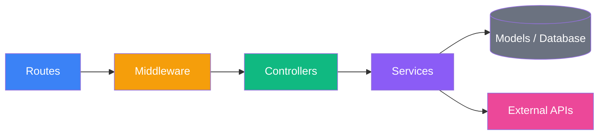
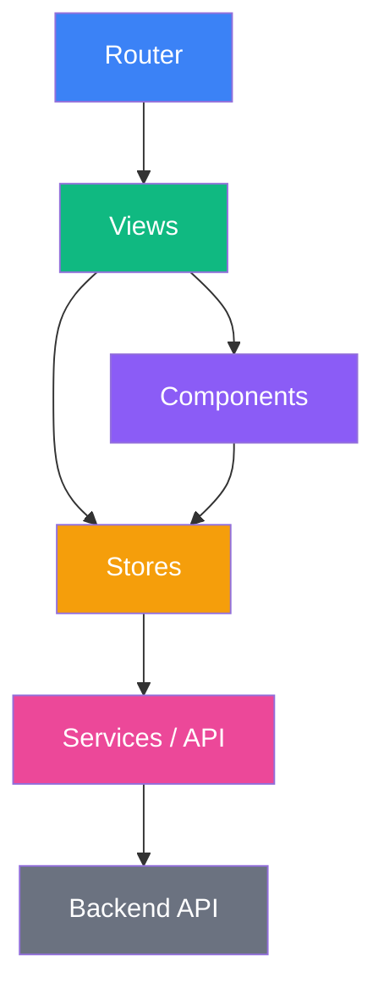
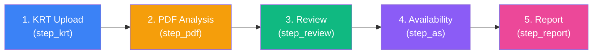
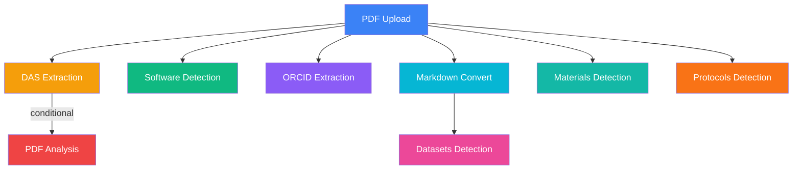

# Architecture Overview

ASAP KR-Sync is a full-stack web application for managing Key Resources Tables (KRT) in academic manuscript submissions. It follows a monorepo structure with a Node.js/Express backend and a Vue 3 frontend.

## Technology Stack

| Layer | Technology |
|-------|-----------|
| **Runtime** | Node.js 20+ |
| **Backend Framework** | Express.js |
| **Frontend Framework** | Vue 3 (Composition API, `<script setup>`) |
| **Build Tool** | Vite |
| **State Management** | Pinia |
| **Database** | PostgreSQL + Sequelize ORM |
| **Job Queue** | pg-boss (PostgreSQL-based) |
| **File Storage** | AWS S3 (or MinIO for local dev) |
| **Authentication** | JWT (local) + Auth0 (OAuth2/OIDC) |
| **Styling** | Tailwind CSS |
| **Logging** | Winston |
| **Containerization** | Docker (multi-stage build) |

## Project Structure

```
asap-kr-sync/
├── conf/                          # Static configuration (rate-limits.json)
├── deploy/                        # Deployment files (systemd, entrypoint)
├── docs/                          # Documentation (this folder)
├── migrations/                    # Sequelize database migrations
├── seeders/                       # Database seed data
├── src/
│   ├── backend/
│   │   ├── config/                # Environment-based configuration modules
│   │   ├── controllers/           # Route handlers (request → response)
│   │   ├── data/                  # Static data files (software-list.json)
│   │   ├── middleware/            # Express middleware (auth, validation, etc.)
│   │   ├── models/                # Sequelize model definitions
│   │   ├── routes/                # Express route definitions
│   │   ├── scripts/               # Utility scripts (seeding, etc.)
│   │   ├── services/              # Business logic layer
│   │   │   ├── auth/              # Authentication (JWT, Auth0)
│   │   │   ├── krt/               # KRT parsing, validation, identifiers
│   │   │   ├── orcid/             # ORCID extraction (GROBID, OpenAlex, ORCID API)
│   │   │   ├── datasets/           # Datasets detection + enrichment list (Google Gemini)
│   │   │   ├── materials/         # Materials detection + enrichment list (Google Gemini)
│   │   │   ├── protocols/         # Protocols detection + enrichment list (Google Gemini)
│   │   │   ├── pdf/               # PDF processing, DAS extraction, analysis
│   │   │   ├── queue/             # Job queue (pg-boss), orchestrator, workers
│   │   │   ├── reports/           # Report generation (Excel, Google Sheets)
│   │   │   ├── software/          # Software detection + enrichment list (Softcite)
│   │   │   ├── storage/           # S3 file operations
│   │   │   └── suggestion/        # AI suggestion management
│   │   └── utils/                 # Shared utilities (logger, errors, helpers)
│   └── frontend/
│       └── src/
│           ├── assets/            # Static assets, demo data, styles
│           ├── components/        # Reusable Vue components
│           │   ├── common/        # Generic UI components
│           │   ├── krt/           # KRT editor components
│           │   ├── layout/        # App layout (header, sidebar)
│           │   └── submission/    # Submission workflow components
│           ├── composables/       # Vue composables (useJobPoller, etc.)
│           ├── router/            # Vue Router configuration
│           ├── services/          # API client services (Axios)
│           ├── stores/            # Pinia state management
│           └── views/             # Page-level components
│               ├── admin/         # Admin pages (users, teams, config, enrichment lists)
│               ├── auth/          # Login, register
│               ├── dashboard/     # Submission list
│               ├── profile/       # User profile
│               └── submissions/   # Submission workflow steps
├── .env.example                   # Environment variable template
├── docker-compose.yml             # Local development services
├── Dockerfile                     # Production container build
└── package.json                   # Root workspace configuration
```

## Backend Architecture

The backend follows a layered architecture:



- **Routes** define HTTP endpoints and attach middleware
- **Middleware** handles cross-cutting concerns (auth, validation, rate limiting)
- **Controllers** handle request/response parsing and delegate to services
- **Services** contain business logic and orchestrate data operations
- **Models** define database schema and relationships via Sequelize

## Frontend Architecture

The frontend is a Single-Page Application (SPA):



- **Router** handles navigation with auth guards and lazy-loaded routes
- **Views** are page-level components mapped to routes
- **Components** are reusable UI building blocks
- **Stores** (Pinia) manage shared application state
- **Services** wrap Axios calls to the backend API

## Submission Workflow

The application guides users through a 5-step workflow:



Each step has a corresponding status, view, and set of operations. Users can navigate back to previous steps and start new rounds (revisions) of the process. See [Submission Workflow](./submission-workflow.md) for the full detail of every step, user action, and transition path.

## Background Job Pipeline

PDF upload triggers parallel background jobs via pg-boss:



See [Background Jobs](./background-jobs.md) for details.

## User Roles

| Role | Access |
|------|--------|
| `author` | Own submissions only |
| `asap_pm` | Submissions from assigned teams |
| `ds_annotator` | All submissions, user/team management |
| `admin` | Full system access |

See [Authentication](./authentication.md) for details.
