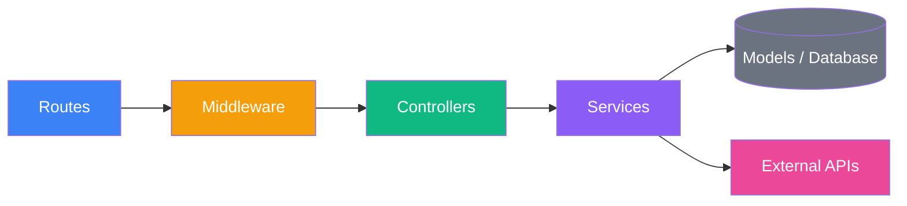
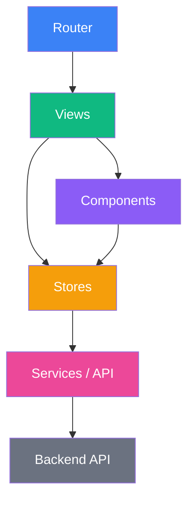
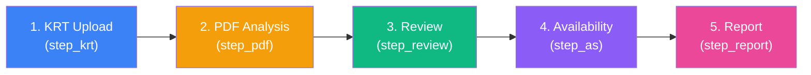
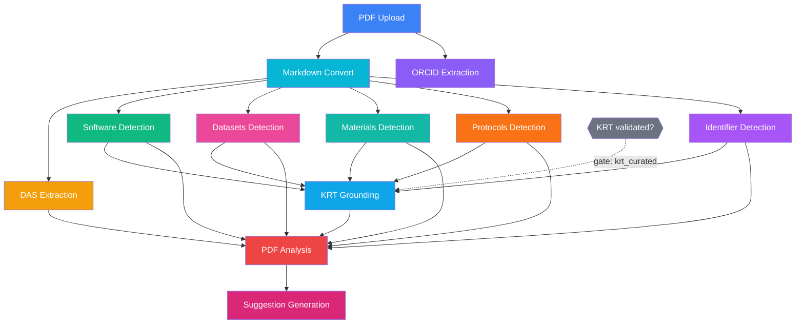

# Architecture Overview

ASAP KR-Sync is a full-stack web application for managing Key Resources Tables (KRT) in academic manuscript submissions. It follows a monorepo structure with a Node.js/Express backend and a Vue 3 frontend.

## Technology Stack

| Layer | Technology |
|-------|-----------|
| **Runtime** | Node.js 20+ |
| **Backend Framework** | Express.js |
| **Frontend Framework** | Vue 3 (Composition API, `<script setup>`) |
| **Build Tool** | Vite |
| **State Management** | Pinia |
| **Database** | PostgreSQL + Sequelize ORM |
| **Job Queue** | pg-boss (PostgreSQL-based) |
| **File Storage** | AWS S3 (or MinIO for local dev) |
| **Authentication** | JWT (local) + Auth0 (OAuth2/OIDC) |
| **Styling** | Tailwind CSS |
| **Logging** | Winston |
| **Containerization** | Docker (multi-stage build) |

## Project Structure

```
asap-kr-sync/
├── conf/                          # Static configuration (rate-limits.json)
├── deploy/                        # Deployment files (systemd, entrypoint)
├── docs/                          # Documentation (this folder)
├── migrations/                    # Sequelize database migrations
├── scripts/                       # Utility scripts (init-db, generate-demo-data, benchmark, etc.)
├── seeders/                       # Database seed data
├── src/
│   ├── backend/
│   │   ├── config/                # Environment-based configuration modules
│   │   ├── controllers/           # Route handlers (request → response)
│   │   ├── data/                  # prompts/ (public, version-controlled .txt) + demo-findings/ (gitignored)
│   │   ├── middleware/            # Express middleware (auth, validation, CSRF, rate-limit, etc.)
│   │   ├── models/                # Sequelize model definitions
│   │   ├── routes/                # Express route definitions
│   │   ├── services/              # Business logic layer
│   │   │   ├── auth/              # Authentication (JWT, Auth0, refresh-token rotation)
│   │   │   ├── datasets/          # Datasets detection (langextract + Google Gemini)
│   │   │   ├── identifier-detection/  # Curated-list identifier scanner (DOIs, RRIDs, accessions, catalogs)
│   │   │   │                          # + list-free published-protocol venue sweep
│   │   │   ├── krt/               # KRT parsing, validation, identifiers, author-KRT seeding (shared by protocols/materials/datasets)
│   │   │   ├── krt-grounding/     # Author KRT ↔ manuscript reconciliation (deterministic + LM second look)
│   │   │   ├── materials/         # Materials detection (Google Gemini, cue-driven)
│   │   │   ├── orcid/             # ORCID extraction (GROBID, OpenAlex, ORCID API)
│   │   │   ├── pdf/               # PDF processing, DAS extraction, markdown convert
│   │   │   ├── pdf-analysis/      # Generated KRT builder — rule-based merge then LM (Gemini) consolidation, rule-based fallback
│   │   │   ├── protocols/         # Protocols detection (Google Gemini; seeded or blind per pipeline)
│   │   │   ├── queue/             # Job queue (pg-boss), orchestrator, workers
│   │   │   ├── reports/           # Excel report generation
│   │   │   ├── software/          # Software detection (Softcite + optional LM pass)
│   │   │   ├── storage/           # S3 file operations
│   │   │   ├── suggestion/        # AI Suggestions — LM (Gemini) author-KRT vs Generated-KRT comparison (suggestion_generation job)
│   │   │   ├── enrichment-list.service.js  # Single shared service backing the four curated lists
│   │   │   └── config.service.js  # Dynamic config (teams, resource types, validation rules) from DB
│   │   └── utils/                 # Shared utilities (logger, errors, helpers, validators)
│   └── frontend/
│       └── src/
│           ├── assets/            # Static assets, demo data, styles
│           ├── components/        # Reusable Vue components
│           │   ├── common/        # Generic UI components
│           │   ├── krt/           # KRT editor components
│           │   ├── layout/        # App layout (header, sidebar)
│           │   └── submission/    # Submission workflow components
│           ├── composables/       # Vue composables (useJobPoller, etc.)
│           ├── router/            # Vue Router configuration
│           ├── services/          # API client services (Axios)
│           ├── stores/            # Pinia state management
│           └── views/             # Page-level components
│               ├── admin/         # Admin pages (users, teams, config, enrichment lists)
│               ├── auth/          # Login, register
│               ├── dashboard/     # Submission list
│               ├── profile/       # User profile
│               └── submissions/   # Submission workflow steps
├── .env.example                   # Environment variable template
├── docker-compose.yml             # Local development services
├── Dockerfile                     # Production container build
└── package.json                   # Root workspace configuration
```

## Backend Architecture

The backend follows a layered architecture:


```mermaid
flowchart LR
    R[Routes] --> M[Middleware]
    M --> C[Controllers]
    C --> S[Services]
    S --> DB[(Models / Database)]
    S --> API[External APIs]

    style R fill:#3b82f6,color:#fff
    style M fill:#f59e0b,color:#fff
    style C fill:#10b981,color:#fff
    style S fill:#8b5cf6,color:#fff
    style DB fill:#6b7280,color:#fff
    style API fill:#ec4899,color:#fff
```

- **Routes** define HTTP endpoints and attach middleware
- **Middleware** handles cross-cutting concerns (auth, validation, rate limiting)
- **Controllers** handle request/response parsing and delegate to services
- **Services** contain business logic and orchestrate data operations
- **Models** define database schema and relationships via Sequelize

### Testing a multi-step write

Every controller that writes more than one row wraps the work in a transaction,
and the failure modes live in the **order** of commit, rollback and whatever
runs after them — not in the SQL. `test-helpers/fake-transaction.js` provides:

- `fakeTransaction(t)` — patches `sequelize.transaction()` and records the
  commit/rollback sequence. It supports both shapes the codebase uses (managed,
  `transaction(async (t) => …)`; and unmanaged, `const t = await transaction()`),
  and it **rejects a double finish exactly as Sequelize does**.
- `callController(handler, req)` — runs a handler and resolves with whichever of
  `res`/`next` it reached, with a timeout, so "the handler neither responded nor
  called next()" fails the test instead of hanging it.

That last property is not decoration. The bug it exists for: `mergeRows`
committed, then ran a non-critical re-validation that threw, and the catch
called `rollback()` on a committed transaction. Sequelize rejected, the
rejection escaped before `next(error)` ran, Express 4 does not forward an async
rejection — and a merge that had **succeeded** left the client waiting forever.

A fake that shrugs at a double finish would let that regression straight back
in. This one did, at first, and a mutation test found the fake at fault rather
than the code — which is the argument for mutation-checking a harness as well as
the thing it tests.

## Frontend Architecture

The frontend is a Single-Page Application (SPA):


```mermaid
flowchart TD
    Router --> Views
    Views --> Components
    Views --> Stores
    Components --> Stores
    Stores --> Services[Services / API]
    Services --> Backend[Backend API]

    style Router fill:#3b82f6,color:#fff
    style Views fill:#10b981,color:#fff
    style Components fill:#8b5cf6,color:#fff
    style Stores fill:#f59e0b,color:#fff
    style Services fill:#ec4899,color:#fff
    style Backend fill:#6b7280,color:#fff
```

- **Router** handles navigation with auth guards and lazy-loaded routes
- **Views** are page-level components mapped to routes
- **Components** are reusable UI building blocks
- **Stores** (Pinia) manage shared application state
- **Services** wrap Axios calls to the backend API

## Submission Workflow

The application guides users through a 5-step workflow:


```mermaid
flowchart LR
    S1["1. KRT Upload\n(step_krt)"] --> S2["2. PDF Analysis\n(step_pdf)"]
    S2 --> S3["3. Review\n(step_review)"]
    S3 --> S4["4. Availability\n(step_as)"]
    S4 --> S5["5. Report\n(step_report)"]

    style S1 fill:#3b82f6,color:#fff
    style S2 fill:#f59e0b,color:#fff
    style S3 fill:#10b981,color:#fff
    style S4 fill:#8b5cf6,color:#fff
    style S5 fill:#ec4899,color:#fff
```

Each step has a corresponding status, view, and set of operations. Users can navigate back to previous steps and start new rounds (revisions) of the process. See [Submission Workflow](./submission-workflow.md) for the full detail of every step, user action, and transition path.

## Background Job Pipeline

PDF upload triggers parallel background jobs via pg-boss. The pipeline separates
two jobs that used to be fused:

- **Discovery** — five detectors answer *what resources does this manuscript
  describe?* Under the default `seeded-v1` pipeline they are seeded with the
  author's rows; under `blind-v1` they never see the table.
- **Grounding** — `krt_grounding` then answers *for each row the author wrote,
  is it in the PDF, and does their row carry everything the PDF says about it?*

Keeping them apart is what makes both answerable. A detector shown the author's
KRT can only confirm it, and its recall becomes unmeasurable.


```mermaid
graph TD
    PDF[PDF Upload] --> MD[Markdown Convert]
    PDF --> ORCID[ORCID Extraction]
    MD --> DAS[DAS Extraction]
    MD --> SW[Software Detection]
    MD --> DS[Datasets Detection]
    MD --> MAT[Materials Detection]
    MD --> PROT[Protocols Detection]
    MD --> ID[Identifier Detection]
    SW --> KG[KRT Grounding]
    DS --> KG
    MAT --> KG
    PROT --> KG
    ID --> KG
    KRTV{{KRT validated?}} -.->|gate: krt_curated| KG
    DAS --> PA[PDF Analysis]
    SW --> PA
    DS --> PA
    MAT --> PA
    PROT --> PA
    ID --> PA
    KG --> PA
    PA --> SG[Suggestion Generation]

    style PDF fill:#3b82f6,color:#fff
    style DAS fill:#f59e0b,color:#fff
    style SW fill:#10b981,color:#fff
    style ORCID fill:#8b5cf6,color:#fff
    style MD fill:#06b6d4,color:#fff
    style DS fill:#ec4899,color:#fff
    style MAT fill:#14b8a6,color:#fff
    style PROT fill:#f97316,color:#fff
    style ID fill:#a855f7,color:#fff
    style KG fill:#0ea5e9,color:#fff
    style PA fill:#ef4444,color:#fff
    style SG fill:#db2777,color:#fff
    style KRTV fill:#6b7280,color:#fff
```

**The `krt_curated` gate covers the whole detection stage** — all five detectors
and KRT Grounding. Under the default pipeline the detection prompts carry the
author's rows, so nothing that reads the table may start while it is still being
edited. The jobs hold in `waiting` until the submission moves past `step_krt`,
then advance by themselves; `pdf_analysis` and `suggestion_generation` inherit
the gate through their dependencies.

**Software Detection depends on Markdown Convert** even though Softcite reads the
PDF: the module's optional LM pass reads the converted markdown, and without the
dependency it would race conversion and skip on most runs.

ORCID Extraction is intentionally **not** a contributor to PDF Analysis — its
output lives on `submission.authors`, not in the Generated KRT. PDF Analysis
auto-advances when DAS was detected; if DAS extraction fails, the job parks at
`pending_input` until the user supplies a DAS manually and clicks Advance.
**Suggestion Generation** runs last; it is LM-only, so with no LM configured no
suggestions are produced.

**Both modes, one pipeline.** With no author KRT, grounding still runs and
reports zero author rows with every candidate unmatched (`meta.mode: 'no_krt'`).
Nothing about the pipeline shape changes — the Generated KRT is then pure
discovery.

See [Background Jobs](./background-jobs.md) for details.

## User Roles

| Role | Access |
|------|--------|
| `author` | Own submissions only |
| `asap_pm` | Submissions from assigned teams |
| `ds_annotator` | All submissions, user/team management |
| `admin` | Full system access |

See [Authentication](./authentication.md) for details.
