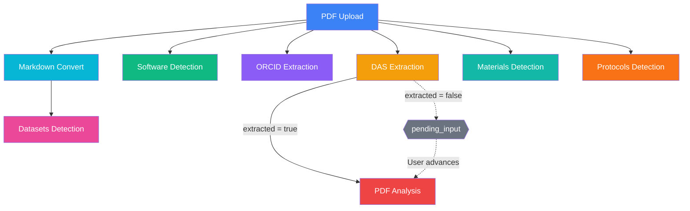
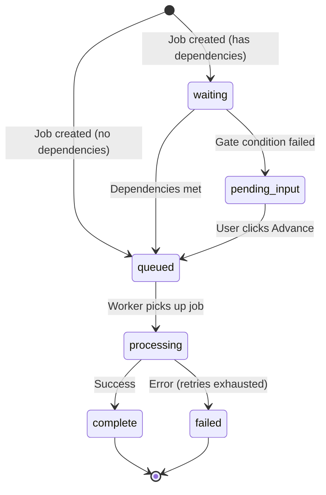

# Background Jobs

The application uses **pg-boss** (PostgreSQL-based job queue) for asynchronous background processing. Jobs are tracked in the `submission_jobs` table, and an orchestrator manages dependencies between jobs. The frontend polls for status updates with exponential backoff.

## Queue Configuration

pg-boss runs in a dedicated `pgboss` schema, separate from application tables.

| Setting | Value |
|---------|-------|
| Archive completed jobs | 24 hours |
| Delete archived jobs | 7 days |
| Monitor state interval | 30 seconds |
| Maintenance interval | 120 seconds |
| Graceful shutdown timeout | 30 seconds |

## Queues and Job Types

| Queue Name | Job Type Constant | Purpose |
|------------|-------------------|---------|
| `das-extraction` | `DAS_EXTRACTION` | Extract Data Availability Statement from PDF |
| `pdf-analysis` | `PDF_ANALYSIS` | Analyze PDF for resources using LM API |
| `software-detection` | `SOFTWARE_DETECTION` | Detect software mentions via Softcite |
| `orcid-extraction` | `ORCID_EXTRACTION` | Extract author ORCIDs via GROBID + OpenAlex |
| `markdown-convert` | `MARKDOWN_CONVERT` | Convert PDF to Markdown (MarkItDown or Modal/Docling) |
| `datasets-detection` | `DATASETS_DETECTION` | Detect dataset mentions (langextract + Gemini two-pass) |
| `materials-detection` | `MATERIALS_DETECTION` | Detect lab material mentions via Google Gemini |
| `protocols-detection` | `PROTOCOLS_DETECTION` | Detect protocol mentions via Google Gemini |
| `report-generation` | `REPORT_GENERATION` | Generate Excel or Google Sheets reports |
| `email-notification` | — | Email sending (defined but no worker yet) |

### Timeout and Retry Configuration

Each queue derives its timeout from the corresponding API timeout environment variable:

| Queue | Env Var for Timeout | Default Timeout | Retry Limit | Retry Delay |
|-------|---------------------|-----------------|-------------|-------------|
| DAS Extraction | `PDF_DAS_EXTRACTOR_API_TIMEOUT` | 300s (5 min) | 2 | 60s |
| PDF Analysis | `PDF_ANALYSIS_API_TIMEOUT` | 300s (5 min) | 2 | 60s |
| Software Detection | `SOFTCITE_API_TIMEOUT` | 600s (10 min) | 2 | 60s |
| ORCID Extraction | `GROBID_API_TIMEOUT` | 30s | 2 | 30s |
| Markdown Convert | `PDF_MARKDOWN_TIMEOUT` | 120s (2 min) | 2 | 30s |
| Datasets Detection | `DATASETS_DETECTION_API_TIMEOUT` | 300s (5 min) | 2 | 60s |
| Materials Detection | `MATERIALS_DETECTION_API_TIMEOUT` | 300s (5 min) | 2 | 60s |
| Protocols Detection | `PROTOCOLS_DETECTION_API_TIMEOUT` | 300s (5 min) | 2 | 60s |
| Report Generation | — (fixed) | 300s (5 min) | 2 | 60s |

**Job expiry formula:**
```
expireInSeconds = max(120, ceil(apiTimeoutMs / 1000) + 60)
```

**Maximum total duration** (all retries + delays):
```
maxTotalSeconds = expireInSeconds × (retryLimit + 1) + retryDelay × retryLimit
```

### Worker Concurrency

| Job Type | Concurrency |
|----------|-------------|
| PDF Analysis | 1 |
| DAS Extraction | 2 |
| Software Detection | 1 |
| ORCID Extraction | 2 |
| Markdown Convert | 2 |
| Datasets Detection | 1 |
| Materials Detection | 1 |
| Protocols Detection | 1 |
| Report Generation | 2 |

## Pipeline

PDF upload triggers a pipeline of parallel and dependent jobs:



### Pipeline Definition

| Job Type | Depends On | Auto-Advance Condition |
|----------|-----------|------------------------|
| DAS Extraction | (none) | Always |
| Software Detection | (none) | Always |
| ORCID Extraction | (none) | Always |
| Markdown Convert | (none) | Always |
| Datasets Detection | Markdown Convert | Always (falls back gracefully if markdown unavailable) |
| Materials Detection | (none) | Always |
| Protocols Detection | (none) | Always |
| PDF Analysis | DAS Extraction | Only if DAS extraction `result.extracted === true` |

### Pipeline Rules

- Jobs with no dependencies start immediately with status `queued`
- Jobs with dependencies start as `waiting` until all dependencies reach a terminal state (`complete` or `failed`)
- After any job completes or fails, the orchestrator checks dependent jobs
- If a conditional gate fails (e.g., DAS not extracted), the dependent job moves to `pending_input` instead of `queued`

## Job Statuses

| Status | Meaning | Transitions To |
|--------|---------|----------------|
| `waiting` | Waiting for dependencies to complete | `queued` or `pending_input` |
| `pending_input` | Waiting for user action (gate condition failed) | `queued` (manual advance) |
| `queued` | Added to pg-boss queue, waiting for worker | `processing` |
| `processing` | Worker is actively processing | `complete` or `failed` |
| `complete` | Finished successfully | (terminal) |
| `failed` | Failed after all retries exhausted | (terminal) |

### Typical Lifecycle



**Happy path:** `waiting → queued → processing → complete → [pipeline advances dependent jobs]`

**Conditional gate (e.g., PDF Analysis when DAS not extracted):** `waiting → pending_input → [user clicks Advance] → queued → processing → complete`

## Job Data Payloads

Data passed to workers when a job starts:

| Job Type | Data Fields |
|----------|-------------|
| DAS Extraction | `submissionId`, `submissionJobId` |
| Software Detection | `submissionId`, `submissionJobId` |
| ORCID Extraction | `submissionId`, `submissionJobId` |
| Markdown Convert | `submissionId`, `submissionJobId` |
| Datasets Detection | `submissionId`, `submissionJobId` |
| Materials Detection | `submissionId`, `submissionJobId` |
| Protocols Detection | `submissionId`, `submissionJobId` |
| PDF Analysis | `submissionId`, `submissionJobId`, `analysisId`, `userId` |
| Report Generation | `submissionId`, `submissionJobId`, `type`, `userId` |

## Result Summaries

Each job stores a lightweight result summary on completion:

| Job Type | Result Shape |
|----------|-------------|
| DAS Extraction | `{ extracted, das }` |
| PDF Analysis | `{ analysisId, findingsCount }` |
| Software Detection | `{ detected, uniqueCount, enrichedCount, suggestionsCount }` |
| ORCID Extraction | `{ authorCount, orcidCount, doi }` |
| Markdown Convert | `{ converted, markdownLength, provider, fileId }` |
| Datasets Detection | `{ detected, totalCount, uniqueCount, highRelevanceCount, suggestionsCount }` |
| Materials Detection | `{ detected, totalCount, uniqueCount, highRelevanceCount, suggestionsCount }` |
| Protocols Detection | `{ detected, totalCount, uniqueCount, highRelevanceCount, suggestionsCount }` |
| Report Generation | `{ reportId }` |

## API Endpoints

### `GET /api/submissions/:id/jobs`

Returns all jobs for the submission's current round. Each job includes status, result, error message, retry count, timing, and configuration (expiry, retry limit, max total seconds).

### `POST /api/submissions/:id/processes/run`

Starts (or re-runs) all pipeline processes for a submission. Creates `SubmissionJob` records and enqueues independent jobs.

### `POST /api/submissions/:id/jobs/:jobType/advance`

Manually advances a `pending_input` job to `queued`. Only works for jobs in `pending_input` status.

## Job Logging & Raw Response Caching

Each background job uses a **JobLogger** that captures structured logs and raw API responses:

### Structured Logs (`SubmissionJob.logs` JSONB)

Array of log entries persisted in PostgreSQL:

```json
[
  { "ts": "2026-04-07T12:00:00Z", "step": "download_pdf", "message": "Downloading PDF from S3", "data": { "fileName": "manuscript.pdf" } },
  { "ts": "2026-04-07T12:00:45Z", "step": "extract_signals_done", "message": "Signal extraction complete", "data": { "totalExtractions": 49, "durationMs": 45844 } }
]
```

### Raw API Responses (`SubmissionJob.rawResponses` JSONB → S3)

Large API responses are uploaded to S3 and referenced by S3 key:

```json
{
  "langextract-signals": "{manuscriptId}/round-1/jobs/datasets_detection/langextract-signals.json",
  "gemini-consolidation": "{manuscriptId}/round-1/jobs/datasets_detection/gemini-consolidation.json"
}
```

### S3 Structure

All files for a submission are organized by manuscript ID and round:

```
{bucketPrefix}{manuscriptId}/round-{n}/
  ├── krt/              KRT files
  ├── pdf/              Working PDF
  ├── pdf_original/     Original uploaded PDF
  ├── supplemental/     Supplemental methods files
  ├── supplemental_pdf/ PDF version of supplemental
  ├── markdown/         PDF-to-Markdown conversions
  ├── reports/          Generated reports
  └── jobs/             Process logs & raw responses
      ├── {jobType}/
      │   ├── logs.json
      │   └── {response-name}.json
      └── ...
```

### API

`GET /api/submissions/:id/jobs/:jobType/responses/:responseName` — returns a presigned S3 download URL for a raw response file.

### UI

- **Job popup**: "View logs" link opens a modal with the structured log timeline
- **Show more modal**: Logs tab with timestamps, steps, messages, and expandable data
- **Raw responses**: Download links visible to admin/ds_annotator roles

## Frontend Polling

The `useJobPoller` composable polls job status with exponential backoff:

| Parameter | Value |
|-----------|-------|
| Initial interval | 3 seconds |
| Max interval | 30 seconds |
| Backoff factor | 1.5× per poll |
| Max poll duration | 20 minutes |

**Behavior:**
- Fetches jobs on mount
- Continues polling while any job is in a running state (`waiting`, `queued`, `processing`)
- Stops polling when all jobs reach terminal states
- `refresh()` resets the backoff to poll quickly again

**Event callbacks** (fire only on observed status transitions, not on first fetch):
- `onJobComplete(type, callback)` — when a job transitions to `complete`
- `onJobFailed(type, callback)` — when a job transitions to `failed`
- `onJobPendingInput(type, callback)` — when a job transitions to `pending_input`

## Key Files

| File | Purpose |
|------|---------|
| `src/backend/services/queue/job-queue.service.js` | pg-boss setup, queue config, handler registration |
| `src/backend/services/queue/orchestrator.service.js` | Pipeline definition, dependency checking, job advancement |
| `src/backend/services/queue/workers.js` | Worker handlers for all job types |
| `src/backend/services/queue/job-logger.service.js` | Structured logging and raw response caching for jobs |
| `src/backend/models/SubmissionJob.js` | Job model with status tracking, logs, and raw responses |
| `src/backend/controllers/jobs.controller.js` | API endpoints for job management |
| `src/frontend/src/composables/useJobPoller.js` | Frontend polling with backoff |
| `src/frontend/src/components/submission/JobStatusPanel.vue` | Job status display in UI |
