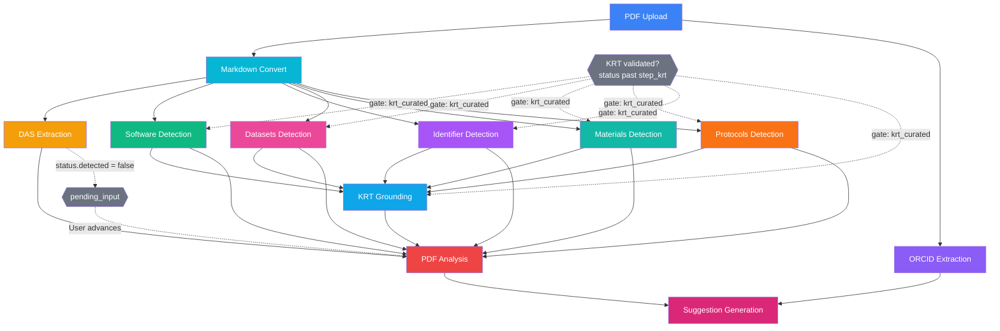
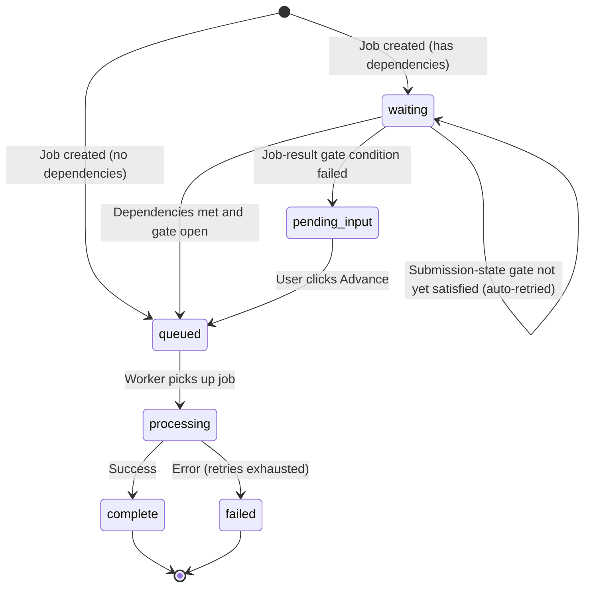

# Background Jobs

The application uses **pg-boss** (PostgreSQL-based job queue) for asynchronous background processing. Jobs are tracked in the `submission_jobs` table, and an orchestrator manages dependencies between jobs. The frontend polls for status updates with exponential backoff.

> This document covers the **queue & orchestration layer** (how jobs are scheduled, sequenced, retried, and polled).
> For what each module *does and how it works internally*, see [background-modules.md](./background-modules.md).

## Queue Configuration

pg-boss runs in a dedicated `pgboss` schema, separate from application tables.

| Setting | Value |
|---------|-------|
| Archive completed jobs | 24 hours |
| Delete archived jobs | 7 days |
| Monitor state interval | 30 seconds |
| Maintenance interval | 120 seconds |
| Graceful shutdown timeout | 30 seconds |

## Queues and Job Types

| Queue Name | Job Type Constant | Purpose |
|------------|-------------------|---------|
| `das-extraction` | `DAS_EXTRACTION` | Extract Data Availability Statement from PDF |
| `software-detection` | `SOFTWARE_DETECTION` | Detect software mentions via Softcite |
| `orcid-extraction` | `ORCID_EXTRACTION` | Extract author ORCIDs via GROBID + OpenAlex |
| `markdown-convert` | `MARKDOWN_CONVERT` | Convert PDF to Markdown (MarkItDown subprocess or Modal/Docling) |
| `datasets-detection` | `DATASETS_DETECTION` | Detect dataset mentions (langextract signals + Gemini consolidation) |
| `materials-detection` | `MATERIALS_DETECTION` | Detect lab material mentions via Google Gemini |
| `protocols-detection` | `PROTOCOLS_DETECTION` | Detect protocol mentions via Google Gemini |
| `identifier-detection` | `IDENTIFIER_DETECTION` | Scan markdown against curated enrichment lists for DOIs/RRIDs/accessions/catalogs (no external API) |
| `pdf-analysis` | `PDF_ANALYSIS` | Build the Generated KRT — LM-consolidate (Gemini) the merged detection candidates, with a rule-based merge fallback |
| `suggestion-generation` | `SUGGESTION_GENERATION` | AI Suggestions — Gemini compares author KRT vs Generated KRT and emits per-resource decisions (LM-only, no fallback) |
| `report-generation` | `REPORT_GENERATION` | Generate Excel reports (ad-hoc, not part of the PDF pipeline) |

### Timeout and Retry Configuration

Each queue derives its timeout from the corresponding API timeout environment variable:

| Queue | Env Var for Timeout | Default Timeout | Retry Limit | Retry Delay |
|-------|---------------------|-----------------|-------------|-------------|
| DAS Extraction | `DAS_EXTRACTION_API_TIMEOUT` | 120s (2 min) | 2 | 60s |
| Software Detection | `SOFTCITE_API_TIMEOUT` | 600s (10 min) | 2 | 60s |
| ORCID Extraction | `GROBID_API_TIMEOUT` | 30s | 2 | 30s |
| Markdown Convert | `PDF_MARKDOWN_TIMEOUT` | 120s (2 min) | 2 | 30s |
| Datasets Detection | `DATASETS_DETECTION_API_TIMEOUT` | 300s (5 min) | 2 | 60s |
| Materials Detection | `MATERIALS_DETECTION_API_TIMEOUT` | 300s (5 min) | 2 | 60s |
| Protocols Detection | `PROTOCOLS_DETECTION_API_TIMEOUT` | 300s (5 min) | 2 | 60s |
| Identifier Detection | — (fixed) | 60s | 1 | 30s |
| PDF Analysis | `KRT_GENERATION_API_TIMEOUT` | 300s (5 min) | 2 | 60s |
| Suggestion Generation | `KRT_COMPARISON_API_TIMEOUT` | 300s (5 min) | 2 | 60s |
| Report Generation | — (fixed) | 300s (5 min) | 2 | 60s |

**Job expiry formula:**
```
expireInSeconds = max(120, ceil(apiTimeoutMs / 1000) + 60)
```

**Maximum total duration** (all retries + delays):
```
maxTotalSeconds = expireInSeconds × (retryLimit + 1) + retryDelay × retryLimit
```

### Worker Concurrency

How many jobs of that type run **at the same time**, across all submissions. A
job for one submission never runs beside another job of the same type for the
*same* submission — the orchestrator queues one row per step per round — so this
is throughput across the queue, not parallelism within a pipeline.

| Job Type | Concurrency |
|----------|-------------|
| Markdown Convert | 2 |
| DAS Extraction | 2 |
| Software Detection | 1 |
| Datasets Detection | 1 |
| Materials Detection | 2 |
| Protocols Detection | 1 |
| Identifier Detection | 2 |
| KRT Grounding | 2 |
| ORCID Extraction | 2 |
| PDF Analysis | 1 |
| Suggestion Generation | 1 |
| DAS Suggestions | 1 |
| Report Generation | 2 |

`concurrency` is this codebase's name for a **pair** of pg-boss settings, and it
has to set both: `teamSize` (how many jobs are fetched) and `teamConcurrency`
(how many of them run at once). `teamConcurrency` was pinned at 1, so every
worker above declaring 2 fetched two jobs and then ran them one after the other
— a setting that read as if it did something and did nothing. Translated in one
place, `buildWorkerOptions`, and pinned by `worker-options.test.js`.

## Pipeline

PDF upload triggers a pipeline of parallel and dependent jobs:


```mermaid
graph TD
    PDF[PDF Upload] --> MD[Markdown Convert]
    PDF --> ORCID[ORCID Extraction]

    MD --> DAS[DAS Extraction]
    MD --> SW[Software Detection]
    MD --> ID[Identifier Detection]
    MD --> DS[Datasets Detection]
    MD --> MAT[Materials Detection]
    MD --> PROT[Protocols Detection]

    SW --> KG[KRT Grounding]
    DS --> KG
    MAT --> KG
    PROT --> KG
    ID --> KG

    KRTV{{KRT validated?<br/>status past step_krt}}
    KRTV -.->|gate: krt_curated| SW
    KRTV -.->|gate: krt_curated| DS
    KRTV -.->|gate: krt_curated| MAT
    KRTV -.->|gate: krt_curated| PROT
    KRTV -.->|gate: krt_curated| ID
    KRTV -.->|gate: krt_curated| KG

    DAS --> PA[PDF Analysis]
    SW --> PA
    DS --> PA
    MAT --> PA
    PROT --> PA
    ID --> PA
    KG --> PA

    PA --> SG[Suggestion Generation]
    ORCID --> SG

    DAS -.->|status.detected = false| PI{{pending_input}}
    PI -.->|User advances| PA

    style PDF fill:#3b82f6,color:#fff
    style DAS fill:#f59e0b,color:#fff
    style SW fill:#10b981,color:#fff
    style ORCID fill:#8b5cf6,color:#fff
    style MD fill:#06b6d4,color:#fff
    style DS fill:#ec4899,color:#fff
    style MAT fill:#14b8a6,color:#fff
    style PROT fill:#f97316,color:#fff
    style ID fill:#a855f7,color:#fff
    style KG fill:#0ea5e9,color:#fff
    style PA fill:#ef4444,color:#fff
    style SG fill:#db2777,color:#fff
    style PI fill:#6b7280,color:#fff
    style KRTV fill:#6b7280,color:#fff
```

**The KRT-validation gate covers the whole detection stage.** Datasets, Materials,
Protocols, Software and Identifier detection are all gated on `krt_curated`, as is
KRT Grounding. Under the default `seeded-v1` pipeline the detection prompts are
given the author's rows, so a detector that ran while the table was still being
edited would answer a question about a KRT that no longer exists — and spend an LM
call doing it. Software and Identifier detection read no KRT themselves, but are
gated with the rest so the stage starts as one moment rather than trickling in
around the KRT step.

**Nothing reads the manuscript when there is no manuscript.** A second gate,
`markdown_ready`, holds every markdown-dependent step — DAS extraction, the five
detectors and KRT Grounding — while `markdown_convert` has completed with
`markdownLength: 0`, **or has failed or been cancelled**. The failed case used
to slip through: the gate only inspected `complete` rows, while the dependency
check counts `failed` as terminal, so an outright converter failure released
every detector to read a manuscript that does not exist — by the one route that
skipped the gate meant to prevent exactly that. Conversion is fail-soft, so a converter error or an empty
response still completes the job; before this gate existed, every downstream
module ran against an empty document and reported zero findings, which reads as
*"your manuscript mentions none of this"* rather than *"we never read your
manuscript"*. Observed on a real run: 11/11 steps complete, 0 datasets, 0
materials, 0 protocols, and all 12 author rows reported not detected.

Unlike the KRT gate this one does **not** clear by itself — conversion has
already finished, unsuccessfully. The jobs API reports
`waitingReason: 'markdown_missing'` and the processes panel shows a blocked
banner where the progress bar would be, naming the re-run that fixes it.
Re-running `markdown_convert` successfully releases every held step
automatically.

Until the submission status moves past `draft`/`step_krt` those jobs stay in
`waiting` and the jobs API reports `waitingReason: 'krt_validation'`, which the
processes panel surfaces as a banner telling the user to click **Continue**. Unlike
the DAS `pending_input` gate this needs **no manual action beyond finishing the KRT
step** — the jobs advance by themselves once the status changes. The gate is on
submission *state*, not on the presence of a KRT: with no author KRT at all the
submission passes it as soon as the author moves on, and grounding still runs and
reports zero author rows, so the pipeline shape is identical in both modes.

**Software Detection depends on Markdown Convert** even though Softcite reads the
PDF directly: the module's second engine — the optional LM pass — reads the
converted markdown, and without the dependency it would race conversion and skip
on nearly every run. This costs nothing end-to-end, because no downstream step
consumes software output before KRT Grounding, which waits for the
markdown-dependent detectors anyway.

ORCID Extraction is intentionally **not** an input to PDF Analysis — its output writes to `submission.authors`, not the Generated KRT. **PDF Analysis** depends on KRT Grounding even though it does not read the grounding outcomes itself: **Suggestion Generation** does, and it reaches the grounding results only through PDF Analysis. Ordering it this way is what guarantees the verdicts exist when suggestions are built, and it is how PDF Analysis inherits the `krt_curated` gate.

### Pipeline Definition

| Job Type | Depends On | Submission-State Gate | Auto-Advance Condition |
|----------|-----------|-----------------------|------------------------|
| Markdown Convert | (none) | — | Always |
| ORCID Extraction | (none) | — | Always |
| DAS Extraction | Markdown Convert | `markdown_ready` | Always |
| Software Detection | Markdown Convert | `markdown_ready`, `krt_curated` | Always (Softcite reads the PDF; the LM pass reads the markdown) |
| Identifier Detection | Markdown Convert | `markdown_ready`, `krt_curated` | Always |
| Datasets Detection | Markdown Convert | `markdown_ready`, `krt_curated` | Always |
| Materials Detection | Markdown Convert | `markdown_ready`, `krt_curated` | Always |
| Protocols Detection | Markdown Convert | `markdown_ready`, `krt_curated` | Always |
| KRT Grounding | Software + Datasets + Materials + Protocols + Identifier Detection | `markdown_ready`, `krt_curated` | Always |
| PDF Analysis | DAS + Software + Datasets + Materials + Protocols + Identifier Detection + KRT Grounding | — (inherited transitively) | Only if DAS extraction `result.status.detected === true` |
| Suggestion Generation | PDF Analysis | — (inherited transitively) | Always (runs last in the pipeline) |

### Pipeline Rules

- Jobs with no dependencies and no gate start immediately with status `queued`
- Jobs with dependencies start as `waiting` until all dependencies reach a terminal state (`complete` or `failed`)
### What Cancel does, and deliberately does not do

**A module already talking to an external API is never interrupted.** It
finishes its call and records its real result; the pipeline stops there.

| state when Cancel lands | what happens |
|---|---|
| `processing` | left alone. Its queue entry is **not** pulled, it completes normally, and its result is kept. |
| `waiting` / `queued` / `pending_input` | queue entry dropped, row marked `cancelled`. |
| `complete` / `failed` / `cancelled` | untouched — history, not backlog. |

Four properties make that safe, and each can break on its own, so each is
pinned in `controllers/cancel-lets-inflight-finish.test.js`:

1. the in-flight module keeps running — a Gemini call already paid for should
   produce a stored answer rather than be thrown away;
2. everything not yet started is `cancelled`;
3. when the in-flight module finishes, its result is recorded (it was never
   marked cancelled, so `markComplete`'s guard does not apply);
4. **its dependents still do not start** — `tryAdvanceStep` only ever starts a
   job that is `waiting`, and they are `cancelled`.

Two guards back that up. `markComplete` **reloads before deciding** and refuses
to resurrect a cancelled row: a worker that had already dequeued a job when the
cancel landed would otherwise complete it and restart the pipeline behind the
user. And `isRoundCancelled` — true if *any* job in the round is cancelled — is
read by the worker's error path, so a failure caused by the cancel is made
terminal immediately instead of being retried: pg-boss retries on a throw, and
retrying would restart the very external work the user asked to stop.

- **`failed` means pg-boss has given up, not "this attempt errored".** A worker
  whose attempt fails with retries left calls `markRetrying`, which keeps the row
  `processing` and records the error for display. Writing `failed` there strands
  the pipeline: the orchestrator treats a `failed` dependency as done, so a
  reconciler sweep landing in the retry backoff evaluated the dependent's gate
  against a result that was not there yet and parked it in `pending_input` —
  which nothing revisits, so the successful retry could not release it. Only a
  manual advance recovered it. Pinned by `models/SubmissionJob.test.js` and
  `orchestrator.service.test.js`.
- After any job completes or fails, the orchestrator checks dependent jobs
- **Conditional (job-result) gate** — if a job-result gate fails (e.g., DAS not extracted), the dependent job moves to `pending_input` and waits for the user to click **Advance**
- **Submission-state gate** — a job whose `gate` (e.g. `krt_curated`) is not yet satisfied stays in `waiting` (never `pending_input`). It needs no manual action: the status-change handler re-drives the pipeline on every submission transition, and the periodic reconciler re-checks gated jobs each sweep, so the job advances on its own once the gate opens

## Job Statuses

| Status | Meaning | Transitions To |
|--------|---------|----------------|
| `waiting` | Waiting for dependencies to complete, or for a submission-state gate (e.g. `krt_curated`) to open | `queued` or `pending_input` |
| `pending_input` | Waiting for user action (a job-result gate condition failed, e.g. DAS not detected) | `queued` (manual advance) |
| `queued` | Added to pg-boss queue, waiting for worker | `processing` |
| `processing` | Worker is actively processing, **including between retries** | `complete` or `failed` |
| `complete` | Finished successfully | (terminal) |
| `failed` | Failed after all retries exhausted | (terminal) |

### Typical Lifecycle


```mermaid
stateDiagram-v2
    [*] --> waiting : Job created (has dependencies)
    [*] --> queued : Job created (no dependencies)

    waiting --> queued : Dependencies met and gate open
    waiting --> waiting : Submission-state gate not yet satisfied (auto-retried)
    waiting --> pending_input : Job-result gate condition failed

    pending_input --> queued : User clicks Advance

    queued --> processing : Worker picks up job
    processing --> complete : Success
    processing --> failed : Error (retries exhausted)

    complete --> [*]
    failed --> [*]
```

**Happy path:** `waiting → queued → processing → complete → [pipeline advances dependent jobs]`

**Job-result gate (e.g., PDF Analysis when DAS not extracted):** `waiting → pending_input → [user clicks Advance] → queued → processing → complete`

**Submission-state gate (e.g., Datasets/Materials/Protocols before KRT validation):** `waiting → [author validates KRT — status leaves step_krt] → queued → processing → complete` (no manual advance; the orchestrator re-drives on the status change)

## Job Data Payloads

Data passed to workers when a job starts:

| Job Type | Data Fields |
|----------|-------------|
| DAS Extraction | `submissionId`, `submissionJobId` |
| Software Detection | `submissionId`, `submissionJobId` |
| ORCID Extraction | `submissionId`, `submissionJobId` |
| Markdown Convert | `submissionId`, `submissionJobId` |
| Datasets Detection | `submissionId`, `submissionJobId` |
| Materials Detection | `submissionId`, `submissionJobId` |
| Protocols Detection | `submissionId`, `submissionJobId` |
| Identifier Detection | `submissionId`, `submissionJobId` |
| PDF Analysis | `submissionId`, `submissionJobId`, `userId` |
| Suggestion Generation | `submissionId`, `submissionJobId`, `userId` |
| Report Generation | `submissionId`, `submissionJobId`, `type`, `userId` |

## Result Summaries

Each job stores a structured result blob on completion. Every entry has the same outer envelope (`status`, `service`, `counts`, `timing`, `data`, `files`) — the table below lists the **distinguishing** keys per job type.

### The shape is a contract, not a convention

Code that reads results generally does **not** know which module it has: the
Technical detail panel, the pipeline cards and the jobs API all walk every job
type through the same accessors. So two rules hold for every module, and a new
module has to follow them:

1. **What a run recorded about itself goes in `result.data.meta`.** Not beside
   `data`, not at the top level. Services that persist their own result write
   `job.result = { ...(job.result || {}), data: { ...result.data, meta: result.meta } }`
   — the helper returns `meta` at the top of its return value (the worker reads
   `result.meta.totalMs` from it for the timing block) and it is nested on the
   way into storage.
2. **Every module freezes what it was given**, via
   `runInputs.saveRunInputs(...)`, stored as the `inputs` artefact in
   `result.files`. That is what makes a run auditable after the documents behind
   it have changed — and the UI states it as a fact, so a module that stops
   doing it makes the UI lie.

Both are enforced by `services/queue/result-shape.test.js`, because both fail
**silently**: the DAS check stored its meta beside `data` for one commit, and
the only symptom was an empty Statistics column on its own page while every
other module looked fine. Nothing threw, nothing logged, and the tests passed. The `service` block is `{ config: {state, enabled, demoEnabled}, outcome: {state, source, failReason?, externalError?} }` for every job. The `files` map carries S3 keys for raw API responses captured by the job logger.

| Job Type | Distinguishing keys |
|----------|---------------------|
| DAS Extraction | `status.detected` (boolean — drives the PDF Analysis auto-advance gate); `data.das` (the extracted text); `files['das-extractor-response' \| 'demo-das']` |
| Software Detection | `counts: {total, unique, enriched}`; `data: {items, meta}`; `files['softcite-response' \| 'demo-software']` |
| ORCID Extraction | `counts: {authors, orcids}`; `data: {doi}`; `files['grobid-header', 'openalex-response']`. Items themselves go to `submission.authors`, not `data.items` |
| Markdown Convert | `data: {fileId, provider, markdownLength}`; `timing.totalMs`. The markdown text itself is uploaded to S3 as a File row of type `markdown` |
| Datasets Detection | `counts: {total, unique, highRelevance}`; `timing: {totalMs, apiMs, signalMs, enrichMs}`; `data: {items, meta}`; `files['langextract-signals', 'gemini-consolidation']` |
| Materials Detection | `counts: {total, unique, highRelevance}`; `data: {items, meta}`; `files['gemini-response']` |
| Protocols Detection | `counts: {total, unique, highRelevance}`; `data: {items, meta}`; `files` includes the raw Gemini response and the extracted JSON |
| Identifier Detection | `counts`; `timing: {totalMs, indexMs, scanMs}`; `data: {items, meta: {byRelevance: {HIGH, MEDIUM, LOW}, byCategory: {software, materials, datasets, protocols}}}`; `files['detection-results', 'identifier-scan']` |
| PDF Analysis | `counts: {resources, contributors, multiSource}`; `data: {items}` (the Generated KRT); `files['generated-krt']` |
| Suggestion Generation | `counts` per decision (`add`/`skip`/`update`/`remove`); `data: {suggestions}` — the **persisted** AI Suggestions list (not recomputed on read), each carrying its decision, reason, and contributing detection module(s) |
| DAS Suggestions | `counts: {total, unique}` (unique = rules needing action); `data: {suggestions, signals, meta: {model, dasLength, krtRowCount, total, applicable, totalMs}}`; `files['inputs', 'das-suggestions']` |
| Report Generation | `data: {reportId, fileUrl}` |

## API Endpoints

### `GET /api/submissions/:id/jobs`

Returns all jobs for the submission's current round. Each job includes status, result, error message, retry count, timing, and configuration (expiry, retry limit, max total seconds).

### `POST /api/submissions/:id/processes/run`

Starts (or re-runs) all pipeline processes for a submission. Creates `SubmissionJob` records and enqueues independent jobs.

### `POST /api/submissions/:id/jobs/:jobType/advance`

Manually advances a `pending_input` job to `queued`. Only works for jobs in `pending_input` status.

### Re-running one step — there is exactly one way

`orchestrator.requeueStep(submissionId, jobType, round, userId)`. It **reuses
the round's existing row** for that step and only enqueues when the step is
actually runnable (dependencies terminal, gates satisfied); otherwise it leaves
it `waiting` for the normal advancement to pick up.

Never insert a second `SubmissionJob` row for a type the pipeline already
created. `getForSubmission` keeps only the newest row per type, so a rival row
**hides** the pipeline's own: the advancement that should have followed lands on
the wrong row, and the real one sits in `waiting` for ever while the run reports
complete. That is what shipped a Generated KRT containing 98 author rows and
zero detections while datasets detection alone had found 96 items.

`markdown_convert` and `orcid_extraction` kept their own insert-a-row restarts
after `pdf_analysis` was converted, and disagreed with `requeueStep` about
in-flight work — a re-run requested while a conversion was running started a
second one against the same file. Both now go through `requeueStep` (after
`cascadeRestart`, which resets everything downstream of the step being re-run).
A re-run asked for while the step is in flight is deliberately a no-op, and the
endpoints say so rather than reporting "queued". Pinned by
`orchestrator.service.test.js`.

## Job Logging & Raw Response Caching

Each background job uses a **JobLogger** that captures structured logs and raw API responses:

### Structured Logs (`SubmissionJob.logs` JSONB)

Array of log entries persisted in PostgreSQL:

```json
[
  { "ts": "2026-04-07T12:00:00Z", "step": "download_pdf", "message": "Downloading PDF from S3", "data": { "fileName": "manuscript.pdf" } },
  { "ts": "2026-04-07T12:00:45Z", "step": "extract_signals_done", "message": "Signal extraction complete", "data": { "totalExtractions": 49, "durationMs": 45844 } }
]
```

### Raw API Responses (`SubmissionJob.result.files` → S3)

Large API responses are uploaded to S3 and referenced by S3 key on the job's `result.files` map (there is no separate `raw_responses` column):

```json
{
  "langextract-signals": "{manuscriptId}/round-1/jobs/datasets_detection/langextract-signals.json",
  "gemini-consolidation": "{manuscriptId}/round-1/jobs/datasets_detection/gemini-consolidation.json"
}
```

### S3 Structure

All files for a submission are organized by manuscript ID and round:

```
{bucketPrefix}{manuscriptId}/round-{n}/
  ├── krt/              KRT files
  ├── pdf/              Working PDF
  ├── pdf_original/     Original uploaded PDF
  ├── supplemental/     Supplemental methods files
  ├── supplemental_pdf/ PDF version of supplemental
  ├── markdown/         PDF-to-Markdown conversions
  ├── reports/          Generated reports
  └── jobs/             Process logs & raw responses
      ├── {jobType}/
      │   ├── logs.json
      │   └── {response-name}.json
      └── ...
```

### API

`GET /api/submissions/:id/jobs/:jobType/responses/:responseName` — returns a presigned S3 download URL for a raw response file.

### UI

- **Job popup**: "View logs" link opens a modal with the structured log timeline
- **Show more modal**: Logs tab with timestamps, steps, messages, and expandable data
- **Raw responses**: Download links visible to admin/ds_annotator roles

## Frontend Polling

The `useJobPoller` composable polls job status with exponential backoff:

| Parameter | Value |
|-----------|-------|
| Initial interval | 3 seconds |
| Max interval | 30 seconds |
| Backoff factor | 1.5× per poll |
| Max poll duration | 20 minutes |

**Behavior:**
- Fetches jobs on mount
- Continues polling while any job is in a running state (`waiting`, `queued`, `processing`)
- Stops polling when all jobs reach terminal states
- `refresh()` resets the backoff to poll quickly again

**Event callbacks** (fire only on observed status transitions, not on first fetch):
- `onJobComplete(type, callback)` — when a job transitions to `complete`
- `onJobFailed(type, callback)` — when a job transitions to `failed`
- `onJobPendingInput(type, callback)` — when a job transitions to `pending_input`

## Key Files

| File | Purpose |
|------|---------|
| `src/backend/services/queue/job-queue.service.js` | pg-boss setup, queue config, handler registration |
| `src/backend/services/queue/orchestrator.service.js` | Pipeline definition, dependency checking, job advancement |
| `src/backend/services/queue/workers.js` | Worker handlers for all job types |
| `src/backend/services/queue/job-logger.service.js` | Structured logging and raw response caching for jobs |
| `src/backend/models/SubmissionJob.js` | Job model with status tracking, logs, and raw responses |
| `src/backend/controllers/jobs.controller.js` | API endpoints for job management |
| `src/frontend/src/composables/useJobPoller.js` | Frontend polling with backoff |
| `src/frontend/src/components/submission/JobStatusPanel.vue` | Job status display in UI |


---

## Job administration (admin UI)

**Page:** `/admin/jobs` — "Processing Jobs" in the sidebar. **Admin role only.**

The pipeline is fail-soft by design: a job that cannot progress parks in `waiting` rather than erroring, and
pg-boss retries transient failures. That is correct for one submission and wrong in aggregate — over time the
queue accumulates work that can never produce anything, while still occupying worker slots and making the
per-submission panel look busy. This page names that backlog and lets an operator clear it.

Every job is annotated with a **staleness verdict**:

| Verdict | Meaning | Certainty |
|---|---|---|
| `orphaned` | The submission it belongs to no longer exists. | certain |
| `superseded` | A newer run of the same step exists for this submission + round. | certain |
| `stuck_waiting` | `waiting` for more than 6h — its dependencies are unlikely to complete. | heuristic |
| `stale_active` | `queued`/`processing` for more than 2h — the worker holding it probably died. | heuristic |

A **finished** job (`complete`/`failed`/`cancelled`) is history, not backlog, and is never flagged — unless its
submission is gone.

Two safety rules are enforced server-side, not just in the UI:

1. **A running job is never touched implicitly.** `processing` means a worker holds it right now, so it is
   excluded from selection and from every bulk action. Deleting one requires an explicit `?force=true`.
2. **Deleting a row also cancels its pg-boss entry.** Otherwise the queue entry survives, fires later, finds
   no `SubmissionJob`, and fails — turning a cleanup into a new source of noise.

`Cancel` is the non-destructive alternative: the record is kept for audit, the queue entry is dropped, and the
row moves to the terminal `cancelled` state so dependent steps stop waiting on it (see the cancellation
propagation rule in the orchestrator).

### API

| Method | Path | Purpose |
|---|---|---|
| `GET` | `/api/admin/jobs` | List jobs with staleness annotations (`status`, `jobType`, `submissionId`, `staleReason`, `limit`, `offset`) |
| `GET` | `/api/admin/jobs/meta` | Filter vocabulary + staleness thresholds, so the UI never hardcodes a drifting list |
| `POST` | `/api/admin/jobs/bulk-delete` | Delete a set of ids (`{ ids, force? }`) |
| `POST` | `/api/admin/jobs/cleanup` | Delete everything matching a `staleReason` (or `'any'`) — **re-classified at call time**, so a job that started running since the page loaded is skipped |
| `POST` | `/api/admin/jobs/:id/cancel` | Stop a job, keep the record |
| `DELETE` | `/api/admin/jobs/:id` | Delete one job (`?force=true` to include a running one) |

**Key files:** `services/queue/job-admin.service.js`, `controllers/job-admin.controller.js`,
`routes/job-admin.routes.js`, frontend `views/admin/JobsView.vue` + `services/job-admin.service.js`.
