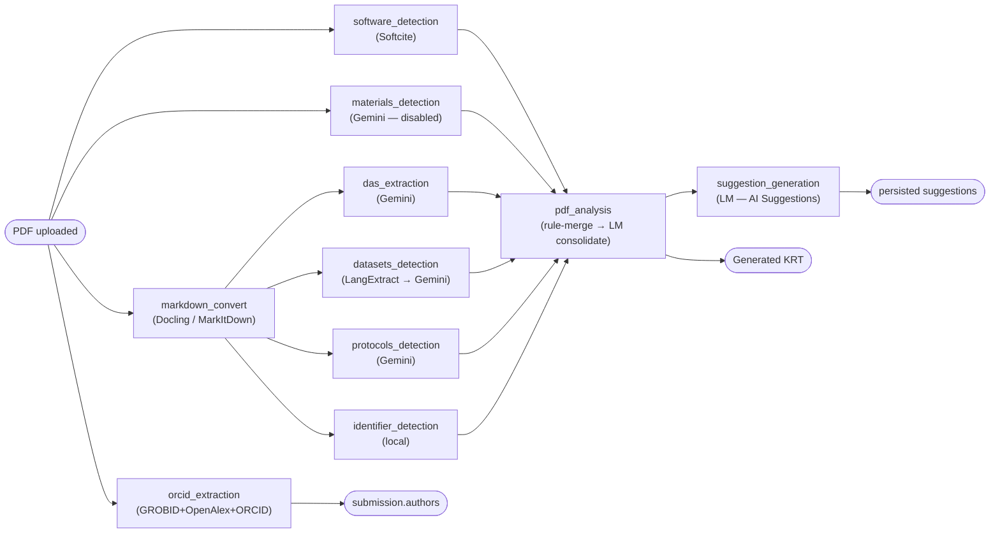

# Background Processing Modules

> A module-by-module functional reference for the background processes that turn an uploaded manuscript into
> the **Generated KRT** and author list. For *how the queue runs them* (scheduling, dependencies, retries,
> concurrency, polling, statuses) see [background-jobs.md](./background-jobs.md); for the *external-service API
> details* (endpoints, auth, request/response) see [external-apis.md](./external-apis.md); for *configuration*
> (env vars, prompts) see the [Master Setup Guide §4](./master-setup-guide.md#4-backend-configuration-env).
>
> This document focuses on **what each module does and how it works internally**.

---

## 1. The module roster

Each background process is a `submission_jobs` row of a given `job_type` (`config/constants.js` → `JOB_TYPES`),
run by a worker in `services/queue/workers.js`. Ten modules participate in the analysis pipeline (an eleventh,
`report_generation`, is ad-hoc — see [submission-workflow.md](./submission-workflow.md)).

| Module (`job_type`) | What it finds | Engine | Depends on | Feeds |
|---------------------|---------------|--------|-----------|-------|
| `markdown_convert` | — (PDF → Markdown text) | Modal/Docling **or** local MarkItDown | — | the text detectors below |
| `das_extraction` | Data Availability Statement | Google Gemini | `markdown_convert` | the PDF-Analysis gate |
| `software_detection` | Software / code | Softcite (NER, not an LLM) | — | PDF Analysis |
| `datasets_detection` | Datasets | LangExtract → Google Gemini (two-pass) | `markdown_convert` | PDF Analysis |
| `materials_detection` | Lab materials / reagents | Google Gemini *(author-seeded; see §3.5)* | — | PDF Analysis |
| `protocols_detection` | Protocols | Google Gemini | `markdown_convert` | PDF Analysis |
| `identifier_detection` | Known RRIDs / DOIs / accessions | **Local** scan of curated lists | `markdown_convert` | PDF Analysis |
| `orcid_extraction` | Authors + ORCIDs | GROBID → OpenAlex → ORCID API | — | `submission.authors` (not the KRT) |
| `pdf_analysis` | The consolidated Generated KRT | Rule-based merge → **LM (Gemini)** consolidation, rule-based fallback | all detectors above | Suggestion Generation |
| `suggestion_generation` | AI Suggestions (author KRT vs Generated KRT) | **LM (Gemini)** — LM-only, no fallback | `pdf_analysis` | the persisted suggestions list |

Pipeline shape (the orchestrator's dependency graph; see [background-jobs.md](./background-jobs.md#pipeline)):



---

## 2. Shared module architecture

Every detector is built the same way — learn this once and each module below is just the specifics.

### 2.1 The three-stage detector contract

A detector turns its raw findings into the canonical **`KrtEntry`** shape (`services/pdf-analysis/krt-entry.js`)
through three stages:

1. **`detect(input)`** — call the engine (external API, LLM, or local scan) → raw output.
2. **`buildKrtItems(raw)`** — map raw output to `KrtEntry[]` (canonical shape, not yet deduped).
3. **`dedupeKrtItems(items)`** — collapse duplicates within this detector (reuses the same merge engine as PDF Analysis).

> **No enrichment step.** Detectors no longer fill blanks from the curated enrichment lists — only the
> **Identifier Detection** module (§3.7) consults the enrichment lists (as its data source, see §2.4).

A `KrtEntry` carries: `resourceType`, `resourceName`, `identifier`, `source`, `newReuse` (`new|reuse|''`),
`origin` (detector label), `confidence` (0–1), `additionalInformation`, and a `detectorMeta` object for
UI-only metadata (excerpt, relevance, version, etc.). The detector writes `{ items, meta }` to its job's
`submission_jobs.result.data`. The canonical shape is defined in `services/pdf-analysis/krt-entry.js`:

```jsonc
{
  "resourceType": "Software/code",
  "resourceName": "Python",
  "identifier": "RRID:SCR_008394",
  "source": "https://python.org",
  "newReuse": "reuse",              // "new" | "reuse" | ""
  "origin": "softcite+list",        // detector label
  "confidence": 0.8,                // 0..1
  "additionalInformation": "…context/snippet…",
  "detectorMeta": {                  // UI-only; NOT persisted to krt_data
    "relevance": "HIGH",            // HIGH | MEDIUM | LOW (Gemini/curated)
    "text_excerpt": "…~200-char snippet…",
    "context": "…Softcite sentence…",
    "version": "3.10",
    "creator": "Python Software Foundation",
    "aliases": ["CPython"],
    "matchedTypes": ["software"],   // identifier-scan
    "position": 1234                 // char offset in source text
  }
}
```

After **`dedupeKrtItems`**, surviving entries also gain a `mergedFrom: [{ confidence, originalItem }]`
array recording the pre-dedup contributors that collapsed into them.

When `pdf_analysis` (§3.9) merges every detector's items into the **Generated KRT**, each row is
re-keyed by `dedupKey` and carries a `detectedBy` provenance array (the cross-detector equivalent of
`mergedFrom`). Note `sourceUrl` here vs. `source` on a `KrtEntry`:

```jsonc
{
  "dedupKey": "rrid:scr_008394|Software/code|reuse",  // identifier|resourceType|newReuse
  "resourceType": "Software/code",
  "resourceName": "Python",         // best canonical name across contributors
  "sourceUrl": "https://python.org", // inferred from identifier when absent
  "identifier": "RRID:SCR_008394",
  "newReuse": "reuse",
  "additionalInformation": "…line-deduped, concatenated detector context…",
  "confidence": 0.8,                // max across contributors
  "detectedBy": [
    { "source": "software_detection", "confidence": 0.8, "originalItem": { /* pre-dedup KrtEntry */ } }
  ]
}
```

> `dedupKey`, `detectedBy`/`mergedFrom`, `detectorMeta` and `confidence` are **transient** — they drive
> suggestion generation and the curator UI but are stripped before a row is persisted to `krt_data`. The
> persisted/display shapes are documented in
> [api-reference.md → KRT Operations](./api-reference.md#krt-operations) and
> [database.md → `krt_data`](./database.md#krt_data); the suggestion shapes are in
> [api-reference.md → Suggestions](./api-reference.md#suggestions).

### 2.2 Fail-soft: the On / Demo / Off + Done / Fail model

Every detector wraps its work in **`runWithDemoFallback`** (`services/demo-fallback.service.js`), driven by two
env flags per module:

```
<MODULE>_ENABLED=true|false              # call the real external service?
<MODULE>_DEMO_DATA_ENABLED=true|false    # fall back to bundled demo data?
```

Resolution (see also [Master Setup Guide §4.3](./master-setup-guide.md#43-detection-module-configuration--the-on--demo--off-model)):

- **On** (`ENABLED=true`): call the external service. On error, pg-boss **retries**; only on the *final* failed
  attempt does it fall back to demo data (if enabled), else the job ends **Fail**.
- **Demo** (`ENABLED=false`, `DEMO_DATA_ENABLED=true`): demo data is the only source.
- **Off** (both false): the module resolves to **Done** with `{ items: [] }` (a deliberate, neutral no-op).

The helper returns a standard envelope: `{ data:{items,meta}, source:'external'|'demo'|null, status:'done'|'fail',
failReason, externalError }`. This means a misconfigured or down external service degrades **only that module**
(to demo/empty), never the whole submission — and a transient error retries the real service first.

> **Why this matters:** demo data is read **only** inside these modules (gated by the flags). No other part of the
> app reads demo findings.

### 2.3 How module outputs become suggestions

`pdf_analysis` (§3.9) produces the **Generated KRT** from every detector's `result.data.items`. A dedicated
**`suggestion_generation`** module (§3.10) then runs an LM (Gemini) comparison of the author KRT vs the
Generated KRT and emits, for every generated resource, a decision (add / skip / update / remove) with a reason
— these are the accept/reject suggestions the curator sees. The suggestions are **persisted on that job's
result**, not diff-computed at read time, so editing the KRT does not silently change them; they change only
when the job is re-run. ORCID output writes to `submission.authors`, not the KRT, and is not an input to the
comparison.

> **No more on-read diff.** AI Suggestions are no longer an algorithmic diff computed by the `/suggestions`
> endpoint. The old `diff-suggestions.service.js` is retired in production (kept in the repo); read/approve/reject
> now operate on the persisted list (see §3.10).

### 2.4 Enrichment lists

The curated `enrichment_list_entries` table (one row per known resource, by `category`) is consulted by **only one
module: `identifier_detection` (§3.7)**, which builds its scan index from it. The text/NER detectors
(software, datasets, materials, protocols) **no longer** cross-reference these lists — they emit exactly what the
engine returned (deduped). Admins manage the lists in the UI (see
[Master Setup Guide §6.5](./master-setup-guide.md#65--step-7--import-the-enrichment-lists)).

---

## 3. Module reference

Each section lists: **purpose · engine · depends on · input · how it works · config files · demo · key files**.
Per-module timeouts, retry limits and concurrency live in [background-jobs.md](./background-jobs.md#timeout-and-retry-configuration);
external-API call specifics live in [external-apis.md](./external-apis.md).

### 3.1 `markdown_convert` — PDF → Markdown

- **Purpose:** convert the combined manuscript PDF to Markdown text **once**, so every text detector reads clean
  text instead of re-parsing the PDF.
- **Engine:** remote **Modal/Docling** when `PDF_MARKDOWN_PROVIDER=modal` (default, layout-aware); local
  **MarkItDown** (Python subprocess via `PYTHON_BIN`) otherwise / as fallback. The subprocess path uses an
  internal random temp filename (not the upload's name) to avoid path traversal.
- **Depends on:** nothing (starts immediately); it is the upstream of DAS, datasets, protocols, identifier.
- **Input:** the combined PDF (`File` type `pdf`). **Output:** the Markdown stored as a new `File` (type
  `markdown`) on S3, reused by downstream jobs.
- **Config:** `PDF_MARKDOWN_PROVIDER`, `PDF_MARKDOWN_MODAL_API_URL/_KEY`, `PDF_MARKDOWN_MODAL_CONVERTER`,
  `PDF_MARKDOWN_TIMEOUT`, `PDF_MARKDOWN_ENABLED`, `PDF_MARKDOWN_DEMO_DATA_ENABLED`, `PYTHON_BIN`.
- **Demo:** `getDemoMarkdown(manuscriptId)` → uploaded as `demo-<id>.md`.
- **Key files:** `services/pdf/markdown-convert.service.js`, `services/pdf/pdf-markdown-client.service.js`,
  `config/pdf-markdown-api.js`.

### 3.2 `das_extraction` — Data Availability Statement

- **Purpose:** extract the DAS (or another configured section) from the Markdown, verbatim.
- **Engine:** **Google Gemini** (`gemini-2.5-flash`). Reads the Markdown and copies the requested section.
- **Depends on:** `markdown_convert`. **Input:** the Markdown.
- **How it works:** the result records the section text and `status.detected`. This **gates `pdf_analysis`**: if a
  DAS was detected, PDF Analysis auto-advances; if not, PDF Analysis parks in `pending_input` for the curator to
  type the statement (then it is advanced — see [submission-workflow.md](./submission-workflow.md)).
- **Config:** `DAS_EXTRACTION_ENABLED`, `DAS_EXTRACTION_GEMINI_API_KEY/_MODEL`, `DAS_EXTRACTION_API_TIMEOUT`,
  `DAS_EXTRACTION_SECTION` (8 section types: das, funding, consent, ethics, author_contributions,
  acknowledgements, coi, keywords), `DAS_EXTRACTION_DEMO_DATA_ENABLED`. **Prompt:** `data/prompts/das-extraction.txt`.
- **Demo:** `getDemoDAS(manuscriptId)`.
- **Key files:** `services/pdf/das-extraction.service.js`, `services/pdf/pdf.service.js`, `config/das-extraction-api.js`.

### 3.3 `software_detection` — Software / code

- **Purpose:** detect software, tools, packages and their versions/URLs.
- **Engine:** **Softcite** — a purpose-built academic NER service (**not** an LLM; deterministic, no token cost,
  no prompt). Returns mentions with offsets and per-mention confidence.
- **Depends on:** nothing (immediate). **Input:** the PDF (Softcite multipart field `input`).
- **How it works:** Softcite mentions → `KrtEntry[]` (resourceType `Software/code`) → deduped. A
  **post-processing** pass then: defaults software to **Reuse**; turns code (programming languages) into
  "`<Lang> code`" marked **New**; **excludes** instrument/acquisition software; and **de-duplicates against the
  author KRT ignoring version numbers / RRIDs** in the name.
- **Config:** `SOFTCITE_API_ENABLED`, `SOFTCITE_API_BASE_URL`, `SOFTCITE_API_TIMEOUT`,
  `SOFTWARE_DETECTION_DEMO_DATA_ENABLED`.
- **Demo:** `getDemoSoftwareMentions(manuscriptId)`.
- **Key files:** `services/software/software.service.js`, `services/software/softcite-client.service.js`,
  `config/softcite-api.js`.

### 3.4 `datasets_detection` — Datasets (two-pass)

- **Purpose:** detect dataset mentions (the noisiest resource type), with relevance scoring.
- **Engine — two passes:**
  1. **LangExtract** (Python subprocess, `python/datasets/extract-signals.py`) chunks the Markdown and extracts
     **grounded candidate signals** with source spans (high recall, reduces hallucination).
  2. **Google Gemini** consolidates those signals + the article: merges duplicate mentions, applies exclusion
     rules (no annotation tracks / preprints / literature-only refs), and classifies KRT relevance.
- **Depends on:** `markdown_convert`. **Input:** the Markdown (both passes).
- **Config:** `DATASETS_DETECTION_ENABLED`, `DATASETS_DETECTION_GEMINI_API_KEY/_MODEL`, `DATASETS_DETECTION_API_TIMEOUT`,
  `DATASETS_DETECTION_DEMO_DATA_ENABLED`, and the LangExtract tunables `DATASETS_LANGEXTRACT_MAX_WORKERS /
  _MAX_CHAR_BUFFER / _EXTRACTION_PASSES / _BATCH_LENGTH / _TIMEOUT`, `PYTHON_BIN`. **Prompts:** pass 1
  `data/prompts/datasets-signals-extraction.txt` + `datasets-signals-examples.json`; pass 2
  `data/prompts/datasets-consolidation.txt`.
- **Demo:** `getDemoDatasetMentions(manuscriptId)`.
- **Key files:** `services/datasets/datasets.service.js`, `services/datasets/langextract-client.service.js`,
  `python/datasets/extract-signals.py`, `config/datasets-detection-api.js`.

### 3.5 `materials_detection` — Lab materials *(author-seeded, minimal)*

- **Purpose:** detect antibodies, cell lines, reagents and other lab materials — grounded on the author's KRT.
- **Engine:** **Google Gemini**, driven by a materials-detection prompt **seeded with the author's KRT material
  rows** (via the shared `services/krt/author-krt-seeds.service.js`). The detector is intentionally minimal: it
  **SKIPS extraction entirely when the author provided no materials** (no author material rows → no Gemini call).
- **Depends on:** nothing (immediate). **Output:** `KrtEntry[]` (Antibody / Cell line / etc.).
- **Config:** `MATERIALS_DETECTION_ENABLED`, `MATERIALS_DETECTION_GEMINI_API_KEY/_MODEL`,
  `MATERIALS_DETECTION_API_TIMEOUT`, `MATERIALS_DETECTION_DEMO_DATA_ENABLED`. **Prompt:**
  `data/prompts/materials-detection.txt`.
- **Demo:** `getDemoLabMaterialMentions(manuscriptId)`.
- **Key files:** `services/materials/materials.service.js`, `services/krt/author-krt-seeds.service.js`,
  `config/materials-detection-api.js`.

### 3.6 `protocols_detection` — Protocols

- **Purpose:** detect experimental protocol mentions.
- **Engine:** **Google Gemini** over the Markdown, with a **post-filter** that reclassifies purely computational
  / in-silico "protocols" as software (`isInSilicoProtocol`) — encoding an ASAP domain rule in code. Parses
  defensively (fenced-code stripping, markdown-escape repair). The prompt is **seeded with the author's protocol
  rows as "Section 0"** (via the shared `services/krt/author-krt-seeds.service.js`). Recent prompt fixes: don't
  pull a reagent vendor as Source or a catalog#/RRID as Identifier; capture protocols.io DOIs/URLs + citations;
  exclude analyses; and improve new/reuse classification.
- **Depends on:** `markdown_convert`. **Output:** `KrtEntry[]` (Protocol).
- **Config:** `PROTOCOLS_DETECTION_ENABLED`, `PROTOCOLS_DETECTION_GEMINI_API_KEY/_MODEL`,
  `PROTOCOLS_DETECTION_API_TIMEOUT`, `PROTOCOLS_DETECTION_DEMO_DATA_ENABLED`. **Prompt:**
  `data/prompts/protocols-detection.txt`.
- **Demo:** `getDemoProtocolMentions(manuscriptId)`.
- **Key files:** `services/protocols/protocols.service.js`, `services/krt/author-krt-seeds.service.js`,
  `config/protocols-detection-api.js`.

> **Author-KRT seeding (shared).** Software (§3.3), Protocols (§3.6) and Lab Materials (§3.5) all reuse the
> shared `services/krt/author-krt-seeds.service.js` helper to ground the LM on the author's existing KRT rows.

### 3.7 `identifier_detection` — Known-identifier scan *(local; enabled by default)*

- **Purpose:** recover known RRIDs, DOIs, accessions and catalog numbers the NER/LLM detectors miss.
- **Engine:** a **pure local scanner** — no external API, no LLM, no prompt. It builds an in-memory index from the
  curated `enrichment_list_entries` and scans the Markdown in a single pass. Enabled by default
  (`demoEnabled: false` — no demo path); set `IDENTIFIER_DETECTION_ENABLED=false` to turn the module Off.
- **Depends on:** `markdown_convert`. **Output:** **cross-category** `KrtEntry[]` (it can emit software / materials
  / datasets / protocols items in one pass) for PDF Analysis to consolidate.
- **References cutoff:** by default the scanner **truncates the document at the first markdown heading matching
  `References` / `Bibliography` / `Citations`** (`cutAtReferences`, default on) and scans only the text *before*
  it — so cited-paper DOIs in the bibliography don't create false positives. Toggle with
  `IDENTIFIER_DETECTION_CUT_AT_REFERENCES=false` to scan the whole document.
  ⚠️ **Caveat (combined PDFs):** the analysed PDF is the main manuscript **+** supplemental concatenated, so the
  Key Resources / reagent table usually sits **after** the main manuscript's References heading. If the markdown
  converter emits "References" as a real `#` heading (Docling does; MarkItDown does not), the cutoff discards the
  supplemental table and the scanner finds nothing — set `IDENTIFIER_DETECTION_CUT_AT_REFERENCES=false` to avoid
  this. See `KNOWN_ISSUES.md`.
- **Config:** `IDENTIFIER_DETECTION_ENABLED` (default `true`), `IDENTIFIER_DETECTION_CUT_AT_REFERENCES`
  (default `true`) — see `config/identifier-detection-api.js`. Index caches after first load.
- **Key files:** `services/identifier-detection/identifier-detection.service.js`,
  `known-identifier-index.service.js`, `known-identifier-scanner.service.js`.

### 3.8 `orcid_extraction` — Authors & ORCIDs

- **Purpose:** assemble a confidence-scored author list with ORCIDs.
- **Engine — a trust ladder:** **GROBID** parses the PDF header (DOI + authors + any embedded ORCIDs) → if a DOI
  exists, **OpenAlex** supplies verified author↔ORCID pairs (matched by first-initial + surname) → remaining gaps
  fall back to the **ORCID public API** (capped, unique-match only). Confidence is set by agreement
  (`grobid+openalex` = high, single source = medium).
- **Depends on:** nothing (immediate). **Output:** written to **`submission.authors`** (`{ items, meta }`) — it is
  **not** a KRT contributor, not a PDF-Analysis dependency, and not an input to Suggestion Generation (§3.10).
- **Config:** `GROBID_API_ENABLED/_BASE_URL/_TIMEOUT`, `OPENALEX_MAILTO/_API_TIMEOUT/_API_ENABLED` (OpenAlex is
  free, no key), `ORCID_API_ENABLED/_TIMEOUT`, `ORCID_EXTRACTION_DEMO_DATA_ENABLED` (default off; no demo data yet).
- **Key files:** `services/orcid/orcid.service.js`, `grobid-client.service.js`, `openalex-client.service.js`,
  `orcid-api-client.service.js`, `config/{grobid,openalex,orcid}-api.js`.

### 3.9 `pdf_analysis` — The Generated KRT (LM-primary, rule-based fallback)

- **Purpose:** turn every detector's items into one **Generated KRT** — the app's best-guess complete resource
  table — in two stages: **(a)** a rule-based `mergeDetections` regroups + coarse-dedups all detections'
  items (preserving per-resource `detectedBy` provenance), then **(b)** an **LM (Google Gemini)** consolidates
  those candidates into the final Generated KRT — merging near-duplicates, dropping non-resources, cleaning
  fields, attaching a `reason` to each **kept** line and recording **dropped** candidates with reasons.
- **LM-primary with a rule-based fallback:** when `KRT_GENERATION_ENABLED` is off or the LM errors, the merged
  candidates (stage a) become the Generated KRT, so the pipeline **always** yields one.
- **Depends on:** `das_extraction`, `software_detection`, `datasets_detection`, `materials_detection`,
  `protocols_detection`, `identifier_detection`. **Gate:** auto-advances only if a DAS was detected (else
  `pending_input`).
- **How stage (a) works (`merge-detections.service.js`):** greedy, **alias-aware** merge keyed on (resourceType +
  newReuse) with identifier-token / opaque-id / normalized-name matching; a per-resource union of aliases enables
  3-way transitive merges; `SOURCE_PRECEDENCE` lets the targeted detectors win display fields over the broad
  identifier scan. When a merged resource has **no** source, it **infers one from the identifier** (allowlist-only
  — GitHub/Zenodo/GEO/etc.; a DOI/accession outranks a URL; ambiguous → blank). The Generated KRT is persisted to
  `pdf_analysis.result.data.items` and uploaded to S3 as `generated-krt.json`.
- **Output:** consumed by the **Suggestion Generation** module (§3.10) to produce AI Suggestions.
- **Config:** `PDF_ANALYSIS_ENABLED` (in-process gate); the LM step: `KRT_GENERATION_ENABLED`,
  `KRT_GENERATION_GEMINI_API_KEY/_MODEL`, `KRT_GENERATION_API_TIMEOUT`. **Prompt:** `data/prompts/pdf-analysis-krt.txt`.
- **Key files:** `services/pdf-analysis/pdf-analysis.service.js`, `merge-detections.service.js`,
  `krt-generation.service.js`, `identifier-normalize.service.js`, `dedupe-krt-items.service.js`, `krt-entry.js`,
  `config/krt-generation-api.js`.

### 3.10 `suggestion_generation` — AI Suggestions (KRT Comparison)

- **Purpose:** compare the **author KRT** against the **Generated KRT** and emit, for **every** generated
  resource, a decision — **add / skip / update / remove** — each with a `reason`, plus author-side fixes. Author
  data is prioritized, the actionable list is kept manageable, and `remove` suggestions are **rare** (clear
  mistakes only).
- **Engine:** **Google Gemini** — **LM-only, no fallback.** With no LM configured (`KRT_COMPARISON_ENABLED` off
  or no key), **no suggestions are produced**.
- **Depends on:** `pdf_analysis` (which already gates on every KRT detector). It runs **last** in the pipeline.
- **Persistence:** suggestions are **persisted on the job result** — not recomputed on every read — so editing
  the KRT does not silently change them. They change only when the job is **re-run** (the "Regenerate
  suggestions" button → `POST /api/submissions/:id/suggestions/regenerate`, or any module restart cascading
  through). `read`/`approve`/`reject` operate on this persisted list; **accepting a `remove` deletes the KRT row**.
- **Origins:** each suggestion carries the **real contributing detection module(s)**
  (software/datasets/materials/protocols/identifier) as origin badges — no longer a flat `krt_comparison` tag.
- **Config:** `KRT_COMPARISON_ENABLED`, `KRT_COMPARISON_GEMINI_API_KEY/_MODEL`, `KRT_COMPARISON_API_TIMEOUT`.
  **Prompt:** `data/prompts/krt-comparison.txt`.
- **Key files:** `services/suggestion/kr-comparison.service.js`, `config/krt-comparison-api.js`. *(The retired
  `services/pdf-analysis/diff-suggestions.service.js` remains in the repo but is no longer used in production.)*

---

## 4. Adding a new detector module

1. Add the `JOB_TYPE` (`config/constants.js`) and a `config/<x>-api.js` reading `<X>_ENABLED` /
   `<X>_DEMO_DATA_ENABLED` (+ any API key/timeout).
2. Implement `services/<x>/<x>.service.js` with the four-stage contract (§2.1), wrapped in `runWithDemoFallback`.
3. Add a demo getter in `services/demo-data.service.js` if the module supports demo data.
4. Register the worker in `services/queue/workers.js` and add the step (with `dependsOn`) to the `PIPELINE` in
   `services/queue/orchestrator.service.js`. If it contributes resources, add it to `pdf_analysis.dependsOn` and to
   `CONTRIBUTOR_SOURCES` in `pdf-analysis.service.js`.
5. Document it here and in [external-apis.md](./external-apis.md).

---

## 5. Key files

| Area | Files |
|------|-------|
| Shared | `services/demo-fallback.service.js` (On/Demo/Off + Done/Fail), `services/pdf-analysis/krt-entry.js` (KrtEntry shape), `services/demo-data.service.js` (demo getters) |
| Orchestration | `services/queue/orchestrator.service.js` (PIPELINE), `services/queue/workers.js`, `services/queue/job-queue.service.js` — see [background-jobs.md](./background-jobs.md) |
| Detectors | `services/{software,datasets,materials,protocols}/`, `services/identifier-detection/`, `services/orcid/`, `services/pdf/` (markdown + DAS), `services/krt/author-krt-seeds.service.js` (shared author-KRT seeding) |
| Consolidation | `services/pdf-analysis/{pdf-analysis,merge-detections,krt-generation,identifier-normalize,dedupe-krt-items}.service.js` (`diff-suggestions.service.js` retired but kept) |
| Suggestions | `services/suggestion/kr-comparison.service.js` (the LM-only AI Suggestions / `suggestion_generation` module) |
| Config | `config/*-api.js` (incl. `krt-generation-api.js`, `krt-comparison-api.js`), `data/prompts/*.txt` (+ `.json`; incl. `pdf-analysis-krt.txt`, `krt-comparison.txt`), `enrichment_list_entries` (DB) |
