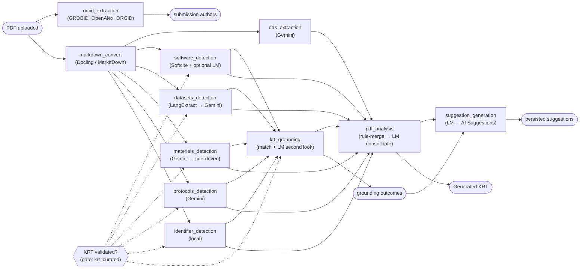

# Background Processing Modules

> A module-by-module functional reference for the background processes that turn an uploaded manuscript into
> the **Generated KRT** and author list. For *how the queue runs them* (scheduling, dependencies, retries,
> concurrency, polling, statuses) see [background-jobs.md](./background-jobs.md); for the *external-service API
> details* (endpoints, auth, request/response) see [external-apis.md](./external-apis.md); for *configuration*
> (env vars, prompts) see the [Master Setup Guide §4](./master-setup-guide.md#4-backend-configuration-env).
>
> This document focuses on **what each module does and how it works internally**.

---

## 1. The module roster

Each background process is a `submission_jobs` row of a given `job_type` (`config/constants.js` → `JOB_TYPES`),
run by a worker in `services/queue/workers.js`. Eleven modules participate in the analysis pipeline (a twelfth,
`report_generation`, is ad-hoc). `das_suggestions` is one of the eleven, but **gated to the Availability step** —
it depends on `das_extraction` for the statement, and its gate holds it there rather than letting it run when
extraction finishes; see §3.11 and [submission-workflow.md](./submission-workflow.md).

| Module (`job_type`) | What it finds | Engine | Depends on | Feeds |
|---------------------|---------------|--------|-----------|-------|
| `markdown_convert` | — (PDF → Markdown text) | Modal/Docling **or** local MarkItDown | — | the text detectors below |
| `das_extraction` | Data Availability Statement | Google Gemini | `markdown_convert` | the PDF-Analysis gate |
| `software_detection` | Software / code | Softcite (NER) **+ optional Gemini LM pass**, unioned | `markdown_convert` + gate `krt_curated` | PDF Analysis |
| `datasets_detection` | Datasets | LangExtract → Google Gemini (two-pass) | `markdown_convert` + gate `krt_curated` | PDF Analysis |
| `materials_detection` | Lab materials / reagents | Google Gemini (cue-driven; seeded with the author rows under `seeded-v1`) | `markdown_convert` + gate `krt_curated` | PDF Analysis |
| `protocols_detection` | Protocols | Google Gemini | `markdown_convert` + gate `krt_curated` | PDF Analysis |
| `krt_grounding` | Author KRT ↔ manuscript reconciliation | Deterministic matcher + optional LM second look | every detector + gate `krt_curated` | Suggestion Generation |
| `identifier_detection` | Known RRIDs / DOIs / accessions | **Local** scan of curated lists | `markdown_convert` + gate `krt_curated` | PDF Analysis |
| `orcid_extraction` | Authors + ORCIDs | GROBID → OpenAlex → ORCID API | — | `submission.authors` (not the KRT) |
| `pdf_analysis` | The consolidated Generated KRT | Rule-based merge → **LM (Gemini)** consolidation, rule-based fallback | all detectors above | Suggestion Generation |
| `suggestion_generation` | AI Suggestions (author KRT vs Generated KRT) | **LM (Gemini)** — LM-only, no fallback | `pdf_analysis` | the persisted suggestions list |
| `das_suggestions` | DAS vs the ASAP rulebook (per-rule verdict) | **LM (Gemini)** — LM-only, **legacy-rules fallback** | `das_extraction` *(gated to the Availability step)* | the `/availability` suggestions list, and its own module page |

Pipeline shape (the orchestrator's dependency graph; see [background-jobs.md](./background-jobs.md#pipeline)). `das_suggestions` is omitted from the diagram below for readability — it hangs off `das_extraction` and is gated to the Availability step (see §3.11). On the app's own pipeline page it is drawn in the **Suggest** stage rather than beside its dependency, via the step's `displayStage`: it depends on something early but runs last, and a reader following the page top to bottom should find it where it actually runs.


```mermaid
flowchart LR
    UP(["PDF uploaded"]) --> OR["orcid_extraction<br/>(GROBID+OpenAlex+ORCID)"]
    UP --> MDC["markdown_convert<br/>(Docling / MarkItDown)"]
    MDC --> DAS["das_extraction<br/>(Gemini)"]
    MDC --> SW["software_detection<br/>(Softcite + optional LM)"]
    MDC --> DS["datasets_detection<br/>(LangExtract → Gemini)"]
    MDC --> MAT["materials_detection<br/>(Gemini — cue-driven)"]
    MDC --> PR["protocols_detection<br/>(Gemini)"]
    MDC --> ID["identifier_detection<br/>(local)"]
    SW --> KG["krt_grounding<br/>(match + LM second look)"]
    DS --> KG
    MAT --> KG
    PR --> KG
    ID --> KG
    KRTV{{"KRT validated?<br/>(gate: krt_curated)"}} -.-> SW
    KRTV -.-> DS
    KRTV -.-> MAT
    KRTV -.-> PR
    KRTV -.-> ID
    KRTV -.-> KG
    SW --> PA["pdf_analysis<br/>(rule-merge → LM consolidate)"]
    MAT --> PA
    DAS --> PA
    DS --> PA
    PR --> PA
    ID --> PA
    KG --> PA
    KG --> GR(["grounding outcomes"])
    PA --> SG["suggestion_generation<br/>(LM — AI Suggestions)"]
    GR --> SG
    SG --> SUG(["persisted suggestions"])
    PA --> GK(["Generated KRT"])
    OR --> AU(["submission.authors"])
```

**Detection waits for the KRT.** Every detector, and `krt_grounding` with them, is gated on `krt_curated`: the
step holds in `waiting` until the submission status moves past `step_krt`, then advances automatically with no
manual action. `pdf_analysis` and `suggestion_generation` inherit the gate through their dependencies, so the whole
analysis after conversion starts at one moment — when the author finishes curating the table.

The reason is seeding. Under the default pipeline the detection prompts are **given the author's rows**, so a
detector that started while the table was still being edited would answer a question about a KRT that no longer
exists, and spend an LM call doing it. The gate is on submission **state**, not on the presence of a KRT: a
submission with no KRT at all passes it as soon as the author moves on, so the no-KRT mode is unaffected.

A second gate, **`markdown_ready`**, holds the same steps (plus `das_extraction`) when `markdown_convert`
completed with `markdownLength: 0`. Conversion is fail-soft — a converter error still completes the job — and
before this gate every downstream module ran against an empty document and reported zero findings, which a reader
cannot tell apart from a manuscript that genuinely mentions nothing. This gate does **not** clear by itself:
conversion has already finished, unsuccessfully, so it takes a re-run.

While a step is gated the jobs API reports `waitingReason` — `'krt_validation'` or `'markdown_missing'` — and the
processes panel turns that into a banner where the progress bar would be, rather than leaving the user to read
"waiting" and wonder what stalled.

> **Two pipelines, one engine.** `seeded-v1` (the default, every user) seeds `datasets`/`materials`/`protocols`
> with the author's rows; `blind-v1` (admin-only, not enabled for anyone yet) shows the detectors nothing and
> reconciles afterwards in `krt_grounding`. The measured trade-off is real in both directions: seeding suppresses
> discovery by about 24%, while the blind arm confirms fewer author rows. Which prompts a run used is recorded on
> the run itself — see §2.1f. Design: [design-krt-detection-two-modes.md](./design-krt-detection-two-modes.md).

---

## 2. Shared module architecture

Every detector is built the same way — learn this once and each module below is just the specifics.

### 2.1 The four-stage detector contract

A detector turns its raw findings into the canonical **`KrtEntry`** shape (`services/pdf-analysis/krt-entry.js`)
through three stages:

1. **`detect(input)`** — call the engine (external API, LLM, or local scan) → raw output.
2. **`buildKrtItems(raw)`** — map raw output to `KrtEntry[]` (canonical shape, not yet deduped).
3. **`attachEvidence(items, index)`** — ground every claim against the manuscript (see §2.1b).
4. **`dedupeKrtItems(items)`** — collapse duplicates within this detector (reuses the same merge engine as PDF Analysis).

> **No enrichment step.** Detectors no longer fill blanks from the curated enrichment lists — only the
> **Identifier Detection** module (§3.7) consults the enrichment lists (as its data source, see §2.4).

A `KrtEntry` carries: `resourceType`, `resourceName`, `identifier`, `source`, `newReuse` (`new|reuse|''`),
`origin` (detector label), `confidence` (0–1), `additionalInformation`, and a `detectorMeta` object for
UI-only metadata (excerpt, relevance, version, etc.). The detector writes `{ items, meta }` to its job's
`submission_jobs.result.data`. The canonical shape is defined in `services/pdf-analysis/krt-entry.js`:

```jsonc
{
  "resourceType": "Software/code",
  "resourceName": "Python",
  "identifier": "RRID:SCR_008394",
  "source": "https://python.org",
  "newReuse": "reuse",              // "new" | "reuse" | ""
  "origin": "softcite+list",        // detector label
  "confidence": 0.8,                // 0..1
  "additionalInformation": "…context/snippet…",
  "detectorMeta": {                  // UI-only; NOT persisted to krt_data
    "relevance": "HIGH",            // HIGH | MEDIUM | LOW (Gemini/curated)
    "text_excerpt": "…~200-char snippet…",
    "context": "…Softcite sentence…",
    "version": "3.10",
    "creator": "Python Software Foundation",
    "aliases": ["CPython"],
    "matchedTypes": ["software"],   // identifier-scan
    "position": 1234                 // char offset in source text
  }
}
```

After **`dedupeKrtItems`**, surviving entries also gain a `mergedFrom: [{ confidence, originalItem }]`
array recording the pre-dedup contributors that collapsed into them.

When `pdf_analysis` (§3.9) merges every detector's items into the **Generated KRT**, each row is
re-keyed by `dedupKey` and carries a `detectedBy` provenance array (the cross-detector equivalent of
`mergedFrom`). Note `sourceUrl` here vs. `source` on a `KrtEntry`:

```jsonc
{
  "dedupKey": "rrid:scr_008394|Software/code|reuse",  // identifier|resourceType|newReuse
  "resourceType": "Software/code",
  "resourceName": "Python",         // best canonical name across contributors
  "sourceUrl": "https://python.org", // inferred from identifier when absent
  "identifier": "RRID:SCR_008394",
  "newReuse": "reuse",
  "additionalInformation": "…line-deduped, concatenated detector context…",
  "confidence": 0.8,                // max across contributors
  "detectedBy": [
    { "source": "software_detection", "confidence": 0.8, "originalItem": { /* pre-dedup KrtEntry */ } }
  ]
}
```

> `dedupKey`, `detectedBy`/`mergedFrom`, `detectorMeta` and `confidence` are **transient** — they drive
> suggestion generation and the curator UI but are stripped before a row is persisted to `krt_data`. The
> persisted/display shapes are documented in
> [api-reference.md → KRT Operations](./api-reference.md#krt-operations) and
> [database.md → `krt_data`](./database.md#krt_data); the suggestion shapes are in
> [api-reference.md → Suggestions](./api-reference.md#suggestions).

### 2.1b The evidence contract

Every `KrtEntry` carries an `evidence` block recording **both** what the detector claimed and
what the manuscript actually supports. Those are two different things and must never share a
field — once the model's claim is overwritten by the located text (or blanked), "how often does
the model embellish?" becomes unanswerable, and no prompt change can be evaluated.

```jsonc
"evidence": {
  // WHAT THE DOCUMENT SUPPORTS — empty/-1 when nothing was located
  "quote":   "…text that occurs in the converted markdown…",
  "offset":  14832,
  "section": "Methods > Immunohistochemistry",
  "match":   "exact",                       // 'exact' | 'partial' | null
  "context": "…the surrounding paragraph…", // + quoteStart/quoteEnd/sentenceStart/sentenceEnd
  "truncated": false,

  // WHAT THE DETECTOR CLAIMED — verbatim, never modified, never blanked
  "claimed": { "quote": "…", "identifier": "RRID:SCR_026874" },

  // EVERY occurrence of this resource, not just the first
  "mentions": [ { "offset": 14832, "section": "Methods", "via": "name" }, … ],

  "verification": {
    "status": "verified" | "embellished" | "unsupported",
    "quoteVerbatim": true, "identifierInText": true, "nameInText": true
  }
}
```

**The three statuses**

| Status | Meaning | What happens to it |
|---|---|---|
| `verified` | the claimed quote is literally in the markdown | kept |
| `embellished` | the quote is **not** verbatim, but the RESOURCE is in the text (its identifier or name) | **kept**, flagged |
| `unsupported` | neither the quote nor the resource is in the text | dropped at `mergeDetections` |

`embellished` exists because of a measured behaviour: the model reads `broom` and `ab41489` from
the manuscript and then writes back a quote carrying the matching `RRID:SCR_026874` /
`RRID:AB_727049` **from its own knowledge**. Those RRIDs are real and correctly associated —
only the quote is not verbatim. Discarding such rows was pure recall loss, so they now survive
with the discrepancy recorded.

**Nothing is discarded by a detector.** Detectors tag; `mergeDetections` filters. That keeps
every claim available for evaluation while keeping `unsupported` rows out of the curator's view.

**Matching is whitespace- and Unicode-insensitive.** The converter line-wraps sentences, and the
corpus mixes MICRO SIGN with GREEK MU, contains mathematical-italic letters a model rewrites as
ASCII, and 1000+ ellipses. Comparison therefore runs over an NFKD-folded, whitespace-collapsed
projection, mapped back to real offsets.

**Exempt from verification:** `identifier_detection` is grounded by construction (the scanner
matched at a known offset). `software_detection` (Softcite) reads the PDF rather than the
markdown, so its sentence is a real quote that may not be a byte-match — it is verified like any
other claim and usually lands as `embellished` rather than being trusted blindly.

### 2.1c Mentions vs detections vs contributors — three different groupings

These are easy to conflate and mean different things:

| Concept | Field | Produced by | Means |
|---|---|---|---|
| **Mention** | `evidence.mentions[]` | `evidence.service` (deterministic) | a place in the manuscript where this resource appears |
| **Merged finding** | `mergedFrom[]` | `dedupeKrtItems` | two findings by the SAME detector that are one resource |
| **Contributor** | `detectedBy[]` | `mergeDetections` | findings from DIFFERENT detectors that are one resource |

A detector emits **one row per resource**, not one per mention — with a single `evidence_quote`.
The exception is `identifier_detection`, which emits one row per identifier occurrence; those
collapse at `dedupeKrtItems`, keeping each position in `mergedFrom`.

`mentions[]` is computed afterwards, by searching the markdown for the resource's identifier and
name. Ordering puts a **usage section ahead of the reference list**, which is what makes
used-vs-cited decidable: a tool appearing only under *References* is cited, one in *Methods* is
used. Before this existed, `indexOf` kept whichever occurrence came first and the rest were
invisible.

### 2.1d From PDF to Generated KRT — the whole chain

Every stage, in order, with what it adds and where it can lose something.

```
 PDF ──► markdown_convert ──► markdown on S3 (every text detector reads THIS)
                                  │
      ┌───────────────────────────┴───────────────────────────┐
      │  5 DETECTORS — all KRT-BLIND, all in parallel         │
      │                                                       │
      │  software    Softcite (PDF) + optional LM (markdown)  │
      │  datasets    LangExtract signals → Gemini consolidate  │
      │  materials   Gemini, cue-driven                        │
      │  protocols   Gemini                                    │
      │  identifier  local regex vs curated lists + venue sweep│
      └───────────────────────────┬───────────────────────────┘
                                  │  each detector, per item:
                                  │   1. detect          → raw model/scanner output
                                  │   2. buildKrtItems   → canonical KrtEntry
                                  │   3. attachEvidence  → verify claim vs markdown,
                                  │                        add mentions + status
                                  │   4. dedupeKrtItems  → collapse within THIS detector
                                  │                        (mergedFrom keeps contributors)
                                  ▼
                        persisted per job: result.data.items
                                  │
      ┌───────────────────────────┴───────────────────────────┐
      │  krt_grounding            (gated on krt_curated)      │
      │  author KRT × candidate pool                          │
      │   • deterministic match: identifier → alias → name    │
      │   • LM second look over the rows nothing matched      │
      │     (every quote re-verified; an unlocatable one      │
      │      changes nothing)                                 │
      │   → per author row: confirmed / incomplete /          │
      │                     partial / not_detected            │
      │   → conflicts where the paper disagrees with the row  │
      └───────────────────────────┬───────────────────────────┘
                                  ▼
      ┌───────────────────────────────────────────────────────┐
      │  pdf_analysis — builds the GENERATED KRT              │
      │                                                       │
      │   a. mergeDetections   cross-detector merge; drops    │
      │                        `unsupported`; detectedBy[]    │
      │                        keeps provenance; infers       │
      │                        SOURCE from the identifier     │
      │   b. consolidateWithLM Gemini merges near-duplicates, │
      │                        drops non-resources, gives a   │
      │                        `reason` per kept/dropped line │
      │                        (rule-based fallback if off)   │
      │   c. reconcileWithAuthorKrt — every author row is     │
      │                        guaranteed to survive          │
      └───────────────────────────┬───────────────────────────┘
                                  ▼
              Generated KRT  (result.data.items + generated-krt.json on S3)
                                  │
      ┌───────────────────────────┴───────────────────────────┐
      │  suggestion_generation                                │
      │   author KRT × Generated KRT × grounding outcomes     │
      │   → add / skip / update / remove, + grounding tags    │
      └───────────────────────────────────────────────────────┘
```

**Where data can be lost, and what protects it**

| Stage | Historic loss | Protection now |
|---|---|---|
| `attachEvidence` | dropped the whole row on an unverifiable quote | tags instead; `mergeDetections` filters |
| `dedupeKrtItems` | silently dropped `evidence` (rebuild by field enumeration) | `pickBestEvidence` + `evidence-pipeline.test.js` |
| `mergeDetections` | same | same |
| `consolidateWithLM` | same — the LM returns only curated fields | evidence recovered from the merged `refs` |

The last three rows are all the same defect: **a stage that rebuilds a resource from its
contributors by enumerating fields loses anything nobody thought to enumerate.** It bit three
separate stages before it was recognised as a class. `evidence-pipeline.test.js` now walks the
whole chain and asserts evidence survives each hop — necessary because the symptom (a suggestion
with no context in the UI) always surfaces far from the stage that caused it.

**Ordering note.** `krt_grounding` runs *before* `pdf_analysis` and reads the raw detector items,
not the Generated KRT. It reconciles against everything the detectors found, including candidates
the LM consolidation later drops.

### 2.1e Automatic transformations applied by the pipeline

Everything below happens **without asking the user**. None of it is available in the KRT Editor —
the editor validates and reports, but (with one exception noted at the end) never rewrites a cell on
its own. Pipeline output reaches the author only as a *suggestion* they must accept or reject.

| # | Transformation | Where | What it does |
|---|---|---|---|
| 1 | **SOURCE inference from identifier** | `merge-detections` → `identifier-normalize` | When **no** contributor supplied a SOURCE, names it from the identifier. Allowlist-only (repositories, accession namespaces, protocol venues); ambiguous → left blank. Never overwrites a supplied source. |
| 2 | **Cross-detector merge** | `merge-detections` | Two items merge on same resource type **and** new/reuse **and** overlapping identifier tokens or matching names. Alias unions enable 3-way transitive merges. |
| 3 | **Nameless-row folding** | `merge-detections` | A row with an empty RESOURCE NAME skips the new/reuse gate and matches against *every* identifier in the other row's field. Stops identifier-only contributors becoming blank duplicate suggestions. |
| 4 | **In-detector dedup** | `dedupe-krt-items` | Collapses duplicates inside one detector's output before consolidation, using the same match engine. |
| 5 | **Enrichment-list fill** | `identifier-detection` | A curated-list hit contributes that entry's SOURCE / IDENTIFIER / NEW-REUSE wholesale. |
| 6 | **Published-protocol venue sweep** | `published-protocol-scanner` | List-free; recognizes protocol-publishing venues from the identifier shape alone and emits `Protocol` rows for ones nobody curated. |
| 7 | **In-silico protocol filter** | `protocols.service.js` | Silently **drops** detected "protocols" that are computational/in-silico methods — ASAP wants those as Software/code. |
| 8 | **References cutoff** | `known-identifier-scanner` | Truncates the scanned text at the first `References` / `Bibliography` heading so cited-paper DOIs don't become false positives. Toggleable; see the caveat in §3.7. |
| 9 | **Resource-type canonicalisation** | `identifier-normalize` | `Code/Software` → `Software/code` at emission, so detector rows don't trip the validator. |
| 10 | **Software version stripping** | `identifier-normalize` | `Fiji 2.9.0`, `ImageJ (RRID:…)`, `MATLAB R2019b` → bare stem, for name matching only. Never applied to datasets/materials, where trailing numbers can be meaningful. |
| 11 | **Identifier normalisation** | `identifier-normalize` | Strips scheme/prefix noise (`https://`, `doi.org/`, `DOI:`, `RRID:`, `Cat#`) and type-tags tokens so a DOI can't collide with a catalog number. |
| 12 | **ADDITIONAL INFORMATION concatenation** | `merge-detections` | Merges each contributor's context, de-duplicated line by line. |
| 13 | **Confidence / relevance scoring** | every detector | `HIGH/MEDIUM/LOW` → 0.95 / 0.7 / 0.4, used for tie-breaking and field ownership. |
| 14 | **Author-row reconciliation** | `krt-grounding` | The author's rows are matched against the candidate pool *after* detection (identifier → alias → name → partial_name), never injected into a detection prompt. Author rows are never mutated — an unmatched row is tagged `not_detected`, not dropped or rewritten. |
| 15 | **Suggestion tiering** | `kr-comparison` | Marks identifier-less finds `needs_verification` so they surface with a **Verify** badge instead of being dropped. |

**Never inferred, on purpose:**

- **NEW/REUSE from an identifier.** A venue DOI proves *where* a protocol was published, never who
  authored it — authors routinely deposit their own **new** protocol alongside the paper.
- **A SOURCE that is merely plausible.** The allowlist returns `null` rather than guess; ambiguous
  publisher prefixes (`10.1371/journal.*`, `10.1007/*`, `10.2144/*`) are deliberately excluded.
- **Anything written directly into the author's KRT.** Suggestions require explicit acceptance; there
  is no auto-accept anywhere in the codebase.

> **The one exception on the editor side:** the validator moves a value from ADDITIONAL INFORMATION
> into an empty IDENTIFIER when it is of a kind allowed for that resource type, and saves the row.
> See [KRT Validation Rules](./krt-validation-rules.md) and [KRT Editor §3](./krt-editor.md).

### 2.1f What a run records about itself

Every module writes a `meta` object into its persisted result at `job.result.data.meta`. Two fields there matter
outside the module that wrote them:

- **`promptFile`** — the repository-relative path of the prompt the run actually used, e.g.
  `src/backend/data/prompts/seeded/materials-detection.txt`. Written **only when the LM pass ran**: a run that
  fell back to a deterministic path, or skipped the model, records `null` rather than naming a prompt it never
  sent. `materials_detection` alone chooses between two files at runtime (seeded vs discovery), which is why this
  is recorded per run instead of looked up from a static table. `datasets_detection` also records
  `signalsPromptFile` for its LangExtract pass.
- **`strategy`** — which strategy answered, e.g. `materials.seeded`, alongside `pipeline` (`seeded-v1` /
  `blind-v1`). Together with `promptFile` this is enough to reproduce a result exactly.

The module pages render both in **Technical detail**, with `promptFile` as a GitHub link on the branch the
deployment runs (`GET /api/config/source`). Three modules legitimately record no prompt because they call no
model: `markdown_convert`, `orcid_extraction` and `identifier_detection`.

### 2.1g The audit record: `inputs.json`

Every run also writes an **`inputs.json`** artefact — what it was given, frozen, so an old result stays
explainable. The rule is **freeze what can change, reference what cannot**:

| kind | how it is stored | why |
|---|---|---|
| author rows, seeds, candidate pool, Generated KRT, grounding outcomes | copied verbatim under `frozen` | they are edited, or replaced by any re-run, underneath a stored result |
| the markdown and the PDF | `fileId` + `version` + **SHA-256** under `documents` | `File` rows are immutable and versioned; a copy per detector per run would duplicate the manuscript for no added proof |
| upstream detections | contributing **job ids** under `upstream` | stable references now that artefact keys are per run |
| the prompt template, and any file it cannot work without | **copied verbatim** under `templateText` / `attachments[].text`, with digests | it lives in the repo, and the repo moves: the running app is not always at the head of its branch, and prompt files get edited, renamed and deleted |
| the **assembled** prompt as sent | digest only | it embeds the manuscript — everything needed to rebuild it is in the same file, so the digest turns a reconstruction into proof |

**Artefact keys carry the job row id**: `…/round-N/jobs/<jobType>/<jobId>/<name>.json`. Without it a re-run
overwrote the previous run's files while `runAllProcesses` created a fresh job row — the older row survived
pointing at keys whose contents had been replaced, showing the newer run's data under the older run's timestamps.

**The template is copied, the assembled prompt is not.** The template used to be a digest too, on the reasoning
that it lives in git and can be looked up — and the UI duly linked to GitHub. That reasoning does not survive
contact with a deployment: dev is not always running the latest commit, so a reader could be shown a prompt that
was *not* the one that ran, silently and with no way to tell. A template is a few kilobytes; the run keeps its
own copy and the UI shows that. The GitHub link for prompts is gone. (The link from a module page to
`docs/background-modules.md` stays — documentation is reference material, not a record of what ran.)

**`attachments` is for a file the prompt cannot work without.** LangExtract's few-shot examples
(`data/prompts/datasets-signals-examples.json`) are the case that exists: they are passed to the extractor as a
separate argument and converted into structured `ExampleData`, so they never enter the prompt text — the template
alone would not reproduce the run. Editing the examples changes the signals exactly as editing the prompt does. A
record that kept one and not the other would claim a run was reproducible when it was not. Anything else a prompt
is handed separately belongs here for the same reason.

The **assembled** prompt is stored as a digest rather than as text, which is only defensible while it can
actually be rebuilt. `scripts/verify-run-audit.js` does exactly that — it rebuilds each prompt from `inputs.json` alone, through the
same assembly helpers the pipeline uses, and compares:

```bash
node scripts/verify-run-audit.js --manuscript DA1-000463-013-org-D-3
node scripts/verify-run-audit.js --all      # exit 1 if anything fails
```

Run it after changing a prompt or the code that assembles one. A failure means the prompt started using an input
the record does not carry, and that input has to be added to that module's `saveRunInputs` call — the digests
prove nothing without it. It has already caught three: a template hashed untrimmed while every loader trims it,
DAS's section name, and datasets consolidation's derived signals (which live in the raw `langextract-signals`
artefact, not in the derived form the prompt embeds).

`krt_grounding` is the one module with no single assembled prompt: its second look sends one per batch of
not-yet-located rows, so it records the batch size, which with the frozen rows reproduces the same split.

### 2.2 Fail-soft: the On / Demo / Off + Done / Fail model

Every detector wraps its work in **`runWithDemoFallback`** (`services/demo-fallback.service.js`), driven by two
env flags per module:

```
<MODULE>_ENABLED=true|false              # call the real external service?
<MODULE>_DEMO_DATA_ENABLED=true|false    # fall back to bundled demo data?
```

Resolution (see also [Master Setup Guide §4.3](./master-setup-guide.md#43-detection-module-configuration--the-on--demo--off-model)):

- **On** (`ENABLED=true`): call the external service. On error, pg-boss **retries**; only on the *final* failed
  attempt does it fall back to demo data (if enabled), else the job ends **Fail**.
- **Demo** (`ENABLED=false`, `DEMO_DATA_ENABLED=true`): demo data is the only source.
- **Off** (both false): the module resolves to **Done** with `{ items: [] }` (a deliberate, neutral no-op).

The helper returns a standard envelope: `{ data:{items,meta}, source:'external'|'demo'|null, status:'done'|'fail',
failReason, externalError }`. This means a misconfigured or down external service degrades **only that module**
(to demo/empty), never the whole submission — and a transient error retries the real service first.

> **Why this matters:** demo data is read **only** inside these modules (gated by the flags). No other part of the
> app reads demo findings.

### 2.3 How module outputs become suggestions

`pdf_analysis` (§3.9) produces the **Generated KRT** from every detector's `result.data.items`. A dedicated
**`suggestion_generation`** module (§3.10) then runs an LM (Gemini) comparison of the author KRT vs the
Generated KRT and emits, for every generated resource, a decision (add / skip / update / remove) with a reason
— these are the accept/reject suggestions the curator sees. The suggestions are **persisted on that job's
result**, not diff-computed at read time, so editing the KRT does not silently change them; they change only
when the job is re-run. ORCID output writes to `submission.authors`, not the KRT, and is not an input to the
comparison.

> **No more on-read diff.** AI Suggestions are no longer an algorithmic diff computed by the `/suggestions`
> endpoint. The old `diff-suggestions.service.js` is retired in production (kept in the repo); read/approve/reject
> now operate on the persisted list (see §3.10).

### 2.4 Enrichment lists

The curated `enrichment_list_entries` table (one row per known resource, by `category`) is consulted by **only one
module: `identifier_detection` (§3.7)**, which builds its scan index from it. The text/NER detectors
(software, datasets, materials, protocols) **no longer** cross-reference these lists — they emit exactly what the
engine returned (deduped). Admins manage the lists in the UI (see
[Master Setup Guide §6.5](./master-setup-guide.md#65--step-7--import-the-enrichment-lists)).

---

## 3. Module reference

Each section lists: **purpose · engine · depends on · input · how it works · config files · demo · key files**.
Per-module timeouts, retry limits and concurrency live in [background-jobs.md](./background-jobs.md#timeout-and-retry-configuration);
external-API call specifics live in [external-apis.md](./external-apis.md).

### 3.1 `markdown_convert` — PDF → Markdown

- **Purpose:** convert the combined manuscript PDF to Markdown text **once**, so every text detector reads clean
  text instead of re-parsing the PDF.
- **Engine:** remote **Modal/Docling** when `PDF_MARKDOWN_PROVIDER=modal` (default, layout-aware); local
  **MarkItDown** (Python subprocess via `PYTHON_BIN`) otherwise / as fallback. The subprocess path uses an
  internal random temp filename (not the upload's name) to avoid path traversal.
- **Depends on:** nothing (starts immediately); it is the upstream of DAS, datasets, protocols, identifier.
- **Input:** the combined PDF (`File` type `pdf`). **Output:** the Markdown stored as a new `File` (type
  `markdown`) on S3, reused by downstream jobs.
- **Config:** `PDF_MARKDOWN_PROVIDER`, `PDF_MARKDOWN_MODAL_API_URL/_KEY`, `PDF_MARKDOWN_MODAL_CONVERTER`,
  `PDF_MARKDOWN_TIMEOUT`, `PDF_MARKDOWN_ENABLED`, `PDF_MARKDOWN_DEMO_DATA_ENABLED`, `PYTHON_BIN`.
- **Demo:** `getDemoMarkdown(manuscriptId)` → uploaded as `demo-<id>.md`.
- **Key files:** `services/pdf/markdown-convert.service.js`, `services/pdf/pdf-markdown-client.service.js`,
  `config/pdf-markdown-api.js`.

### 3.2 `das_extraction` — Data Availability Statement

- **Purpose:** extract the DAS (or another configured section) from the Markdown, verbatim.
- **Engine:** **Google Gemini** (`gemini-2.5-flash`). Reads the Markdown and copies the requested section.
- **Depends on:** `markdown_convert`. **Input:** the Markdown.
- **How it works:** the result records the section text and `status.detected`. This **gates `pdf_analysis`**: if a
  DAS was detected, PDF Analysis auto-advances; if not, PDF Analysis parks in `pending_input` for the curator to
  type the statement (then it is advanced — see [submission-workflow.md](./submission-workflow.md)).
- **Config:** `DAS_EXTRACTION_ENABLED`, `DAS_EXTRACTION_GEMINI_API_KEY/_MODEL`, `DAS_EXTRACTION_API_TIMEOUT`,
  `DAS_EXTRACTION_SECTION` (8 section types: das, funding, consent, ethics, author_contributions,
  acknowledgements, coi, keywords), `DAS_EXTRACTION_DEMO_DATA_ENABLED`. **Prompt:** `data/prompts/das-extraction.txt`.
- **Demo:** `getDemoDAS(manuscriptId)`.
- **Key files:** `services/pdf/das-extraction.service.js`, `services/pdf/pdf.service.js`, `config/das-extraction-api.js`.

### 3.3 `software_detection` — Software / code

- **Purpose:** detect software, tools, packages and their versions/URLs.
- **Engine — two, unioned:**
  1. **Softcite** — a purpose-built academic NER service (**not** an LLM; deterministic, no token cost, no
     prompt), reading the PDF. Recognises tool NAMES written in prose, with good precision.
  2. **An optional Gemini LM pass** (`software-lm.service.js`) reading the converted markdown, cue-driven.
     It covers what a name recogniser structurally cannot see: `RRID:SCR_…` tokens, GitHub/GitLab/PyPI/CRAN
     links, packages named only in a parenthetical, and custom code promised in a data-availability
     statement. Against the DS curators' reports Softcite alone scored **25% recall — the worst of any
     module — and 253 of the 291 misses carried a machine-readable identifier in the text** (143 an
     `RRID:SCR_`). Off by default (`SOFTWARE_DETECTION_LM_ENABLED=true` to enable).

  The LM pass is **additive and fail-soft**: disabled, missing markdown, or an LM error all degrade to
  Softcite-only rather than failing the module. Where both engines find the same tool, they collapse into one
  row carrying both provenances — and that agreement is itself a confidence signal.
- **Depends on:** `markdown_convert`, **gated on `krt_curated`** (see §1). Softcite alone could start immediately, but the LM pass reads the
  markdown and would otherwise race the conversion and skip on nearly every run. Waiting costs nothing
  end-to-end: nothing consumes software output until `krt_grounding`, which waits for the markdown-dependent
  detectors regardless. **Input:** the PDF (Softcite) + the Markdown (LM pass).
- **How it works:** Softcite mentions → `KrtEntry[]` (resourceType `Software/code`) → deduped. A
  **post-processing** pass then: defaults software to **Reuse**; turns code (programming languages) into
  "`<Lang> code`" marked **New**; **excludes** instrument/acquisition software; and **de-duplicates against the
  author KRT ignoring version numbers / RRIDs** in the name.
- **Config:** `SOFTCITE_API_ENABLED`, `SOFTCITE_API_BASE_URL`, `SOFTCITE_API_TIMEOUT`,
  `SOFTWARE_DETECTION_DEMO_DATA_ENABLED`; LM pass: `SOFTWARE_DETECTION_LM_ENABLED`,
  `SOFTWARE_DETECTION_GEMINI_API_KEY/_MODEL`, `SOFTWARE_DETECTION_API_TIMEOUT`.
  **Prompt:** `data/prompts/software-detection.txt`.
- **Demo:** `getDemoSoftwareMentions(manuscriptId)`.
- **Key files:** `services/software/software.service.js`, `services/software/softcite-client.service.js`,
  `services/software/software-lm.service.js`, `config/softcite-api.js`,
  `config/software-detection-lm-api.js`.

### 3.4 `datasets_detection` — Datasets (two-pass)

- **Purpose:** detect dataset mentions (the noisiest resource type), with relevance scoring.
- **Engine — two passes:**
  1. **LangExtract** (Python subprocess, `python/datasets/extract-signals.py`) chunks the Markdown and extracts
     **grounded candidate signals** with source spans (high recall, reduces hallucination).
  2. **Google Gemini** consolidates those signals + the article: merges duplicate mentions, applies exclusion
     rules (no annotation tracks / preprints / literature-only refs), and classifies KRT relevance.
- **Depends on:** `markdown_convert`, **gated on `krt_curated`** (see §1). **Input:** the Markdown (both passes),
  plus the author's dataset rows as seeds under `seeded-v1`.
- **Config:** `DATASETS_DETECTION_ENABLED`, `DATASETS_DETECTION_GEMINI_API_KEY/_MODEL`, `DATASETS_DETECTION_API_TIMEOUT`,
  `DATASETS_DETECTION_DEMO_DATA_ENABLED`, and the LangExtract tunables `DATASETS_LANGEXTRACT_MAX_WORKERS /
  _MAX_CHAR_BUFFER / _EXTRACTION_PASSES / _BATCH_LENGTH / _TIMEOUT`, `PYTHON_BIN`. **Prompts:** pass 1
  `data/prompts/datasets-signals-extraction.txt` + `datasets-signals-examples.json`; pass 2
  `data/prompts/datasets-consolidation.txt`.
- **Demo:** `getDemoDatasetMentions(manuscriptId)`.
- **Key files:** `services/datasets/datasets.service.js`, `services/datasets/langextract-client.service.js`,
  `python/datasets/extract-signals.py`, `config/datasets-detection-api.js`.

### 3.5 `materials_detection` — Lab materials *(cue-driven)*

- **Purpose:** detect antibodies, cell lines, reagents, chemicals, strains and other lab materials from the manuscript alone.
- **Engine:** **Google Gemini**, driven by a cue-driven materials-detection prompt: the model is told which *textual
  cues* mark a material (a catalog number, an RRID, a vendor name, a clone ID, a concentration in a methods
  sentence) rather than being handed a list to enrich. The prompt carries an explicit **"LISTS: ONE ROW PER ITEM"**
  worked example, because the dominant failure mode was collapsing a comma-separated antibody list into a single row.
- **Depends on:** `markdown_convert`, **gated on `krt_curated`** (see §1). It runs on every submission, including
  ones with no author materials at all: the seeded strategy falls back to the discovery prompt when there is
  nothing to seed with, so the module always produces something. **Output:** `KrtEntry[]` (Antibody / Cell line / etc.).
- **Config:** `MATERIALS_DETECTION_ENABLED`, `MATERIALS_DETECTION_GEMINI_API_KEY/_MODEL`,
  `MATERIALS_DETECTION_API_TIMEOUT`, `MATERIALS_DETECTION_DEMO_DATA_ENABLED`. **Prompt:**
  `data/prompts/materials-detection.txt`.
- **Demo:** `getDemoLabMaterialMentions(manuscriptId)`.
- **Key files:** `services/materials/materials.service.js`, `config/materials-detection-api.js`.

### 3.6 `protocols_detection` — Protocols

- **Purpose:** detect experimental protocol mentions.
- **Engine:** **Google Gemini** over the Markdown, with a **post-filter** that reclassifies purely computational
  / in-silico "protocols" as software (`isInSilicoProtocol`) — encoding an ASAP domain rule in code. Parses
  defensively (fenced-code stripping, markdown-escape repair). The prompt's former "Section 0" — the author's own
  protocol rows, injected as authoritative base records — is what `blind-v1` removes; under the default
  `seeded-v1` the author's protocol rows are still passed as seeds (see §1). Recent prompt fixes: don't
  pull a reagent vendor as Source or a catalog#/RRID as Identifier; capture protocols.io DOIs/URLs + citations;
  exclude analyses; and improve new/reuse classification.
- **Depends on:** `markdown_convert`, **gated on `krt_curated`** (see §1). **Output:** `KrtEntry[]` (Protocol).
- **Config:** `PROTOCOLS_DETECTION_ENABLED`, `PROTOCOLS_DETECTION_GEMINI_API_KEY/_MODEL`,
  `PROTOCOLS_DETECTION_API_TIMEOUT`, `PROTOCOLS_DETECTION_DEMO_DATA_ENABLED`. **Prompt:**
  `data/prompts/protocols-detection.txt`.
- **Demo:** `getDemoProtocolMentions(manuscriptId)`.
- **Key files:** `services/protocols/protocols.service.js`, `config/protocols-detection-api.js`.

> **`services/krt/author-krt-seeds.service.js` is no longer on the detection path.** Software, Protocols, Materials
> and Datasets all used to call it to inject the author's rows into their prompts. None do now. The module is kept
> because the A/B harness `scripts/compare-datasets-prompts.js` still uses it to reproduce the seeded prompt and
> measure it against the current one — it is eval scaffolding, not production code. Author rows now enter at
> `krt_grounding` (§3.7b).

### 3.7 `identifier_detection` — Known-identifier scan *(local; enabled by default)*

- **Purpose:** recover known RRIDs, DOIs, accessions and catalog numbers the NER/LLM detectors miss.
- **Engine:** a **pure local scanner** — no external API, no LLM, no prompt. Enabled by default
  (`demoEnabled: false` — no demo path); set `IDENTIFIER_DETECTION_ENABLED=false` to turn the module Off.
  Two independent sweeps over the same Markdown feed one output:
  - **(a) enrichment-list sweep** — builds an in-memory index from the curated `enrichment_list_entries` and
    matches identifiers present in it. High precision, but blind to anything nobody curated.
  - **(b) published-protocol sweep** — *list-free*. Recognizes protocol-publishing **venues** (protocols.io,
    Nature Protocols, JoVE, Bio-protocol, STAR Protocols, MethodsX, Current Protocols, Cold Spring Harbor
    Protocols, Protocol Exchange) from the identifier shape alone, so it recovers protocol DOIs/URLs that were
    never curated. Emits `Protocol` rows carrying an IDENTIFIER and a SOURCE but **no RESOURCE NAME and no
    NEW/REUSE** — neither is inferable from an identifier, and a venue DOI says *where* a protocol was published,
    not who authored it (authors routinely deposit their own **new** protocol alongside the paper). The
    consolidator folds these into the named row for the same identifier; see the nameless-row rule in
    `merge-detections.service.js`. Allowlist-only: ambiguous prefixes (`10.1371/journal.*`, `10.1007/*`,
    `10.2144/*`, legacy `10.21203/rs.*`) are deliberately **not** matched.
- **Depends on:** `markdown_convert`, **gated on `krt_curated`** (see §1) — it reads no KRT itself, but is
  gated with the rest of detection so the stage starts as one. **Output:** **cross-category** `KrtEntry[]` (it can emit software / materials
  / datasets / protocols items in one pass) for PDF Analysis to consolidate.
- **References cutoff:** by default the scanner **truncates the document at the first markdown heading matching
  `References` / `Bibliography` / `Citations`** (`cutAtReferences`, default on) and scans only the text *before*
  it — so cited-paper DOIs in the bibliography don't create false positives. Toggle with
  `IDENTIFIER_DETECTION_CUT_AT_REFERENCES=false` to scan the whole document.
  ⚠️ **Caveat (combined PDFs):** the analysed PDF is the main manuscript **+** supplemental concatenated, so the
  Key Resources / reagent table usually sits **after** the main manuscript's References heading. If the markdown
  converter emits "References" as a real `#` heading (Docling does; MarkItDown does not), the cutoff discards the
  supplemental table and the scanner finds nothing — set `IDENTIFIER_DETECTION_CUT_AT_REFERENCES=false` to avoid
  this. See `KNOWN_ISSUES.md`.
- **Config:** `IDENTIFIER_DETECTION_ENABLED` (default `true`), `IDENTIFIER_DETECTION_CUT_AT_REFERENCES`
  (default `true`) — see `config/identifier-detection-api.js`. Index caches after first load.
- **Key files:** `services/identifier-detection/identifier-detection.service.js`,
  `known-identifier-index.service.js`, `known-identifier-scanner.service.js`,
  `published-protocol-scanner.service.js`. The protocol-venue catalog itself lives in
  `SOURCE_INFERENCE_RULES` (`services/pdf-analysis/identifier-normalize.service.js`, rows tagged
  `venue: 'protocol'`) — one table, also used to auto-fill SOURCE during consolidation.

### 3.7b `krt_grounding` — Author KRT ↔ manuscript reconciliation

- **Purpose:** answer, for every row the author wrote, *is it in the PDF, and does the row carry everything the
  PDF says about it?* Emits one outcome per author row — `confirmed`, `incomplete`, `partial`, or `not_detected`.
- **Engine:** a **deterministic matcher** (no external service) plus an **optional LM second look**. The matcher
  runs a per-type key hierarchy, strongest first: **identifier → alias → name → partial_name**, because the
  identifying field differs per type (an accession identifies a dataset, an RRID an antibody, a protocols.io DOI a
  protocol, a version-stripped name a piece of software). Resource types must agree, except that a type-less
  candidate — the identifier sweep, which genuinely cannot know the type — may match anything.
- **`partial_name`, the weakest tier**, fires when one name occurs as a contiguous run of whole tokens inside the
  other. Authors write the packaged construct (`AAV5.CaMKII.GCaMP6f.WPRE.SV40`) while the paper names the component
  (`GCaMP6f`); strict equality misses every one of those, and in one demo manuscript that alone produced 0
  confirmed rows out of 45 while `GCaMP6f` appeared in the text six times. Guarded against the obvious failure
  modes: generic token runs (`cell line`) and lone short tokens (`GFP`) never match, and **a partial match never
  contributes a fill or a conflict** — the bare protein's identifier is not the packaged virus's identifier. It
  answers *"is this in the manuscript?"*, never *"what is its identifier?"*.
- **Version stripping is software-only.** `stripSoftwareVersion` removes any trailing 1-4 digit number, which is
  right for `Prism 9` and destructive for `Alexa Fluor 568` — that and `Alexa Fluor 488` both collapse to
  `alexa fluor`. Ungated, the matcher confirmed an author's 568 antibody against a detected 488 one and offered to
  fill in the wrong RRID. Both the row side and the candidate side now gate on resource type.
- **Aliases come from three depths.** `mergeDetections` rebuilds a candidate without `detectorMeta`, so by the time
  grounding runs the detector's aliases live inside `detectedBy[].originalItem`. Reading only the top level found
  **0 of 444** candidates with aliases while 83 had them nested — the alias tier never fired once across 574 author
  rows. `candidateNames` now looks at all three depths.
- **Identifier tokens must survive the tokeniser.** Two defects made unrelated resources compare as equal:
  `RRID:IMSR_JAX:000664` was captured as `imsr_jax` (the pattern stopped at the second colon), making every JAX
  mouse strain identical to every other; and a case-insensitive GenBank pattern matched `s41592` inside
  `10.1038/s41592-…`, so two unrelated DOIs shared a token. Both are fixed in `krt/identifier-extractor.js`; a
  matcher is only ever as good as the tokens it compares.
- **Conflicts ignore boilerplate.** The residual comparison that catches `strain code: 400` vs `001` used to treat
  `https://`, `doi.org`, `#` and citation tails as real differences, so `#9091S; (RRID:AB_2687579)` vs
  `9091S; RRID:AB_2687579` was reported as a conflict. 13 of 45 corpus conflicts were this. Boilerplate is now
  stripped before comparing, and the case that justified the residual still fires.
- **What the module may say about each field, and why.** It checks the KRT against the PDF, so it may only
  contradict the author about things the manuscript actually states:

  | field | filled when empty | may raise an Incoherence |
  |---|---|---|
  | `identifier` | yes | **yes** — extracted verbatim from the text, and comparable |
  | `source` | yes | **no** |
  | `newReuse` | **no** | **no** |

  `newReuse` is absent from both columns: **no detector reads new-versus-reuse from the manuscript**, every one
  hard-codes a default, so a "found value" was our own default handed back — filling an empty cell from it invents
  data wearing grounding provenance. `source` is fillable but never contradictable: for a dataset it is the
  repository, for a material the supplier, inferred from where a thing lives rather than asserted by the paper, so
  a difference is not evidence the author is wrong. Offering a repository for an empty cell is useful; telling a
  curator their supplier contradicts the paper is not. Both halves of both rules are pinned in
  `match-author-rows.service.test.js` — the fill half is the one that was silently unprotected.
- **Every identifier in a cell is judged on its own.** An IDENTIFIER cell routinely holds several — a catalogue
  number *and* an RRID, an RRID *and* a DOI — and they are separate claims: a paper citing `RRID:AB_2201407`
  almost never prints the vendor's catalogue number. `presence.identifiers` carries one verdict per part, in the
  order the author wrote them, each with `value` (the author's own text, e.g. `Cat#657012`) and `needle` (what was
  searched, `657012`) — a verdict a curator cannot match to the cell in front of them is not a verdict.
  `identifiersNotFound` is the actionable subset, and the editor's FOUND column reads **"Yes - partial ids"** with
  the uncorroborated ones named. Collapsing the cell into one boolean answered a question nobody asked ("is ANY of
  this in the paper?") and hid the half a curator can act on. An **empty** cell yields no verdicts at all — "nothing
  to check" is not "checked and not found".
- **The second look** takes the rows nothing matched and asks the LM to find each one in the manuscript, returning
  an exact quote. **Every returned quote is re-verified against the markdown here**, so a confident-sounding
  hallucination changes nothing: an unverifiable quote leaves the row `not_detected`. This is the *right* use of
  the author's table — as a search query, never as a seed.
- **Depends on:** every detector, **gated on `krt_curated`**. **Output:** consumed by `suggestion_generation`.
- **Fail-soft:** not wrapped in `runWithDemoFallback` — there is no external service to fall back *from*. The
  matcher always runs; a failing/unconfigured second look degrades to "no second look" rather than failing the job.
- **Both modes, one path.** With no author KRT there are simply zero rows to reconcile and every candidate is
  reported as unmatched (`meta.mode: 'no_krt'`). Nothing about the pipeline shape changes.

> **The author's data is never modified.** `not_detected` is a **tag**, not a deletion or a correction — it flags a
> possible citation gap for a human to judge, and the row is kept exactly as written. `partial` is likewise
> informational: located, but on a weak key, so nothing is proposed from it. `incomplete` proposes a fill
> for an **empty** author cell only, and re-checks emptiness at suggestion-build time so a stale outcome can never
> overwrite curated data. Acting on either stays a human decision in the suggestions UI.

- **Config:** `KRT_GROUNDING_GEMINI_API_KEY/_MODEL`, `KRT_GROUNDING_API_TIMEOUT`,
  `KRT_GROUNDING_SECOND_LOOK_ENABLED` (default on when a key is present).
  **Prompt:** `data/prompts/krt-grounding-second-look.txt`.
- **API:** `GET /api/submissions/:id/grounding`, `POST /api/submissions/:id/grounding/regenerate`.
- **Key files:** `services/krt-grounding/krt-grounding.service.js`, `match-author-rows.service.js`,
  `config/krt-grounding-api.js`, `controllers/krt-grounding.controller.js`.

---

### 3.8 `orcid_extraction` — Authors & ORCIDs

- **Purpose:** assemble a confidence-scored author list with ORCIDs.
- **Engine — a trust ladder:** **GROBID** parses the PDF header (DOI + authors + any embedded ORCIDs) → if a DOI
  exists, **OpenAlex** supplies verified author↔ORCID pairs (matched by first-initial + surname) → remaining gaps
  fall back to the **ORCID public API** (capped, unique-match only). Confidence is set by agreement
  (`grobid+openalex` = high, single source = medium).
- **Depends on:** nothing (immediate). **Output:** written to **`submission.authors`** (`{ items, meta }`) — it is
  **not** a KRT contributor, not a PDF-Analysis dependency, and not an input to Suggestion Generation (§3.10).
- **Config:** `GROBID_API_ENABLED/_BASE_URL/_TIMEOUT`, `OPENALEX_MAILTO/_API_TIMEOUT/_API_ENABLED` (OpenAlex is
  free, no key), `ORCID_API_ENABLED/_TIMEOUT`, `ORCID_EXTRACTION_DEMO_DATA_ENABLED` (default off; no demo data yet).
- **Key files:** `services/orcid/orcid.service.js`, `grobid-client.service.js`, `openalex-client.service.js`,
  `orcid-api-client.service.js`, `config/{grobid,openalex,orcid}-api.js`.

### 3.9 `pdf_analysis` — The Generated KRT (LM-primary, rule-based fallback)

- **Purpose:** turn every detector's items into one **Generated KRT** — the app's best-guess complete resource
  table — in two stages: **(a)** a rule-based `mergeDetections` regroups + coarse-dedups all detections'
  items (preserving per-resource `detectedBy` provenance), then **(b)** an **LM (Google Gemini)** consolidates
  those candidates into the final Generated KRT — merging near-duplicates, dropping non-resources, cleaning
  fields, attaching a `reason` to each **kept** line and recording **dropped** candidates with reasons.
- **LM-primary with a rule-based fallback:** when `KRT_GENERATION_ENABLED` is off or the LM errors, the merged
  candidates (stage a) become the Generated KRT, so the pipeline **always** yields one.
- **Depends on:** `das_extraction`, `software_detection`, `datasets_detection`, `materials_detection`,
  `protocols_detection`, `identifier_detection`. **Gate:** auto-advances only if a DAS was detected (else
  `pending_input`).
- **How stage (a) works (`merge-detections.service.js`):** greedy, **alias-aware** merge keyed on (resourceType +
  newReuse) with identifier-token / opaque-id / normalized-name matching; a per-resource union of aliases enables
  3-way transitive merges; `SOURCE_PRECEDENCE` lets the targeted detectors win display fields over the broad
  identifier scan. When a merged resource has **no** source, it **infers one from the identifier** (allowlist-only
  — GitHub/Zenodo/GEO/protocol venues/etc.; a DOI/accession outranks a URL; ambiguous → blank). The Generated KRT
  is persisted to `pdf_analysis.result.data.items` and uploaded to S3 as `generated-krt.json`.
  - **Nameless rows** (empty RESOURCE NAME) are exempt from the newReuse equality check and match against *every*
    identifier in the other row's field, not just the first one `extractIdentifierTokens` indexed. Identifier-only
    contributors — the published-protocol venue sweep — cannot know a name or new/reuse, and author/detector rows
    routinely carry semicolon-joined DOI lists; without this they surfaced as blank duplicate suggestions. The
    relaxation is restricted to nameless rows on purpose: two **named** protocols citing one DOI in common must
    stay two rows.
- **Truncated responses are salvaged per list.** The consolidation body carries two arrays — `resources`
  (kept) and `dropped` (rejected) — and `salvageTruncatedObjects` takes an array **name**, not just the body.
  Reading it as one flat stream put rejected candidates into the Generated KRT labelled "kept" and emptied the
  dropped-candidates audit table. Any future envelope with more than one list must be salvaged the same way;
  pinned by `utils/gemini-json.test.js`.
- **Output:** consumed by the **Suggestion Generation** module (§3.10) to produce AI Suggestions.
- **Config:** `PDF_ANALYSIS_ENABLED` (in-process gate); the LM step: `KRT_GENERATION_ENABLED`,
  `KRT_GENERATION_GEMINI_API_KEY/_MODEL`, `KRT_GENERATION_API_TIMEOUT`. **Prompt:** `data/prompts/pdf-analysis-krt.txt`.
- **Key files:** `services/pdf-analysis/pdf-analysis.service.js`, `merge-detections.service.js`,
  `krt-generation.service.js`, `identifier-normalize.service.js`, `dedupe-krt-items.service.js`, `krt-entry.js`,
  `config/krt-generation-api.js`.

### 3.10 `suggestion_generation` — AI Suggestions (KRT Comparison)

- **Purpose:** compare the **author KRT** against the **Generated KRT** and emit, for **every** generated
  resource, a decision — **add / skip / update / remove** — each with a `reason`, plus author-side fixes. Author
  data is prioritized, the actionable list is kept manageable, and `remove` suggestions are **rare** (clear
  mistakes only).
- **Engine:** **Google Gemini** — **LM-only, no fallback.** With no LM configured (`KRT_COMPARISON_ENABLED` off
  or no key), **no suggestions are produced**.
- **Depends on:** `pdf_analysis` (which already gates on every KRT detector). It runs **last** in the pipeline.
- **Persistence:** suggestions are **persisted on the job result** — not recomputed on every read — so editing
  the KRT does not silently change them. They change only when the job is **re-run** (the "Regenerate
  suggestions" button → `POST /api/submissions/:id/suggestions/regenerate`, or any module restart cascading
  through). `read`/`approve`/`reject` operate on this persisted list; **accepting a `remove` deletes the KRT row**.
- **Origins:** each suggestion carries the **real contributing detection module(s)**
  (software/datasets/materials/protocols/identifier) as origin badges — no longer a flat `krt_comparison` tag.
- **Truncation is survivable, and used not to be.** This call ran with **no generation config at all** — the model
  default token budget, while the prompt demands one decision per generated row. The largest tables truncated
  first: the reply came back with an unterminated ```` ```json ```` fence, `JSON.parse` died on the backtick, the
  parser returned `[]`, and the retry wrapper tried four more times. Measured on a 335-row KRT: 22 minutes, then
  **zero** suggestions, with an empty panel and nothing to say anything had failed. It now sets
  `maxOutputTokens` 65536 and `thinkingConfig.thinkingBudget: 0` (thinking otherwise eats the same budget),
  handles an unterminated fence, and **salvages the decisions that completed before the cut**. Losing some
  suggestions to truncation is a degradation; losing all of them silently is a failure.
- **Config:** `KRT_COMPARISON_ENABLED`, `KRT_COMPARISON_GEMINI_API_KEY/_MODEL`, `KRT_COMPARISON_API_TIMEOUT`.
  **Prompt:** `data/prompts/krt-comparison.txt`.
- **Key files:** `services/suggestion/kr-comparison.service.js`, `config/krt-comparison-api.js`. *(The retired
  `services/pdf-analysis/diff-suggestions.service.js` remains in the repo but is no longer used in production.)*

### 3.11 `das_suggestions` — Availability Statement check (DAS Suggestions)

> **Gated, not standalone.** This was outside the pipeline until it was given the
> `availability_ready` gate. The reason it was outside is worth keeping in mind if
> the gate is ever touched: a `waiting` job counts as outstanding work, so a DAS
> check waiting from the moment a PDF is uploaded held the KRT and PDF steps'
> "all processes finished" gate shut for the whole session. That is now handled
> in the right place — the jobs API reports `waitingReason: 'availability_step'`,
> and the client excludes a step parked behind a stage the user has not reached
> from those gates (`isFutureStepJob`). Widen that exemption and the old bug
> comes back, in a form that looks like a UI glitch rather than a pipeline one.
>
> The gate has two conditions, and both matter: the submission must have reached
> `step_as`, **and** carry a real statement — extraction is fail-soft and writes
> `NO_DAS_SENTINEL` when it finds none, so "there is a row" is not "there is a
> statement". The gate reads the submission's current statement rather than the
> extraction result, so an author who types one by hand releases it; the
> extraction result would still say "not found" for ever.

- **Purpose:** check the **Data/Code Availability Statement (DAS)** against ASAP's rulebook and return, per rule,
  whether it **applies** (an issue to address) with a reason. Replaces the legacy hardcoded, client-side substring
  rules with a Gemini call that judges the DAS **by meaning** (e.g. "no new data were generated" and "this study
  did not produce primary data" both satisfy the no-new-data check).
- **Engine:** **Google Gemini** — LM-only, **with a legacy-rules fallback.** When `DAS_SUGGESTIONS_ENABLED` is off
  / no key (or the LM fails), the `/availability` view falls back to the same rules computed **in-browser**, and
  **Continue is not blocked**. The fallback now announces itself: silently, it presented a weaker set of checks in
  the same cards as the model's verdicts, with no way to tell which one you were reading.
- **Zero verdicts is a failed run, not a clean statement.** `readVerdicts` throws when the body carries no
  readable verdicts. This is the opposite rule to the detection modules, where an empty list *is* an answer
  ("this manuscript mentions no antibodies") — here the rulebook is fixed and every rule gets a verdict, so
  empty means the call failed. It has to fail loudly because `buildSuggestions` defaults an unmentioned rule to
  `applies: false`, which renders as a green "check passed" box: an unparseable response drew **nine passed
  checks** over a statement nobody had managed to check. Pinned by `das-suggestions.service.test.js`.
- **A pipeline step, gated to the Availability step.** It depends on `das_extraction` for the statement, and the
  `availability_ready` gate holds it there rather than letting it run when extraction finishes. The gate has two
  conditions — the submission has reached `step_as`, **and** it carries a real statement (extraction is fail-soft
  and writes `NO_DAS_SENTINEL` when it found none, so "there is a row" is not "there is a statement"). It reads the
  submission's *current* statement rather than the extraction result, so an author who types one by hand releases
  it; the extraction result would say "not found" for ever. It is also **re-run when the DAS is edited** — that is
  a frontend behaviour, not a pipeline condition. While it runs, `/availability` shows a **loader** and blocks
  **Continue** until the job is terminal.
- **Why the gate is not just a dependency.** A `waiting` job counts as outstanding work, so before this gate
  existed the check was kept out of the pipeline entirely: waiting from PDF upload onward, it held the KRT and PDF
  steps' "all processes finished" gate shut for the whole session. The jobs API now reports
  `waitingReason: 'availability_step'` and the client excludes a step parked behind a stage the user has not
  reached (`isFutureStepJob`). Widening that exemption brings the old bug back, as what looks like a UI glitch.
- **Inputs:** the current DAS text (`submission.dataAvailabilityStatement`) + deterministic **KRT signals** computed
  from `KRTData` (`has_new_dataset`, `has_new_code`, `has_dataset/code/protocol/lab-material resources`). The LM
  judges the DAS text; the KRT booleans are handed to it as ground truth. Because a check like `no_new_code` fires
  purely on `has_new_code` (a row that is **both** Software/code **and** marked `new`), a KRT whose only code rows
  are `reuse` will correctly trigger the no-new-code checks regardless of the DAS wording.
- **Persistence:** the per-rule verdicts are persisted on the job result (`result.data.suggestions`) — each with a
  `reason` kept for **every** rule (applicable or not, so the UI's "More details" disclosure can explain both
  flagged and passed checks) — alongside the KRT `signals` used (`result.data.signals`) and `result.data.meta`
  (see the [result-shape contract](./background-jobs.md#result-summaries); this module stored its meta beside
  `data` for one commit and the only symptom was a blank Statistics column on its own page). It also writes the
  frozen `inputs` artefact every module writes: the statement as sent, the KRT signals, and the prompt by template
  + assembled digest. Read via `GET /api/submissions/:id/das-suggestions`; re-run via
  `POST /api/submissions/:id/das-suggestions/regenerate`, which returns one of **three** outcomes — queued, or
  `pending` (gated, will run at the Availability step), or not queued because there is no statement. Those must
  stay distinguishable: a bare job id could not, and the API told authors with a good statement that they had not
  written one.
- **UI (`/availability`):** each LM-checked suggestion has a **"More details"** toggle showing the model's
  per-rule reasoning (green-accented for passed checks), plus a section-level **"What the check saw"** panel
  listing the KRT `signals` the model was given.
- **Config:** `DAS_SUGGESTIONS_ENABLED`, `DAS_SUGGESTIONS_GEMINI_API_KEY/_MODEL`, `DAS_SUGGESTIONS_API_TIMEOUT`.
  **Prompt:** `data/prompts/das-suggestions.txt`.
- **Key files:** `services/das-suggestions/das-suggestions.service.js`, `config/das-suggestions-api.js`,
  `controllers/das-suggestions.controller.js`, frontend `views/submissions/AvailabilityView.vue` and the module
  page's `components/modules/DasSuggestionsTable.vue` + `das-suggestions.js`.

**The rulebook — all DAS Suggestions (9 checks).** Presentation (severity / title / message / recommended text) is
fixed in `DAS_RULES` (`das-suggestions.service.js`); the LM only decides `applies` + a reason. A rule "applies" when
the DAS has the described problem (i.e. the suggestion is shown to the author).

| # | `rule_id` | Severity | Applies when… | Recommended text offered |
|---|-----------|----------|---------------|--------------------------|
| 1 | `no_new_dataset` | warning | the KRT has **no new dataset** row | *"No new primary data were collected in this study."* |
| 2 | `no_new_code` | warning | the KRT has **no new code/software** row | *"No code was generated for this study; all data cleaning, preprocessing, analysis, and visualization was performed using [insert program name(s)]."* |
| 3 | `datasets_not_mentioned` | info | the KRT has dataset resources but the DAS does not mention the data | — |
| 4 | `code_not_mentioned` | info | the KRT has software/code resources but the DAS does not mention code/software | — |
| 5 | `protocols_not_mentioned` | info | the KRT has protocol resources but the DAS does not mention protocols | — |
| 6 | `materials_not_mentioned` | info | the KRT has lab-material resources but the DAS does not mention materials/reagents/resources | — |
| 7 | `missing_no_data_statement` | warning | no new dataset **and** the DAS does not explicitly state that no new (primary) data were generated | *"No new primary data were collected in this study."* |
| 8 | `missing_no_code_statement` | warning | no new code **and** the DAS does not explicitly state that no new code was generated | *"No code was generated for this study; all data cleaning, preprocessing, analysis, and visualization was performed using [insert program name(s)]."* |
| 9 | `missing_krt_reference` | warning | the DAS does not indicate that a Key Resources Table (or equivalent — a Zenodo DOI / persistent identifier / referenced table) lists the study's outputs alongside their identifiers | *"The data, code, protocols, and key lab materials used and generated in this study are listed in a Key Resources Table alongside their persistent identifiers at [enter the Zenodo DOI or Table number]."* |

---

## 3.9 Measuring the pipeline without a database or an LM bill

Two scripts, deliberately split so the expensive half runs once and the cheap
half runs as often as you like.

**`scripts/batch-detection-check.js`** — runs the real pipeline end to end over
the demo corpus by calling the pure stage functions directly. No
`SubmissionJob`, no `krt_data`, no S3, so it is safe against a live environment.
Markdown is cached under `tmp/batch-check/markdown/`, so re-runs skip the slow
external conversion.

The corpus covers **both modes**: manuscripts that ship an author KRT (where
grounding can be scored) and manuscripts that do not (pure discovery, to be read
by a human). A corpus of only KRT-bearing papers would hide half the product.

It writes `tmp/batch-check/<name>-artifacts.json` per document containing the
**full** candidate pool, author rows, per-row outcomes with `matchedBy`, the
Generated KRT, and every detection with its evidence. Persisting artifacts
rather than counts is what makes the next question free: an earlier run recorded
`candidates: 102` and nothing else, so "how many of those misses would a better
matcher catch?" could only be answered by paying for the whole run again.

```bash
node scripts/batch-detection-check.js                 # the default corpus
node scripts/batch-detection-check.js --only <name>   # one document
node scripts/batch-detection-check.js --max-mb 8      # skip oversized PDFs
```

Run it in the container (`docker compose run --rm --no-deps app-tools
scripts/batch-detection-check.js`) so it picks up `.env` and can reach the
services. Put `-e VAR=…` **before** the service name — after it, node's own `-e`
flag swallows it and the container exits having done nothing.

**`scripts/build-krt-report-xlsx.js`** — reads those artifacts and writes
reviewer-facing workbooks to `tmp/batch-check/reports/`:

| file | contents |
|---|---|
| `<name>.xlsx` | Overview · Generated KRT · Author KRT vs manuscript (per-row verdict, fills, conflicts) · Detections from all modules with located *and* claimed quotes · Dropped by consolidation |
| `_SUMMARY.xlsx` | one row per document, an Author-vs-Generated diff, and every conflict |

It is **offline**: no LM calls, no database. Reports can be rebuilt, restyled or
re-scoped without another run, which is the point of the split.

**Comparing two pipelines.** Three more scripts exist for measuring one version
of the pipeline against another — used to compare `dev` with
`feat/krt-detection-two-modes`:

| script | what it does | LM cost |
|---|---|---|
| `branch-suggestions.js` | fills in the AI suggestions for an existing run's artifacts (the batch runner stops at the Generated KRT) | 1 call per document |
| `compare-dev-vs-branch.js` | prints the comparison: rows each pipeline ADDS beyond the author KRT, and how many of them the manuscript supports | none |
| `build-dev-vs-branch-xlsx.js` | reviewer workbooks, both pipelines side by side, caveats sheet first | none |

The scoring rule that makes the comparison meaningful: **both Generated KRTs
contain every author row by construction** (both pipelines run
`reconcileWithAuthorKrt`), so overlap with the author table is ~100% and tells
you nothing. The comparison lives entirely in what each pipeline ADDS — and
"more rows" is not automatically better, so every added row and every suggestion
is checked against the same converted markdown with the same deterministic
search, blind to which pipeline produced it.

That check is a **floor, not a correctness measure**: it asks whether the
resource is mentioned, which is necessary but not sufficient. Descriptive names
("Proteomics data") score `no` on both sides even when the resource is
discussed, so absolute rates understate both pipelines while the comparison
between them stays fair.

**Isolating one variable.** Comparing two branches bundles every change between
them and therefore attributes nothing. A second set of scripts holds the
**engine constant** — identical evidence verification, merge, consolidation and
matcher — and varies only the detection prompts and whether the author KRT is
seeded into them, which is what makes a difference attributable:

| script | what it does | LM cost |
|---|---|---|
| `evaluate-pipelines.js` | scores all three stages — detections, suggestions, and the final KRT with every suggestion auto-accepted | none |
| `ab-prompt-arms.js` | runs the arms interleaved per document (A: branch prompts, no seed · B: dev prompts + full author KRT · C: dev prompts + the author KRT filtered to rows found in the manuscript) | full pipeline per arm per document |
| `analyze-ab-arms.js` | prints discovery, echo, grounding and anchored confirmations; excludes any document missing an arm | none |
| `build-ab-arms-xlsx.js` | reviewer workbooks, three arms side by side, caveats sheet first → `tmp/ab-arms-reports/` | none |

Two metrics matter here and they are not interchangeable. **Discovery** counts
items that are *not* author rows; seeding cannot inflate it, so it compares
cleanly across arms. **Anchored confirmation** asks whether a confirmed author
row's own name or identifier occurs in the manuscript — strictly more than the
`echo` metric, which only asks whether the model's quote verifies. A quote
verifies if that *sentence* exists, not if it is *about* that resource, so echo
read 0 in every arm while anchoring separated them 85% / 59% / 85%. Echo alone
would have produced the wrong conclusion.

Interleaving the arms per document is not cosmetic: re-running one arm on one
document swung ~22% in detection count (117 → 95). Per-document differences
below roughly a quarter are not distinguishable from run-to-run LM variance.

Output directories differ by writer. `tmp/ab-arms/` is written by the pipeline
running in the container (root-owned); the workbooks therefore go to a sibling,
`tmp/ab-arms-reports/`, which the host user can write.

---

## 4. Adding a new detector module

1. Add the `JOB_TYPE` (`config/constants.js`) and a `config/<x>-api.js` reading `<X>_ENABLED` /
   `<X>_DEMO_DATA_ENABLED` (+ any API key/timeout).
2. Implement `services/<x>/<x>.service.js` with the four-stage contract (§2.1), wrapped in `runWithDemoFallback`.
3. Add a demo getter in `services/demo-data.service.js` if the module supports demo data.
4. Register the worker in `services/queue/workers.js` and add the step (with `dependsOn`) to the `PIPELINE` in
   `services/queue/orchestrator.service.js`. If it contributes resources, add it to `pdf_analysis.dependsOn` and to
   `CONTRIBUTOR_SOURCES` in `pdf-analysis.service.js`.
5. Document it here and in [external-apis.md](./external-apis.md).

---

## 5. Key files

| Area | Files |
|------|-------|
| Shared | `services/demo-fallback.service.js` (On/Demo/Off + Done/Fail), `services/pdf-analysis/krt-entry.js` (KrtEntry shape), `services/demo-data.service.js` (demo getters) |
| Orchestration | `services/queue/orchestrator.service.js` (PIPELINE), `services/queue/workers.js`, `services/queue/job-queue.service.js` — see [background-jobs.md](./background-jobs.md) |
| Detectors | `services/{software,datasets,materials,protocols}/`, `services/identifier-detection/`, `services/orcid/`, `services/pdf/` (markdown + DAS), `services/krt/author-krt-seeds.service.js` (eval-only; see §3.6) |
| Consolidation | `services/pdf-analysis/{pdf-analysis,merge-detections,krt-generation,identifier-normalize,dedupe-krt-items}.service.js` (`diff-suggestions.service.js` retired but kept) |
| Suggestions | `services/suggestion/kr-comparison.service.js` (the LM-only AI Suggestions / `suggestion_generation` module) |
| Config | `config/*-api.js` (incl. `krt-generation-api.js`, `krt-comparison-api.js`), `data/prompts/*.txt` (+ `.json`; incl. `pdf-analysis-krt.txt`, `krt-comparison.txt`), `enrichment_list_entries` (DB) |
