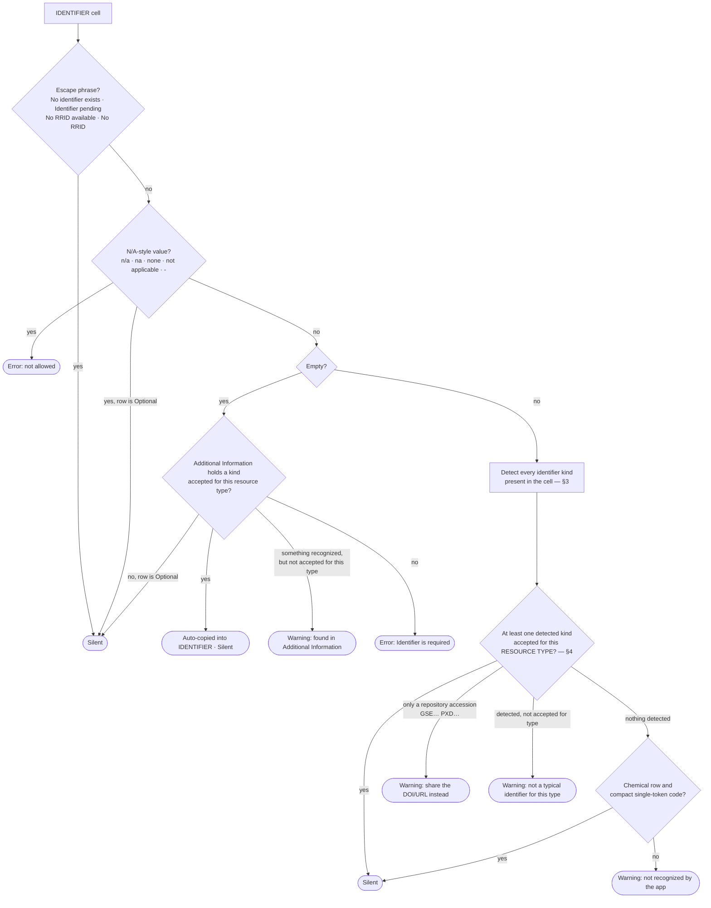

# KRT Validation Rules

The complete reference of how the app checks a Key Resources Table (KRT): what each column must contain,
**which identifiers the app recognizes, and which of them each resource type accepts.**

This is the page the app links to from the KRT editor ("Validation rules ↗"). It describes the behaviour
of the code on the branch you are viewing; the implementation it documents is listed at the [end](#where-the-rules-live-in-the-code).

**Contents**

1. [How validation works](#1-how-validation-works)
2. [Column-by-column rules](#2-column-by-column-rules)
3. [Identifier kinds the app recognizes](#3-identifier-kinds-the-app-recognizes)
4. [Which identifiers each resource type accepts](#4-which-identifiers-each-resource-type-accepts)
5. [Worked example: Dataset vs Other](#5-worked-example-dataset-vs-other)
6. [Verified acceptance matrix](#6-verified-acceptance-matrix)
7. [Special treatments per resource type](#7-special-treatments-per-resource-type)
8. [Import-time normalizations](#8-import-time-normalizations)
9. [Known limitations](#9-known-limitations)
10. [Where the rules live in the code](#where-the-rules-live-in-the-code)

---

## 1. How validation works

Validation runs on every row, automatically after upload and after every cell edit, on both the submission
editor and the standalone ["Validate a KRT" page](./submission-workflow.md). Each check produces one of three
outcomes:

| Outcome | Shown as | Meaning | Blocks "Continue"? |
|---|---|---|---|
| **Error** | red | Something is missing or not allowed | **Only for RESOURCE TYPE.** Every other error can be acknowledged and the user continues; it is handled downstream. |
| **Warning** | yellow | Advisory — the value is probably fine, the app just could not confirm it | Never |
| **Silent** | nothing | Accepted | — |

Five columns are validated: **RESOURCE TYPE**, **RESOURCE NAME**, **SOURCE**, **IDENTIFIER**, **NEW/REUSE**.
**ADDITIONAL INFORMATION is never validated** — it is only *read*, to auto-fill an empty Identifier.

The identifier check is the one people ask about most, so here it is as a flow:

Two consequences worth stating plainly:

- **No identifier-format rule is ever blocking.** Only an *empty* or *N/A* identifier is an error, and even
  that does not block "Continue". Per-type acceptance only decides whether the curator sees a yellow remark.
- **A cell passes if *any* recognized kind in it is accepted for the type.** `GSE12345 (https://…)` is fine
  everywhere because of the URL, even though the bare accession alone would warn.

---

## 2. Column-by-column rules

### RESOURCE TYPE

The value must be one of the canonical types (the list is managed in the admin configuration; the current
set is the 14 types in [§4](#4-which-identifiers-each-resource-type-accepts)).

| Situation | Outcome |
|---|---|
| Empty / whitespace | **Error** — "Resource type is required" |
| N/A value | **Error** — "…(N/A is not allowed)" |
| Exact canonical type | Silent |
| Wrong casing (`antibody`) | **Error**, one-click fixable → "Use 'Antibody'" |
| Recognized synonym or plural (`Chemicals`, `Plasmid`, `Tools`…) — see [§7](#recognized-synonyms) | **Error**, one-click fixable |
| Anything else | **Error** — "Did you mean…?" (closest match, ≤3 edits) or the list of valid types |

This is the **only column whose errors block "Continue"**: each row must be classified before analysis.

### RESOURCE NAME

| Situation | Outcome |
|---|---|
| Empty / whitespace | **Error** — "Resource name is required" |
| N/A value | **Error** — "…not allowed as a resource name" |
| Longer than 500 characters | **Warning** — suggests shortening |
| Any other value | Silent |

### SOURCE

Source is the repository or vendor *name* (Zenodo, GitHub, Addgene, ATCC…). The DOI/URL belongs in IDENTIFIER.

| Situation | Outcome |
|---|---|
| Empty, **and** the row is Software/code **and** already carries a real identifier | Silent — the identifier locates it |
| Empty otherwise | **Error** — "Source is required" |
| Any non-empty value | Silent |

### IDENTIFIER

Summarized by the flow in [§1](#1-how-validation-works). In table form:

| Situation | Outcome |
|---|---|
| `No identifier exists`, `Identifier pending`, `No RRID available`, `No RRID` (any case, trailing dots ignored) | Silent |
| N/A value, row is Optional | Silent |
| N/A value, otherwise | **Error** — "…not allowed as an identifier" |
| Empty, Additional Information contains a kind accepted for this type | Silent — value auto-copied into IDENTIFIER |
| Empty, Additional Information contains something recognized but not accepted for this type | **Warning** — "…found in Additional Information" |
| Empty, row is Optional | Silent |
| Empty, otherwise | **Error** — "Identifier is required" |
| Non-empty, at least one recognized kind accepted for this type | Silent |
| Non-empty, nothing recognized, Chemical row with a compact single-token code | Silent |
| Non-empty, nothing recognized | **Warning** — "Identifier not recognized by the app" |
| Non-empty, only a bare repository accession (`GSE…`, `PXD…`) | **Warning** — "not accepted on its own" (share the DOI/URL) |
| Non-empty, recognized but not accepted for this type | **Warning** — "<Kind> is not a typical identifier for <type>" |

"Optional" is the per-row **Opt** checkbox in the editor; it relaxes the empty/N/A rules for that row only.

### NEW/REUSE

| Situation | Outcome |
|---|---|
| Empty / whitespace | **Error** — "NEW/REUSE is required" |
| N/A value | **Error** — "…not allowed" |
| Anything other than `new` / `reuse` | **Error** — "Invalid value" |
| `new` / `reuse` (any casing; `n`, `r`, `reused` are normalized on import) | Silent |

### Cross-field: protocols.io

| Situation | Outcome |
|---|---|
| SOURCE contains `protocols.io` **and** IDENTIFIER is a concrete value that is **not** a DOI or URL | **Error** — "protocols.io protocols require a DOI or URL identifier" |
| SOURCE contains `protocols.io`, IDENTIFIER empty or an escape phrase | Left to the standard Identifier rules (no double flag) |

### N/A variants (rejected in every column)

`n/a`, `na`, `n.a.`, `n.a`, `not available`, `not applicable`, `none`, `-`, `--` (case-insensitive).

---

## 3. Identifier kinds the app recognizes

The app scans the IDENTIFIER cell (and ADDITIONAL INFORMATION) for the kinds below. Detection is
**substring-based** unless marked *whole cell*: surrounding words do not prevent recognition, and one cell can
match several kinds at once (`https://doi.org/10.…` is a DOI *and* a URL; `P04637` is a UniProt ID, a
GenBank-shaped token *and* a catalog-number-shaped token).

The **catalog number** kind is a loose fallback (any run of ≥4 digits with an optional short prefix). Many
mis-typed identifiers are therefore not "unrecognized" but silently reclassified as catalog numbers — which
is why they pass on lab-material rows and warn on Dataset / Software / Protocol rows.

| Kind | What is recognized | Matches | Does **not** match |
|---|---|---|---|
| **DOI** | `10.` + ≥4 digits + `/` + non-blank text. Case-insensitive. | `10.5281/zenodo.1234567` · `https://doi.org/10.17504/protocols.io.abc` (also a URL) · `10.6019/S-BSST1234` | `doi:zenodo.1234567` (no `10.` — falls through to catalog number) |
| **URL** | `http://` or `https://` + text | `https://github.com/lab/tool` | `github.com/lab/tool` (no scheme) · `www.addgene.org/12345` (only `12345` is seen, as a catalog number) |
| **RRID** | `RRID:` + authority + `_` + id, with an optional `:sub-id`; **or** a bare authority-scoped id for the known authorities `AB, CVCL, IMSR, MGI, RGD, MMRRC, BDSC, DGRC, FBst, FBrf, ZFIN, ZIRC, WB, CGC, NXR, Addgene` (normalized to `RRID:…`) | `RRID:AB_2617428` · `AB_2617428` · `RRID:IMSR_JAX:000664` · `CVCL_F1H5` · `RRID:SCR_002285` (also SCR) | — |
| **SCR code** | `SCR_` + digits | `SCR_016499` · `RRID:SCR_016499` | `SCR 016499` (→ catalog number) |
| **CAS number** | 2–7 digits `-` 2 digits `-` 1 digit | `144-55-8` · `7732-18-5` | `144558` (→ catalog number) |
| **Cellosaurus** | `Cellosaurus:` + id (a bare `CVCL_…` is caught by the RRID rule instead) | `Cellosaurus: CVCL_F1H5` | — |
| **Addgene** | `Addgene:` + number, or `Addgene: Submitted…` (bare `Addgene_12345` → RRID rule; bare `12345` → catalog number) | `Addgene: 12345` · `Addgene: Submitted` | `Addgene 12345` (→ catalog number) |
| **EMDB** | `EMDB:` + digits | `EMDB: 55203` · `EMDB:55203` | **`EMD-55203`** (official EMDB form — seen as a catalog number) |
| **PDB** | `PDB:` + 4 alphanumerics | `PDB: 9SHG` | **`9SHG`** alone |
| **EMPIAR** | `EMPIAR` + `-` / `:` / space + digits | `EMPIAR-13145` · `EMPIAR: 13145` | — |
| **GenBank** | 1–2 **uppercase** letters + 5–6 digits, optional `.version` | `AB123456` · `U12345.1` | **`NM_001301.3`** (RefSeq, underscore form) · `ab123456` (lowercase → catalog number) |
| **UniProt** | Standard UniProt accession shape, case-insensitive | `P04637` · `Q9NZC2` · `A0A024R161` | — |
| **PMID** | `PMID:` + digits | `PMID: 12345678` | **`12345678`** alone (→ catalog number) |
| **Catalog number** | 0–3 letters, optional `-`/`#`, **≥4 digits**, optional trailing letter. Fallback: suppressed when a DOI, RRID, SCR, EMDB, PDB, EMPIAR, CAS or accession is in the same cell | `sc-32233` · `HY-102007` · `6946S` · `62802` · `12345` | `ab290` (3 digits) · `Cat# 12-345` |
| **Oligonucleotide sequence** *(whole cell)* | Entire cell is ≥6 letters from `A C G T U N` (any case) | `ACGTACGTAA` | `ACGT primer` · `5'-ACGTAC-3'` |
| **BioStudies accession** *(whole cell)* | Entire cell is `S-BSST…` or `S-BIAD…`. The DOI form `10.6019/S-…` is accepted via the DOI rule | `S-BSST1234` · `S-BIAD5` | `S-BSST1234 (BioImages)` |
| **Repository accession** *(advisory only)* | `PXD`, `GSE`, `SRR`, `SRP`, `SRX`, `PRJNA`, `PRJEB`, `PRJDB`, `SAMN`, `SAMEA`, `E-XXXX-nnn` (ArrayExpress), `phs` + 6 digits. **Never accepted on its own** — the app asks for the DOI/URL of the record | `GSE12345` · `PXD012345` · `E-MTAB-1234` | — |

---

## 4. Which identifiers each resource type accepts

**DOI and URL are accepted for every resource type.** On top of that:

| Resource type | Also accepts | On the "not typical" list (warns when it is the only kind found)¹ |
|---|---|---|
| **Antibody** | RRID, catalog number | SCR code, Cellosaurus, Addgene, EMDB, PDB, EMPIAR, GenBank, UniProt, PMID, CAS number, oligonucleotide sequence, BioStudies accession |
| **Bacterial strain** | RRID, catalog number | same as Antibody |
| **Viral vector** | RRID, catalog number | same as Antibody |
| **Biological sample** | catalog number, BioStudies accession | RRID, SCR code, Cellosaurus, Addgene, EMDB, PDB, EMPIAR, GenBank, UniProt, PMID, CAS number, oligonucleotide sequence |
| **Chemical, peptide, or recombinant protein** | RRID, catalog number, **CAS number**, UniProt — **plus any compact single-token code** (≤40 chars, no spaces, optional `Cat#` / `Cat. No.` label) | SCR code, Cellosaurus, Addgene, EMDB, PDB, EMPIAR, GenBank, PMID, oligonucleotide sequence, BioStudies accession |
| **Critical commercial assay** | RRID, catalog number | same as Antibody |
| **Experimental model: Cell line** | RRID, catalog number, Cellosaurus | SCR code, Addgene, EMDB, PDB, EMPIAR, GenBank, UniProt, PMID, CAS number, oligonucleotide sequence, BioStudies accession |
| **Experimental model: Organism/strain** | RRID, catalog number | same as Antibody |
| **Oligonucleotide** | **oligonucleotide sequence**, GenBank | RRID, SCR code, Cellosaurus, Addgene, EMDB, PDB, EMPIAR, UniProt, PMID, CAS number, catalog number, BioStudies accession |
| **Recombinant DNA** | RRID, catalog number, Addgene | SCR code, Cellosaurus, EMDB, PDB, EMPIAR, GenBank, UniProt, PMID, CAS number, oligonucleotide sequence, BioStudies accession |
| **Dataset** | **EMDB, PDB, EMPIAR, GenBank, UniProt, BioStudies accession** | RRID, SCR code, Cellosaurus, Addgene, PMID, CAS number, catalog number, oligonucleotide sequence |
| **Software/code** | **RRID, SCR code** | Cellosaurus, Addgene, EMDB, PDB, EMPIAR, GenBank, UniProt, PMID, CAS number, catalog number, oligonucleotide sequence, BioStudies accession |
| **Protocol** | **PMID** | RRID, SCR code, Cellosaurus, Addgene, EMDB, PDB, EMPIAR, GenBank, UniProt, CAS number, catalog number, oligonucleotide sequence, BioStudies accession |
| **Other** (tools, instruments, "resource") | **RRID, SCR code, catalog number** | Cellosaurus, Addgene, EMDB, PDB, EMPIAR, GenBank, UniProt, PMID, CAS number, oligonucleotide sequence, BioStudies accession |

¹ In practice several of these rarely warn on their own: a GenBank- or UniProt-shaped value also matches the
catalog-number shape, `Addgene: 12345` contains a catalog-number-shaped `12345`, and `Cellosaurus: CVCL_…`
contains an RRID-shaped `CVCL_…` — so they pass wherever catalog numbers / RRIDs are accepted. The verified
outcomes are in [§6](#6-verified-acceptance-matrix).

Bare repository accessions (`GSE…`, `PXD…`, …) warn for **every** type, Dataset included: the app asks for
the DOI or landing-page URL of the record.

The same information, kind by kind:

| Kind | Accepted for |
|---|---|
| DOI, URL | **all** types |
| RRID | Antibody, Bacterial strain, Viral vector, Chemical, Critical commercial assay, Cell line, Organism/strain, Recombinant DNA, Software/code, Other |
| Catalog number | Antibody, Bacterial strain, Viral vector, Biological sample, Chemical, Critical commercial assay, Cell line, Organism/strain, Recombinant DNA, Other |
| SCR code | Software/code, Other |
| CAS number | Chemical |
| Cellosaurus | Cell line |
| Addgene | Recombinant DNA |
| EMDB / PDB / EMPIAR | Dataset |
| GenBank | Dataset, Oligonucleotide |
| UniProt | Dataset, Chemical |
| BioStudies accession | Dataset, Biological sample |
| PMID | Protocol |
| Oligonucleotide sequence | Oligonucleotide |
| Repository accession | none — always advisory |

These lists are a single table in the code (`IDENTIFIER_KIND_ALLOWED_TYPES`) and can be tuned per type
without changing anything else.

---

## 5. Worked example: Dataset vs Other

| Value in IDENTIFIER | **Dataset** | **Other** |
|---|---|---|
| `10.5281/zenodo.1234567` · any `https://…` | ✓ | ✓ |
| `EMDB: 55203` · `PDB: 9SHG` · `EMPIAR-13145` | ✓ | ⚠ not typical |
| `S-BSST1234` | ✓ | ⚠ not typical (`10.6019/S-BSST1234` ✓) |
| `AB123456` (GenBank) · `P04637` (UniProt) | ✓ | ✓ — only because they also look like catalog numbers |
| `RRID:SCR_002285` · `SCR_002285` | ⚠ not typical | ✓ |
| `RRID:AB_2617428` | ⚠ not typical | ✓ |
| `sc-32233` · `12345` (catalog number) | ⚠ not typical | ✓ |
| `GSE12345` · `PXD012345` (bare accession) | ⚠ share the DOI/URL | ⚠ share the DOI/URL |
| `GSE12345 (https://www.ncbi.nlm.nih.gov/geo/…)` | ✓ (URL) | ✓ (URL) |
| `EMD-55203` | ⚠ (seen as a catalog number) | ✓ (seen as a catalog number) |
| `in-house`, prose | ⚠ not recognized | ⚠ not recognized |
| `No identifier exists` · `Identifier pending` | ✓ | ✓ |
| empty · `N/A` | ✗ error | ✗ error |

---

## 6. Verified acceptance matrix

Produced by running the validator itself (`validateIdentifierValues`) over each sample value × each resource
type — not by reading the patterns. Regenerate it after any change to the extractor or the per-type table.

Legend: `✓` silent · `⚠T` not typical for this type · `⚠U` not recognized · `⚠A` bare accession, share the
DOI/URL · `✗` error. "Detected" is what the extractor found in the cell.

| Value | Detected | Antibody | Bact. | Viral | BioSample | Chemical | Assay | CellLine | Organism | Oligo | RecDNA | Dataset | Software | Protocol | Other |
|---|---|---|---|---|---|---|---|---|---|---|---|---|---|---|---|
| `10.5281/zenodo.1234567` | doi | ✓ | ✓ | ✓ | ✓ | ✓ | ✓ | ✓ | ✓ | ✓ | ✓ | ✓ | ✓ | ✓ | ✓ |
| `https://doi.org/10.5281/zenodo.1234567` | doi, url | ✓ | ✓ | ✓ | ✓ | ✓ | ✓ | ✓ | ✓ | ✓ | ✓ | ✓ | ✓ | ✓ | ✓ |
| `https://github.com/lab/tool` | url | ✓ | ✓ | ✓ | ✓ | ✓ | ✓ | ✓ | ✓ | ✓ | ✓ | ✓ | ✓ | ✓ | ✓ |
| `RRID:AB_2617428` | rrid | ✓ | ✓ | ✓ | ⚠T | ✓ | ✓ | ✓ | ✓ | ⚠T | ✓ | ⚠T | ✓ | ⚠T | ✓ |
| `AB_2617428` | rrid | ✓ | ✓ | ✓ | ⚠T | ✓ | ✓ | ✓ | ✓ | ⚠T | ✓ | ⚠T | ✓ | ⚠T | ✓ |
| `RRID:IMSR_JAX:000664` | rrid | ✓ | ✓ | ✓ | ⚠T | ✓ | ✓ | ✓ | ✓ | ⚠T | ✓ | ⚠T | ✓ | ⚠T | ✓ |
| `RRID:SCR_002285` | rrid, scr | ✓ | ✓ | ✓ | ⚠T | ✓ | ✓ | ✓ | ✓ | ⚠T | ✓ | ⚠T | ✓ | ⚠T | ✓ |
| `SCR_016499` | scr | ⚠T | ⚠T | ⚠T | ⚠T | ⚠T | ⚠T | ⚠T | ⚠T | ⚠T | ⚠T | ⚠T | ✓ | ⚠T | ✓ |
| `144-55-8` | cas | ⚠T | ⚠T | ⚠T | ⚠T | ✓ | ⚠T | ⚠T | ⚠T | ⚠T | ⚠T | ⚠T | ⚠T | ⚠T | ⚠T |
| `Cellosaurus: CVCL_F1H5` | rrid, cellosaurus | ✓ | ✓ | ✓ | ⚠T | ✓ | ✓ | ✓ | ✓ | ⚠T | ✓ | ⚠T | ✓ | ⚠T | ✓ |
| `CVCL_F1H5` | rrid | ✓ | ✓ | ✓ | ⚠T | ✓ | ✓ | ✓ | ✓ | ⚠T | ✓ | ⚠T | ✓ | ⚠T | ✓ |
| `Addgene: 12345` | addgene, catalogNumber | ✓ | ✓ | ✓ | ✓ | ✓ | ✓ | ✓ | ✓ | ⚠T | ✓ | ⚠T | ⚠T | ⚠T | ✓ |
| `12345` | catalogNumber | ✓ | ✓ | ✓ | ✓ | ✓ | ✓ | ✓ | ✓ | ⚠T | ✓ | ⚠T | ⚠T | ⚠T | ✓ |
| `EMDB: 55203` | emdb | ⚠T | ⚠T | ⚠T | ⚠T | ⚠T | ⚠T | ⚠T | ⚠T | ⚠T | ⚠T | ✓ | ⚠T | ⚠T | ⚠T |
| `EMD-55203` | catalogNumber | ✓ | ✓ | ✓ | ✓ | ✓ | ✓ | ✓ | ✓ | ⚠T | ✓ | ⚠T | ⚠T | ⚠T | ✓ |
| `PDB: 9SHG` | pdb | ⚠T | ⚠T | ⚠T | ⚠T | ⚠T | ⚠T | ⚠T | ⚠T | ⚠T | ⚠T | ✓ | ⚠T | ⚠T | ⚠T |
| `9SHG` | — | ⚠U | ⚠U | ⚠U | ⚠U | ✓ | ⚠U | ⚠U | ⚠U | ⚠U | ⚠U | ⚠U | ⚠U | ⚠U | ⚠U |
| `EMPIAR-13145` | empiar | ⚠T | ⚠T | ⚠T | ⚠T | ⚠T | ⚠T | ⚠T | ⚠T | ⚠T | ⚠T | ✓ | ⚠T | ⚠T | ⚠T |
| `AB123456` | catalogNumber, genbank | ✓ | ✓ | ✓ | ✓ | ✓ | ✓ | ✓ | ✓ | ✓ | ✓ | ✓ | ⚠T | ⚠T | ✓ |
| `NM_001301.3` | — | ⚠U | ⚠U | ⚠U | ⚠U | ✓ | ⚠U | ⚠U | ⚠U | ⚠U | ⚠U | ⚠U | ⚠U | ⚠U | ⚠U |
| `P04637` | catalogNumber, genbank, uniprot | ✓ | ✓ | ✓ | ✓ | ✓ | ✓ | ✓ | ✓ | ✓ | ✓ | ✓ | ⚠T | ⚠T | ✓ |
| `PMID: 12345678` | catalogNumber, pmid | ✓ | ✓ | ✓ | ✓ | ✓ | ✓ | ✓ | ✓ | ⚠T | ✓ | ⚠T | ⚠T | ✓ | ✓ |
| `12345678` | catalogNumber | ✓ | ✓ | ✓ | ✓ | ✓ | ✓ | ✓ | ✓ | ⚠T | ✓ | ⚠T | ⚠T | ⚠T | ✓ |
| `sc-32233` | catalogNumber | ✓ | ✓ | ✓ | ✓ | ✓ | ✓ | ✓ | ✓ | ⚠T | ✓ | ⚠T | ⚠T | ⚠T | ✓ |
| `HY-102007` | catalogNumber | ✓ | ✓ | ✓ | ✓ | ✓ | ✓ | ✓ | ✓ | ⚠T | ✓ | ⚠T | ⚠T | ⚠T | ✓ |
| `ab290` | — | ⚠U | ⚠U | ⚠U | ⚠U | ✓ | ⚠U | ⚠U | ⚠U | ⚠U | ⚠U | ⚠U | ⚠U | ⚠U | ⚠U |
| `Cat# ab290` | — | ⚠U | ⚠U | ⚠U | ⚠U | ✓ | ⚠U | ⚠U | ⚠U | ⚠U | ⚠U | ⚠U | ⚠U | ⚠U | ⚠U |
| `ACGTACGTAA` | oligoSequence | ⚠T | ⚠T | ⚠T | ⚠T | ⚠T | ⚠T | ⚠T | ⚠T | ✓ | ⚠T | ⚠T | ⚠T | ⚠T | ⚠T |
| `S-BSST1234` | biostudiesAccession | ⚠T | ⚠T | ⚠T | ✓ | ⚠T | ⚠T | ⚠T | ⚠T | ⚠T | ⚠T | ✓ | ⚠T | ⚠T | ⚠T |
| `10.6019/S-BSST1234` | doi | ✓ | ✓ | ✓ | ✓ | ✓ | ✓ | ✓ | ✓ | ✓ | ✓ | ✓ | ✓ | ✓ | ✓ |
| `GSE12345` | accession | ⚠A | ⚠A | ⚠A | ⚠A | ⚠A | ⚠A | ⚠A | ⚠A | ⚠A | ⚠A | ⚠A | ⚠A | ⚠A | ⚠A |
| `PXD012345` | accession | ⚠A | ⚠A | ⚠A | ⚠A | ⚠A | ⚠A | ⚠A | ⚠A | ⚠A | ⚠A | ⚠A | ⚠A | ⚠A | ⚠A |
| `GSE12345 (https://www.ncbi.nlm.nih.gov/geo/query/acc.cgi?acc=GSE12345)` | accession, url | ✓ | ✓ | ✓ | ✓ | ✓ | ✓ | ✓ | ✓ | ✓ | ✓ | ✓ | ✓ | ✓ | ✓ |
| `in-house plasmid` | — | ⚠U | ⚠U | ⚠U | ⚠U | ⚠U | ⚠U | ⚠U | ⚠U | ⚠U | ⚠U | ⚠U | ⚠U | ⚠U | ⚠U |
| `No identifier exists` | — | ✓ | ✓ | ✓ | ✓ | ✓ | ✓ | ✓ | ✓ | ✓ | ✓ | ✓ | ✓ | ✓ | ✓ |
| `Identifier pending` | — | ✓ | ✓ | ✓ | ✓ | ✓ | ✓ | ✓ | ✓ | ✓ | ✓ | ✓ | ✓ | ✓ | ✓ |
| `No RRID available` | — | ✓ | ✓ | ✓ | ✓ | ✓ | ✓ | ✓ | ✓ | ✓ | ✓ | ✓ | ✓ | ✓ | ✓ |
| `N/A` | — | ✗ | ✗ | ✗ | ✗ | ✗ | ✗ | ✗ | ✗ | ✗ | ✗ | ✗ | ✗ | ✗ | ✗ |
| *(empty)* | — | ✗ | ✗ | ✗ | ✗ | ✗ | ✗ | ✗ | ✗ | ✗ | ✗ | ✗ | ✗ | ✗ | ✗ |

---

## 7. Special treatments per resource type

| Type | Treatment |
|---|---|
| **Chemical, peptide, or recombinant protein** | Any compact single-token code passes the identifier check (vendor codes like `ab290` do not fit the ≥4-digit catalog rule). Consequence: a Chemical row only gets a "not recognized" remark for a multi-word value or one longer than 40 characters. |
| **Software/code** | SOURCE may be empty when the row already carries a real identifier. `Software` / `Code` are rewritten to `Software/code` on import; a blank NEW/REUSE defaults to `reuse` on import. The `No RRID available` escape phrase exists mainly for these rows (an RRID is the expected identifier for software), though it is accepted on any row. |
| **Protocol** | PMID is the only extra accepted kind. If SOURCE mentions `protocols.io`, the identifier *must* be a DOI or URL (error otherwise) — this rule applies to any row whose Source is protocols.io, whatever its type. |
| **Other** | The catch-all for tools and instruments: `Tool(s)`, `Instrument(s)`, `Resource(s)` are offered as one-click fixes to `Other`. Identified like lab materials (RRID, SCR, catalog number). |
| **Any row flagged Optional** | An empty or N/A identifier is silent. |

### Recognized synonyms

Values that are flagged as an **error with a one-click fix** to the canonical type (case-insensitive; the plural
of most types — `Antibodies`, `Datasets`, `Protocols`, … — is recognized too):

| Written by the author | Fixed to |
|---|---|
| `Chemical`, `Chemicals`, `Peptide(s)`, `Recombinant protein(s)`, `cDNA construct(s)`, `Biological reagent(s)` | Chemical, peptide, or recombinant protein |
| `Kit`, `Assay kit`, `Commercial assay`, `Commercial assay or kit`, `Assay or kit` | Critical commercial assay |
| `Cell line(s)`, `Experimental models: cell line(s)` | Experimental model: Cell line |
| `Mouse strain(s)`, `Mouse line(s)`, `Rat strain(s)`, `Animal strain`, `Organism`, `Organism/strain`, `Strain`, `Genetic reagent`, `Genetic reagent (Mus musculus)` | Experimental model: Organism/strain |
| `Virus`, `Virus strain(s)` | Viral vector |
| `Plasmid(s)` | Recombinant DNA |
| `Bacteria` | Bacterial strain |
| `Software`, `Code`, `Code/software` | Software/code (rewritten silently on import) |
| `Tool(s)`, `Instrument(s)`, `Resource(s)` | Other |

---

## 8. Import-time normalizations

Some author inputs are silently corrected when the file is parsed, before any validation:

| Behaviour |
|---|
| "Header" rows (a resource-type name with no other data) are dropped |
| `Software` / `Code` → canonical `Software/code` |
| Software rows with a blank NEW/REUSE default to `reuse` |
| `n` / `r` / `reused` in NEW/REUSE → `new` / `reuse` |
| Empty IDENTIFIER is auto-filled from ADDITIONAL INFORMATION when it holds a recognized identifier (most specific kind first: RRID, SCR, Cellosaurus, Addgene, EMDB/PDB/EMPIAR, BioStudies, DOI, oligo sequence, PMID, GenBank, UniProt, URL — catalog numbers are never auto-copied at import) |
| In the cell editor, typing `None` / `n/a` into IDENTIFIER is rewritten to `No identifier exists` on save |
| Column headers are matched loosely (`ID`, `DOI`, `RRID`, `URL` all map to IDENTIFIER) |

---

## 9. Known limitations

Behaviours the matrix in [§6](#6-verified-acceptance-matrix) makes visible. None of them blocks anything
(at most a yellow remark), but they explain results that can look surprising:

1. **`EMD-55203` is not recognized as EMDB** — only the `EMDB: 55203` spelling is. A Dataset row using the
   official `EMD-` form gets "Catalog number is not a typical identifier".
2. **Bare PDB codes (`9SHG`) are not recognized** — only `PDB: 9SHG`.
3. **RefSeq accessions (`NM_…`, `NP_…`, `XM_…`) are not recognized**; GenBank detection covers only the
   1–2-letter + digits form.
4. **A bare PMID on a Protocol row warns** — `12345678` without `PMID:` is read as a catalog number.
5. **Catalog-number overlap** — GenBank/UniProt-shaped values and `PMID: …` / `Addgene: …` also match the
   catalog-number shape, so they pass on lab-material rows regardless; conversely a catalog code shaped like
   `AB123456` passes on a Dataset row as GenBank.
6. **`Cellosaurus: CVCL_…` also counts as an RRID**, so it passes wherever RRIDs do, not only on Cell line rows.
7. **CAS numbers are accepted only for Chemical** rows.

---

## Where the rules live in the code

| Concern | File |
|---|---|
| Detection patterns ([§3](#3-identifier-kinds-the-app-recognizes)) | `src/backend/services/krt/identifier-extractor.js` — `patterns` |
| Per-type acceptance ([§4](#4-which-identifiers-each-resource-type-accepts)) | `src/backend/services/krt/validator.service.js` — `IDENTIFIER_KIND_ALLOWED_TYPES` |
| Identifier outcome logic ([§1](#1-how-validation-works)) | `validator.service.js` — `validateIdentifier` (submission editor) / `validateIdentifierValues` (Validate-a-KRT page, offline tooling) |
| Chemical lenient rule | `validator.service.js` — `looksLikeChemicalCatalog` |
| Escape phrases / N/A list | `validator.service.js` — `isNoIdentifierPhrase`, `isNAVariation` |
| Other column validators | `validator.service.js` — `validateResourceType`, `validateResourceName`, `validateSource`, `validateNewReuse`, `validateProtocolsIoIdentifier` |
| Resource-type synonyms ([§7](#recognized-synonyms)) | `validator.service.js` — `normalizeResourceType` |
| Canonical resource types | database table `resource_types` (admin configuration); offline mirror `DEFAULT_RESOURCE_TYPES` |
| Import-time normalizations ([§8](#8-import-time-normalizations)) | `src/backend/services/krt/parser.service.js` — `preprocessRow` |
| Cell-edit hints in the UI | `src/frontend/src/components/krt/KRTCellEditModal.vue` |
| Tests | `validator-rules.test.js`, `validator-source.test.js`, `identifier-extractor.test.js`, `parser-normalize.test.js` |

Every row runs through `validateRow` (submission flow) or `validateRowValues` (stateless page), which call the
five column validators plus the protocols.io cross-field check. See
[Submission Workflow](./submission-workflow.md) for how validation gates the steps.
