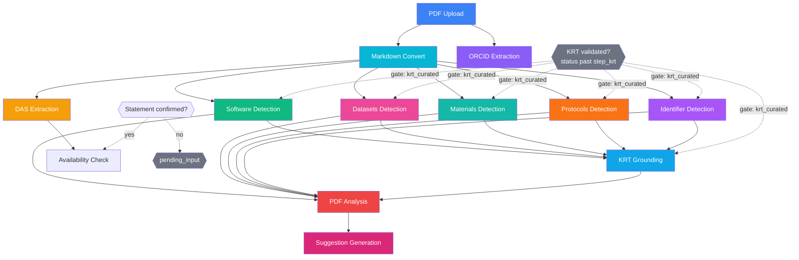
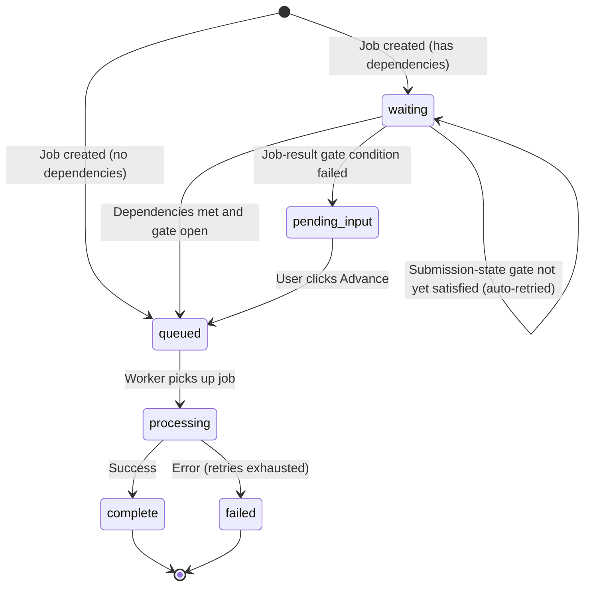

# Pipeline Jobs

The application uses **pg-boss** (PostgreSQL-based job queue) to run the pipeline asynchronously. Jobs are tracked in the `submission_jobs` table, and an orchestrator manages dependencies between jobs. The frontend polls for status updates with exponential backoff.

> This document covers the **queue & orchestration layer** (how jobs are scheduled, sequenced, retried, and polled).
> For what each module *does and how it works internally*, see [pipeline-modules.md](./pipeline-modules.md).

## Queue Configuration

pg-boss runs in a dedicated `pgboss` schema, separate from application tables.

| Setting | Value |
|---------|-------|
| Archive completed jobs | 24 hours |
| Delete archived jobs | 7 days |
| Monitor state interval | 30 seconds |
| Maintenance interval | 120 seconds |
| Graceful shutdown timeout | 30 seconds |

## Queues and Job Types

| Queue Name | Job Type Constant | Purpose |
|------------|-------------------|---------|
| `das-extraction` | `DAS_EXTRACTION` | Extract Data Availability Statement from PDF |
| `software-detection` | `SOFTWARE_DETECTION` | Detect software mentions via Softcite |
| `orcid-extraction` | `ORCID_EXTRACTION` | Extract author ORCIDs via GROBID + OpenAlex |
| `markdown-convert` | `MARKDOWN_CONVERT` | Convert PDF to Markdown (MarkItDown subprocess or Modal/Docling) |
| `datasets-detection` | `DATASETS_DETECTION` | Detect dataset mentions (langextract signals + Gemini consolidation) |
| `materials-detection` | `MATERIALS_DETECTION` | Detect lab material mentions via Google Gemini |
| `protocols-detection` | `PROTOCOLS_DETECTION` | Detect protocol mentions via Google Gemini |
| `identifier-detection` | `IDENTIFIER_DETECTION` | Scan markdown against curated enrichment lists for DOIs/RRIDs/accessions/catalogs (no external API) |
| `pdf-analysis` | `PDF_ANALYSIS` | Build the Generated KRT — LM-consolidate (Gemini) the merged detection candidates, with a rule-based merge fallback |
| `suggestion-generation` | `SUGGESTION_GENERATION` | AI Suggestions — Gemini compares author KRT vs Generated KRT and emits per-resource decisions (LM-only, no fallback) |
| `report-generation` | `REPORT_GENERATION` | Generate Excel reports (ad-hoc, not part of the PDF pipeline) |

### Timeout and Retry Configuration

Each queue derives its timeout from the corresponding API timeout environment variable:

| Queue | Env Var for Timeout | Default Timeout | Retry Limit | Retry Delay |
|-------|---------------------|-----------------|-------------|-------------|
| DAS Extraction | `DAS_EXTRACTION_API_TIMEOUT` | 120s (2 min) | 2 | 60s |
| Software Detection | `SOFTCITE_API_TIMEOUT` | 600s (10 min) | 2 | 60s |
| ORCID Extraction | `GROBID_API_TIMEOUT` | 30s | 2 | 30s |
| Markdown Convert | `PDF_MARKDOWN_TIMEOUT` | 120s (2 min) | 2 | 30s |
| Datasets Detection | `DATASETS_DETECTION_API_TIMEOUT` | 300s (5 min) | 2 | 60s |
| Materials Detection | `MATERIALS_DETECTION_API_TIMEOUT` | 300s (5 min) | 2 | 60s |
| Protocols Detection | `PROTOCOLS_DETECTION_API_TIMEOUT` | 300s (5 min) | 2 | 60s |
| Identifier Detection | — (fixed) | 60s | 1 | 30s |
| PDF Analysis | `PDF_ANALYSIS_API_TIMEOUT` | 300s (5 min) | 2 | 60s |
| Suggestion Generation | `KRT_COMPARISON_API_TIMEOUT` | 300s (5 min) | 2 | 60s |
| Report Generation | — (fixed) | 300s (5 min) | 2 | 60s |

**Job expiry formula:**
```
expireInSeconds = max(120, ceil(apiTimeoutMs / 1000) + 60)
```

**Maximum total duration** (all retries + delays):
```
maxTotalSeconds = expireInSeconds × (retryLimit + 1) + retryDelay × retryLimit
```

### Worker Concurrency

How many jobs of that type run **at the same time**, across all submissions. A
job for one submission never runs beside another job of the same type for the
*same* submission — the orchestrator queues one row per step per round — so this
is throughput across the queue, not parallelism within a pipeline.

| Job Type | Concurrency |
|----------|-------------|
| Markdown Convert | 2 |
| DAS Extraction | 2 |
| Software Detection | 1 |
| Datasets Detection | 1 |
| Materials Detection | 2 |
| Protocols Detection | 1 |
| Identifier Detection | 2 |
| KRT Grounding | 2 |
| ORCID Extraction | 2 |
| PDF Analysis | 1 |
| Suggestion Generation | 1 |
| DAS Suggestions | 1 |
| Report Generation | 2 |

`concurrency` is this codebase's name for a **pair** of pg-boss settings, and it
has to set both: `teamSize` (how many jobs are fetched) and `teamConcurrency`
(how many of them run at once). `teamConcurrency` was pinned at 1, so every
worker above declaring 2 fetched two jobs and then ran them one after the other
— a setting that read as if it did something and did nothing. Translated in one
place, `buildWorkerOptions`, and pinned by `worker-options.test.js`.

## Pipeline

PDF upload triggers a pipeline of parallel and dependent jobs:



**The KRT-validation gate covers the whole detection stage.** Datasets, Materials,
Protocols, Software and Identifier detection are all gated on `krt_curated`, as is
KRT Grounding. Under the default `seeded-v1` pipeline the detection prompts are
given the author's rows, so a detector that ran while the table was still being
edited would answer a question about a KRT that no longer exists — and spend an LM
call doing it. Software and Identifier detection read no KRT themselves, but are
gated with the rest so the stage starts as one moment rather than trickling in
around the KRT step.

**Nothing reads the manuscript when there is no manuscript.** A second gate,
`markdown_ready`, holds every markdown-dependent step — DAS extraction, the five
detectors and KRT Grounding — while `markdown_convert` has completed with
`markdownLength: 0`, **or has failed or been cancelled**. The failed case used
to slip through: the gate only inspected `complete` rows, while the dependency
check counts `failed` as terminal, so an outright converter failure released
every detector to read a manuscript that does not exist — by the one route that
skipped the gate meant to prevent exactly that. Conversion is fail-soft, so a converter error or an empty
response still completes the job; before this gate existed, every downstream
module ran against an empty document and reported zero findings, which reads as
*"your manuscript mentions none of this"* rather than *"we never read your
manuscript"*. Observed on a real run: 11/11 steps complete, 0 datasets, 0
materials, 0 protocols, and all 12 author rows reported not detected.

Unlike the KRT gate this one does **not** clear by itself — conversion has
already finished, unsuccessfully. The jobs API reports
`waitingReason: 'markdown_missing'` and the processes panel shows a blocked
banner where the progress bar would be, naming the re-run that fixes it.
Re-running `markdown_convert` successfully releases every held step
automatically.

Until the submission status moves past `draft`/`step_krt` those jobs stay in
`waiting` and the jobs API reports `waitingReason: 'krt_validation'`, which the
processes panel surfaces as a banner telling the user to click **Continue**. Unlike
the DAS `pending_input` gate this needs **no manual action beyond finishing the KRT
step** — the jobs advance by themselves once the status changes. The gate is on
submission *state*, not on the presence of a KRT: with no author KRT at all the
submission passes it as soon as the author moves on, and grounding still runs and
reports zero author rows, so the pipeline shape is identical in both modes.

**Software Detection depends on Markdown Convert** even though Softcite reads the
PDF directly: the module's second engine — the optional LM pass — reads the
converted markdown, and without the dependency it would race conversion and skip
on nearly every run. This costs nothing end-to-end, because no downstream step
consumes software output before KRT Grounding, which waits for the
markdown-dependent detectors anyway.

**PDF Analysis does not depend on DAS Extraction.** It used to, and it parked in
`pending_input` until a statement existed. That was the wrong step to ask: the
consolidator merges the KRT detectors' findings and never reads the Availability
Statement, so a field only the Availability step uses was holding up the entire
KRT half of the pipeline — in a state nothing revisits, so a run that parked
there needed a manual advance even after the author supplied one.

The decision moved to the step that actually reads the statement. **DAS
Suggestions** now advances only once somebody has confirmed the statement, so no
LM call is spent on a paragraph nobody has read. See
[The Availability Statement, and who vouches for it](#the-availability-statement-and-who-vouches-for-it).

ORCID Extraction is intentionally **not** an input to PDF Analysis — its output writes to `submission.authors`, not the Generated KRT. **PDF Analysis** depends on KRT Grounding even though it does not read the grounding outcomes itself: **Suggestion Generation** does, and it reaches the grounding results only through PDF Analysis. Ordering it this way is what guarantees the verdicts exist when suggestions are built, and it is how PDF Analysis inherits the `krt_curated` gate.

### Pipeline Definition

| Job Type | Depends On | Submission-State Gate | Auto-Advance Condition |
|----------|-----------|-----------------------|------------------------|
| Markdown Convert | (none) | — | Always |
| ORCID Extraction | (none) | — | Always |
| DAS Extraction | Markdown Convert | `markdown_ready` | Always |
| Software Detection | Markdown Convert | `markdown_ready`, `krt_curated` | Always (Softcite reads the PDF; the LM pass reads the markdown) |
| Identifier Detection | Markdown Convert | `markdown_ready`, `krt_curated` | Always |
| Datasets Detection | Markdown Convert | `markdown_ready`, `krt_curated` | Always |
| Materials Detection | Markdown Convert | `markdown_ready`, `krt_curated` | Always |
| Protocols Detection | Markdown Convert | `markdown_ready`, `krt_curated` | Always |
| KRT Grounding | Software + Datasets + Materials + Protocols + Identifier Detection | `markdown_ready`, `krt_curated` | Always |
| PDF Analysis | Software + Datasets + Materials + Protocols + Identifier Detection + KRT Grounding | — (inherited transitively) | Always |
| Suggestion Generation | PDF Analysis | — (inherited transitively) | Always (runs last in the pipeline) |
| DAS Suggestions | DAS Extraction | `availability_ready` | Only if `submission.dasConfirmedAt` is set — **or** the run was asked for by hand |

### Pipeline Rules

- Jobs with no dependencies and no gate start immediately with status `queued`
- Jobs with dependencies start as `waiting` until all dependencies reach a terminal state (`complete` or `failed`)

### One round, one PDF, one KRT

Every step used to resolve its own input: nine services running the same
`File.findOne({ type }, order: version DESC)`, each answering "the latest one"
at whatever moment it happened to run. There was no pipeline-level notion of
the round's inputs, so replacing a file mid-run split the round — some steps had
read the old version, some the new, and nothing recorded that it had happened.

The KRT was worse, because **nothing restarts when it changes**. Detectors are
seeded from `krt_data` as each one runs; PDF Analysis reads `krt_data` again
when it consolidates. An author editing their table between the two — which the
workflow invites, the editor being one click away — got an analysis whose
detections came from one version and whose consolidation reconciled against
another. Silently.

**The rule: the first step in a round to read an input freezes it.** Every later
reader in that round is handed the same thing. `submission_input_freezes` holds
one row per (submission, round, input kind), and the unique constraint is what
makes two detectors starting in the same millisecond agree on one answer rather
than produce two.

The freeze **levels are not configured anywhere** — they fall out of the
dependency graph:

| Input | Frozen by | Which means |
|---|---|---|
| `pdf` | Markdown Convert | at the start of the round |
| `markdown` | whichever detector runs first | as soon as there is text to read |
| `krt` | the first detector | **after the author has validated it** — the detectors are gated on `krt_curated` |

Adding a step changes the levels correctly and automatically, because the levels
*are* the graph. Each step declares what it reads:

```js
{ jobType: JOB_TYPES.SOFTWARE_DETECTION, ..., reads: ['pdf', 'markdown', 'krt'] }
```

**Files are held by reference** (`file_id` plus the version and key as they
were); a File row is immutable once written. **The KRT is held by value**,
because `krt_data` rows are the live editing surface and have no version to
point at — the snapshot IS the reference. It is small: 89 rows on an average
KRT, 335 on the largest seen. Nothing in the pipeline writes `krt_data` (only
user actions do, through the controllers), so handing a step a snapshot changes
what it reads and nothing else.

**Not fail-soft.** Most of this codebase degrades rather than stops, and that is
usually right. Not here: a freeze that failed silently would mean the step read
*something*, and the whole point is that nobody could tell which something. A
frozen file that has since been deleted is an error, never a quiet substitution.

#### When an input is re-frozen

An input is re-taken **only when every step that reads it is being re-run**.

- Restarting **Markdown Convert** cascades through every markdown reader, so the
  markdown freeze goes and the next run picks up the current file.
- Restarting **one detector** does not. Its siblings keep results built from the
  frozen markdown, and handing the restarted one a different document would
  split the round — the failure the freeze exists to prevent, arriving through
  the repair path.
- **`runAllProcesses`** releases everything. That is the call a PDF upload
  makes, and it is what lets a replaced manuscript reach the pipeline at all.

The readers are derived from the `reads` declarations rather than listed
somewhere: a step added without updating a hand-written list would silently make
the rule wrong.

One residual race remains, and predates this: a downstream step already
`processing` is deliberately left alone by `cascadeRestart`, so it finishes
against the input the round was using while the restart takes a newer one. Its
own run record still says which document it read.

#### Saying so

`GET /api/submissions/:id/jobs` returns an `inputs` array — one entry per frozen
input, with the version the run read, what is live now, and `stale`. The
pipeline page turns that into **"This analysis used an earlier version of your
data"**, naming each document and both versions.

For the KRT this compares row COUNTS, which cannot see an edited cell. That is
the honest limit of it: `stale` means "rows were added or removed", never
"nothing has changed". Both counts are reported so a reader can judge.

### "Restart from here"

The button used to say **Restart** and do more than that. Restarting a step also
resets everything downstream of it — those results were built from what this
step produced — so a click on Markdown Convert threw away eight modules' work
with nothing on screen to say so.

It now asks first, and the dialog says three things:

1. **which steps re-run** — this one and every step that depends on it,
   transitively, each named;
2. **that everything else is kept**, results included;
3. **which documents come along.** An input is re-taken only when every step
   that reads it is being re-run, so "restart the conversion" picks up a
   manuscript replaced since the round began and "restart one detector"
   deliberately does not. Someone restarting a single module to pick up their
   new PDF finds that out here rather than after the run.

Restarting **DAS Extraction** additionally warns that the working Availability
Statement will be cleared and read again from the manuscript — anything typed
by hand is lost. That is the point of the restart, and it is not recoverable.

The rule lives in `utils/restart-plan.js` as pure functions over the pipeline
graph, so it is readable and testable on its own; `RestartFromHereDialog.vue`
renders it. Never a native `confirm()`: this app has none, and a native dialog
cannot show a list.

**Restarts live on the pipeline page**, and only there. That is where the whole
graph is visible, where several steps can be picked at once, and where the
consequences of a restart are consequences you can see.

On the pipeline page the card is itself a link, so the button's click is both
stopped AND prevented: without both, restarting a step also navigates away from
the page you wanted to watch it from.

#### The four cases, and one rule

| A finished step | Clean? | What happens |
|---|---|---|
| no error, results | yes | carries on by itself |
| no error, **nothing found** | yes | carries on. A detector finding nothing IS an answer |
| **partial** error | no | the pipeline pauses and asks |
| **total** error | no | the pipeline pauses and asks |

One predicate covers both halves of "not clean" — `issueOf()` in the
orchestrator — and it also swallows a case that used to slip through entirely: a
step reaching `complete` while its outcome was `fail`, which a rule keyed on
status alone let past while the consolidator built on nothing.

**A tolerated partial does not ask.** Whether a degraded run is worth a human's
attention depends on WHICH engine died, so it is declared per module:

```js
const PARTIAL_AUTO_CONTINUE = { software_detection: ['softcite'] }
```

Softcite dying leaves the LM pass, which read the manuscript — common, and
stopping the round for it would be noise. The LM dying leaves name-matching with
no reading behind it, which is worth a question. The engine is already in the
record (`failReason: '<engine>_failed'`), so this is a lookup rather than an
inference.

#### Gates and required edges

They used to be two ideas doing overlapping work. Splitting them properly turned
out to remove one:

- **`gate`** — a fact about the **submission**: `krt_curated`,
  `availability_ready`. Not a dependency, and no dependency rule can express it.
- **`dependsOn` + `optional`** — facts about **dependencies**. A step lists what
  it needs; anything in `optional` it can do without.
- **`produced(job)`** — on the **producer**: did this step yield usable output?
  Defaults to "finished cleanly".

`markdown_ready` was the odd one out — a gate that only ever asked a question
about a dependency's output, repeated on the seven steps that read the
manuscript. It is now `produced()` on Markdown Convert: asked once, and a reader
added later cannot forget to ask it.

> A live Continue immediately found what that refactor exposed: **KRT Grounding
> read the manuscript but declared no dependency on the conversion** — it had
> been relying on the gate. With the gate gone it had no protection at all. The
> invariant *"every step that `reads: ['markdown']` must depend on the
> conversion, and not optionally"* is now a test.

#### A failure pauses what comes after it

`failed` used to count as terminal alongside `complete`, so a failed step
released its dependents and they ran anyway. The consolidator would build a
Generated KRT from four detectors instead of five and say nothing about the
fifth — a quietly thinner answer, and the reader had no way to know it had
happened.

Now the dependents hold at `waiting`, and the person looking at it chooses. The
choice is **not a gamble**, because what each answer costs is computed:

| What is missing | Continue means |
|---|---|
| **optional** data | the steps below run, degraded — "will run with less to work from" |
| **required** data | they cannot run at all, so they are **skipped** — "cannot run without it and will be skipped" |

Skipping rather than the alternatives, all of which are worse: running them
means nine unexplained failures in place of the one real one; leaving them
`waiting` makes `allProcessesFinished` false for ever, which disables the
submission's own Continue button and traps the user in the step; `cancelled`
means "a person stopped this", and a report must tell that apart from "skipped
because the conversion produced no text".

Skipping cascades, so `reconcileSubmission` repeats until nothing moves —
`PIPELINE` is not in topological order and one pass left the tail of a cascade
waiting for the next sweep.

Now the dependents hold at `waiting`, and the person looking at it chooses:

| | What it does | Where |
|---|---|---|
| **Retry** | runs the failed step again | the module's page |
| **Continue without it** | records a decision to proceed without its data | the module's page and the pipeline banner |

**Continue does not re-run anything and does not pretend the step succeeded.**
The row stays `failed`; what is written is `step_executions.decision` —
`{ at, byUserId, choice }`. Recorded rather than inferred, because a report
built without software detection looks exactly like one where software detection
found nothing, and the difference is only knowable if somebody wrote it down.
Two people pressing Continue on the same stalled pipeline is not an error, and
the second does not overwrite the first's name.

**The decision lives on the EXECUTION, not on the step.** It used to be two
columns on the job row, cleared in three places when a step re-ran — and
`runAllProcesses`, the one that re-runs everything, did not clear them, so a
decision about run 1's failure silently released run 2's. There is nothing to
clear now: a re-executed step gets a new execution, which was never decided
about, and a carried-over step keeps the decision along with the result it was
about. The bug is not fixed; it is unrepresentable.

Writing it is **not** a guarded background write. Every other history write logs
and carries on, because a broken logbook must not fail a run that succeeded — but
the orchestrator is about to act on a decision, and one that failed silently
would release the pipeline on a choice nobody made.

One unacknowledged failure is enough to hold a step — a decision about datasets
says nothing about materials.

**The pause has to be visible**, or it is worse than the silent degradation it
replaced: a page of steps sitting at `waiting` with no explanation.

`GET /jobs` therefore carries an **`issues`** array — the whole list, computed
once by `describeIssues()`. `PipelineIssues.vue` renders it on the Availability
step, the pipeline page and a module's page, all able to act; anywhere else can
render the same list with `actionable: false`, because a page that reports a
problem it cannot help with is still how someone finds out.

The Manuscript step is the exception: it shows the same decision **on the step's
own tile** inside the pipeline panel, because a box above the panel repeated in
prose what the tile already showed as a red pill — with the buttons only on the
copy the reader was not looking at. Both surfaces call the same
`useIssueDecision`, so what a decision does cannot drift between them. None of them re-derives anything: the last time a rule like this lived on
the client, the pipeline page asked for a field the API never sent and drew
failed steps as green ticks for weeks.

**"Continue past all"** exists because three degraded detectors is three
questions blocking the same steps, asked when the user is already annoyed. One
press, recorded against each step separately so the record stays precise.

**The report carries it.** A `Pipeline` sheet lists every step in pipeline order:
what became of it, who carried on past it and when, runs, duration and tokens.
Every other sheet in that workbook is the OUTPUT, and a report built without
software detection looks exactly like one where software detection found
nothing — this is the only place the difference is written down. Present even
when empty, because "no record" is itself a fact and a missing sheet reads as an
oversight. `GET /jobs`
therefore returns `blockedBy` (the failed steps holding each one, by name) and
`waitingReason: 'blocked_by_failure'`, which takes precedence over a gate — a
step behind a failed conversion is *also* behind `markdown_ready`, and "waiting
for the converted manuscript" is true but useless when the conversion failed.
The pipeline page turns that into a banner naming each failure and how many
steps are stuck behind it.

The trade, stated plainly: a transient 503 now stalls the round until someone
looks. For a tool with a human in the loop that is the right way round — a stall
you can see beats a result quietly missing a detector — but it is a trade.

#### Retry — the narrow one

A module's own page offers **Retry**, not a restart. Different thing, different
rule:

| | Restart from here | Retry |
|---|---|---|
| Runs | the step **and everything built on it** | that step, alone |
| Releases input freezes | yes, when every reader re-runs | **never** |
| Runs `onManualRestart` | yes | no |
| Available when | any time | the step **failed** and nothing downstream has run since — which, now that failures pause, is the normal case |
| Lives on | the pipeline page | the module's page |

It is for the case that comes up after an external service is fixed, or a patch
is deployed: the pipeline is stuck behind one failure and what is wanted is to
unblock it, not to re-run the round.

**The condition is not "did it fail" but "has anything consumed the failure
yet".** While everything downstream is still `waiting`, nothing was built on its
absence, so running it alone leaves nothing stale — which is exactly the state a
blocked pipeline is in when `markdown_convert` fails and every detector sits
behind the `markdown_ready` gate. Once a later step HAS run, retrying alone
would leave that step's result built on the failure while this one's is not;
the button is **disabled with the reason**, naming the step that ran and pointing
at the restart that would work. Hiding it would answer "why can I not retry
this?" with silence.

Three things a retry deliberately does not do, each of which would make it a
restart wearing a smaller name:

- **release the input freezes** — the round is mid-flight and the steps that did
  run read the frozen documents. A retry taking fresh ones would split the round,
  which is the failure the freeze exists to prevent, arriving through the repair
  path;
- **cascade** — there is nothing downstream to reset. That is the precondition,
  checked rather than assumed;
- **run `onManualRestart`** — a retry of DAS extraction must not clear a
  statement the author typed while the service was down.

`POST /api/submissions/:id/jobs/:jobType/retry`. `retryCount` is reset with the
row: those attempts belonged to the run that failed, and left in place the panel
would show a fresh run already on its third try.

#### Restarting several steps at once

Every pipeline card also carries a **pick** box. Ticking several and pressing
*Restart them* is ONE restart, not a loop of single ones — and the difference
costs money:

> Restart the software detector. Everything downstream is reset and software
> runs. If it finishes before the second restart is issued, grounding finds
> every dependency terminal — materials is still `complete` from the previous
> round — and starts. The second restart then resets it, so grounding runs twice
> and both runs are paid for. The first is invisible rather than harmless,
> because the second answer is the one that sticks.

`orchestrator.restartSteps` therefore resets **every** selected step's
downstream before enqueueing **any** of them. Between those two loops nothing is
running that could release a downstream step, because each is `waiting` on a
selected step that has not started. Freezes are released once, over the union —
a larger set than any single step would compute, which is why `requeueStep`
takes `{ releaseFreezes: false }` when a batch is driving.

The other half of the point is what is **not** picked: restarting two detectors
keeps the other three's results, where "restart from here" on their shared
consumer would have re-run all five.

`POST /api/submissions/:id/processes/restart  { jobTypes: [...] }`, behind the LM
budget like `run` — a selection of five detectors is five detectors' worth of
model work. An unknown step is refused before anything is touched: half a
restart is worse than none, because the caller has to work out which half ran.

**The processes panel has no modal any more.** A tile used to lead to one of two
places: the module page if the step was `complete`, a modal otherwise. So the
same click showed one thing for a finished module and another for a failed one —
and the modal was the older, thinner view: no run history, no frozen inputs, no
restart that says what it takes with it. A module is worth the same page whatever
state it is in, and "it failed" is exactly when you want the record. Every tile
now links to the module page, in any state. (That removed ~780 lines from
`JobStatusPanel.vue`, including a per-job table renderer the module pages had
already replaced.)

### The Availability Statement, and who vouches for it

The Availability check reports on a paragraph that was pulled out of the
manuscript automatically, and extraction gets it wrong often enough to matter.
A check of the wrong paragraph is worse than no check at all, because the report
presents it as the author's own statement. So the check is the one step in the
pipeline that will not start on its own.

**Two fields, two meanings.** They are not redundant:

| Field | Means | Written by |
|---|---|---|
| `extractedDataAvailabilityStatement` | what the **last extraction** found | every extraction run, always |
| `dataAvailabilityStatement` | what the submission **stands on** | extraction *only while it is empty*; otherwise a person |

Once the working field holds a statement, it belongs to whoever put it there.
`applyExtractedDas` (`services/pdf/pdf.service.js`, pure and tested in
`das-write-rule.test.js`) enforces that. The bug it fixes: extraction wrote the
working field every time, so an author whose statement the extractor could not
find typed one by hand — the whole reason the manual path exists — and the next
extraction replaced it with "Not found". The app undid their work and called it
an update.

`NO_DAS_SENTINEL` (`"Not found"`) counts as **empty** everywhere. Extraction is
fail-soft and always persists something, so a first pass that found nothing
leaves the sentinel in the working field; treating that as occupied would lock
out every later extraction, including the one that finally succeeds.

**Confirmation is provenance, not ceremony.**

| Event | Confirmation |
|---|---|
| Extraction fills an empty field | cleared — extractor-authored text has nobody behind it |
| A person writes or edits the statement | **set, in their name** — writing it *is* vouching for it |
| The same text re-saved (no change) | untouched — nothing was decided, and re-stamping would credit the wrong person |
| The statement is emptied | cleared |
| `POST /:id/das/confirm` | set, in the caller's name |
| A new round starts | cleared — it was about the previous manuscript |

Asking someone to confirm a sentence they just typed is the kind of dialog people
learn to dismiss without reading, so the app does not ask. The prompt appears
only for text nobody has touched — on the Availability page, and in the metadata
editor, which is reachable from **every** step so the pipeline can be unblocked
without navigating to step 5.

**Nothing is shown before it is confirmed.** The server refuses to spend an LM
call, but the page had two ways around that and both were live:

- the **legacy in-browser rules** cost nothing to compute, so they rendered
  immediately — a page of recommendations about a paragraph the author had never
  agreed was theirs, indistinguishable from the real thing. Free to compute is
  not the same as safe to show;
- **arriving on the page** called `regenerate`, which takes the MANUAL path —
  and that path deliberately skips the confirmation, because a person clicking a
  step by name has decided to run it. Opening a page is not that decision, so
  the gate never applied to the one route every author takes.

Worse, with no suggestions to show, the tail of the render chain was a bare
`v-else` holding an **all-clear**: an unconfirmed statement rendered as a green
"No issues found" — a pass from a check that had never run. It is now
`v-else-if="dasConfirmed"`; an empty list is not a clean one.

The Suggestions card shows a locked panel instead, with the confirmation in it,
and the step's instructions lead with the same thing.

**Re-running DAS Extraction by hand clears the working statement** first
(`onManualRestart` on the step definition). Asking for extraction again is asking
for a fresh reading, and without the reset the module would run and change
nothing visible — the working field is only filled while empty. The pipeline
running extraction as part of a normal round does **not** clear it: only somebody
asking for a fresh reading gets one.

> ⚠️ A manual re-extraction therefore discards an author-written statement. The
> "Restart from here" work is where that warning belongs in the UI.

**Editing the statement while extraction is running** is blocked in the editor —
the field says what is happening and disables itself. The feature is not taken
away, only the trap: whatever is typed there would be overwritten seconds later,
or would overwrite the extraction, with no way for the author to tell which.

### What Cancel does, and what it cannot stop

**A cancel interrupts.** Every unfinished step becomes `cancelled`, is unusable,
and must be re-run.

| state when Cancel lands | what happens |
|---|---|
| `processing` | row marked `cancelled`, queue entry pulled. The CALL cannot be stopped — see below. |
| `waiting` / `queued` / `pending_input` | queue entry dropped, row marked `cancelled`. |
| `complete` / `failed` / `cancelled` | untouched — history, not backlog. |

A running module used to be left alone to finish and record its real result,
which meant pressing Cancel on the one thing actually burning money did nothing
a user could see: the module carried on and the pipeline treated its answer as a
normal success.

**What genuinely cannot be interrupted is the external call.** The promise is
abandoned, the request completes, and it is billed. So the answer is RECORDED as
discarded rather than dropped — `step_executions.discarded`, with its counts and
its token cost — and the page says so: *"One answer arrived after you stopped it
and was thrown away — 33,286 tokens, already spent."* A user who cancelled to
avoid the spend learns it happened from the page, not from an invoice.

Pulling the queue entry is what stops a pg-boss RETRY, which would be a second
call the user has already refused.

Five properties, each breakable on its own, pinned in
`controllers/cancel-interrupts.test.js`:

1. a `processing` job is cancelled like the rest;
2. its queue entry is pulled;
3. everything not yet started is cancelled too;
4. the late answer is recorded as discarded, not as a result;
5. **its dependents still do not start** — `tryAdvanceStep` only ever starts a
   job that is `waiting`, and they are `cancelled`.

**The discarded answer must not come back as the result**, and it did, twice
over, until two leaks were closed: the job logger's `flush()` copied the payload
onto the execution, and nine services wrote `job.result.data` by hand before
`markComplete`'s guard could run. Storing a result goes through
`job.persistData()` now, which reloads and refuses a cancelled step —
`one-restart-path.test.js` reads the source to keep the tenth service honest.

**A restart revives what the cancel stopped.** `cascadeRestart` resets cancelled
dependents along with completed ones: asking for a step to run again is asking
for what depends on it to run again, whatever stopped them last time. It used to
skip them, which left three steps permanently stuck with no button that reached
them. In-flight dependents are still skipped — resetting one abandons work
already under way and pays for it twice.

Two guards back that up. `markComplete` **reloads before deciding** and refuses
to resurrect a cancelled row: a worker that had already dequeued a job when the
cancel landed would otherwise complete it and restart the pipeline behind the
user. And `isRoundCancelled` — true if *any* job in the round is cancelled — is
read by the worker's error path, so a failure caused by the cancel is made
terminal immediately instead of being retried: pg-boss retries on a throw, and
retrying would restart the very external work the user asked to stop.

- **`failed` means pg-boss has given up, not "this attempt errored".** A worker
  whose attempt fails with retries left calls `markRetrying`, which keeps the row
  `processing` and records the error for display. Writing `failed` there strands
  the pipeline: the orchestrator treats a `failed` dependency as done, so a
  reconciler sweep landing in the retry backoff evaluated the dependent's gate
  against a result that was not there yet and parked it in `pending_input` —
  which nothing revisits, so the successful retry could not release it. Only a
  manual advance recovered it. Pinned by `models/SubmissionJob.test.js` and
  `orchestrator.service.test.js`.
- After any job completes or fails, the orchestrator checks dependent jobs
- **Every step records who asked for it** in `triggered_by_user_id`, written by
  `runAllProcesses` (whoever started the round), `requeueStep` (whoever re-ran
  that one step), `advanceJob` (whoever released a step parked on
  `pending_input`), and `cascadeRestart` (**every step downstream of a re-run**).

  That last one is deliberate: asking for one step to re-run is asking for
  everything below it to re-run too, and those are real model calls really paid
  for. Re-running `identifier_detection` re-runs `krt_grounding`,
  `pdf_analysis` and `suggestion_generation` — all four are credited to the
  person who clicked. A step the cascade *skips* — only in-flight ones now — is
  not re-credited, because its stored result is still the older run's.

  **Only a step somebody asked for is credited.** Not "every advance that has a
  userId in scope" — the periodic reconciler is handed the *submission's owner*
  (it needs a user for the job payload), so gating on the id alone credited the
  author for a re-drive they never asked for and, because the sweep runs on a
  timer, silently overwrote the curator who did. `tryAdvanceStep` credits only
  when its `triggeredBy` is `'manual'` (i.e. `requeueStep`); `'reconciler'` and
  a worker's own jobType do not.

  Via HTTP the id is always present: every trigger route sits behind
  `authenticate` and passes `req.userId`. A NULL therefore means one of three
  things — the row predates the column, a script drove the service layer
  directly (`tmp/run-pipeline-test.js` and friends), or the orchestrator
  advanced the step itself.

  The remaining rule is that an
  advance carrying **no** user never overwrites it: `checkAndAdvance` fires on
  every worker completion with no user attached, so a plain assignment would
  blank the attribution seconds after the pipeline recorded it and leave every
  finished run credited to nobody — while still looking like a working feature.
  Pinned by `services/queue/triggered-by.test.js`.

  The jobs API returns it as `triggeredBy: { id, name }` (null for an automatic
  advance), resolved with one extra query in the controller rather than an
  include on `getForSubmission` — that method is the orchestrator's hot path on
  every advance and has no use for the join. It is **not** gated on
  `canViewInternals`: the change log already shows every editor's name to anyone
  who can open the submission, and "a curator re-ran this on my manuscript" is
  precisely what an author benefits from knowing.
- **The move out of `waiting` is atomic.** `tryAdvanceStep` takes the step with
  a conditional update — `SET status='queued' WHERE id=? AND status='waiting'` —
  and enqueues only if that update touched a row. `checkAndAdvance` runs on
  *every* worker completion, and `pdf_analysis` sits behind seven steps that
  finish within milliseconds of each other; two of them completing together
  both read `waiting`, both found the dependencies terminal, and both enqueued
  the same row. Two queue entries on one row means the same model call runs and
  is paid for twice, with both results written over each other. Postgres
  serialises the update, so exactly one caller wins and the loser returns
  quietly. If the enqueue then fails, the claim is **released** back to
  `waiting` — a `queued` row with a null `pgBossJobId` is the one state no
  reconciler heals. Pinned by `orchestrator.service.test.js` ("two dependencies
  finishing at once"), which uses a barrier and per-caller row copies, because
  a fake that shares one row object per type cannot reproduce the race at all.
- **Conditional (`canAutoAdvance`) gate** — a step that needs a human decision moves to `pending_input` and waits for it. Only DAS Suggestions has one. It is **skipped for a manual run**, and the name is the reason: it governs *auto* advancing, and a person clicking the step by name has made the decision by clicking. Applying it anyway would park a job somebody just asked for in a state nothing revisits
- **Submission-state gate** — a job whose `gate` (e.g. `krt_curated`) is not yet satisfied stays in `waiting` (never `pending_input`). It needs no manual action: the status-change handler re-drives the pipeline on every submission transition, and the periodic reconciler re-checks gated jobs each sweep, so the job advances on its own once the gate opens

### A run is one attempt at the whole round

Four levels, and knowing which one you are talking about is most of it:

| Level | One of these is… | Where it lives |
|---|---|---|
| **round** | a version of the manuscript | `submissions.current_round` |
| **pipeline run** | one coherent attempt at processing that round | `pipeline_runs` |
| **step execution** | one step actually doing work | `step_executions` |
| **attempt** | one try inside an execution — the two 529s before the success | `step_executions.attempts` |

`submission_jobs` is what the SCHEDULER needs and nothing more: live status,
queue id, round, job type. History and decisions live on the execution.

**A run contains every step**, either executed by it or CARRIED OVER from its
parent by link (`pipeline_run_steps.carried_over`). Restarting one detector must
not re-run the other eleven — so run 2 points at run 1's executions for the
steps it did not repeat, and the UI must always say when it is showing one.

**`newRun()` is the only operation.** Creating a submission, retrying a step,
restarting a selection and uploading a new document are the same call with a
different set of steps to re-execute; `cause` is what tells them apart
afterwards. Two rules it holds to:

- the caller's re-run set is only a SEED — everything downstream joins it,
  because a carried-over result built without what is being re-run is stale the
  moment that step succeeds. An *optional* dependency is still downstream: "c
  can run without b" says nothing about whether c's existing result, built from
  b, is still true;
- a step the parent never executed joins the re-run set too. There is nothing to
  carry, and nothing else would enqueue it.

**A run reaches a state of its own.** `settleRun` derives it from the steps:
`paused` when something needs a person, `complete` when all are terminal,
`superseded` when it was replaced before finishing. "Complete" is about the
ATTEMPT — whether it went well lives on the executions, per step.

**Releasing a gated step is not a new run.** `das_suggestions` waits behind the
Availability step and never starts on its own, so confirming the statement comes
through `requeueStep` — which opens a run only when the step has ALREADY
executed in the current one. Otherwise this is the run REACHING the step.

**A step writes only to its own execution.** Promoting output into the
submission is a separate, attributed act — see [the apply
system](#the-apply-system) below.

**A restart chooses which parameters to run with.** `pipeline_runs.params_source`
is `live` (today's prompts and config, the default) or `frozen` (the ones each
step's previous execution recorded). A restart already re-read the round's
frozen INPUTS but always used today's prompt, so a re-run that disagreed with
the original could not be told apart from a prompt somebody edited in between —
which is the question a re-run is usually asked to settle.

Frozen resolution happens in the worker, once per job, and is applied at two
choke points rather than in each service: the shared Gemini wrapper swaps the
model, and every prompt loader goes through `frozenParams.prompt()`. There is no
shared prompt loader, so `run-inputs-freeze.test.js` reads the source to check
that none of the nine skips it — a loader that did would run the current prompt
while the page said the run had been reproduced.

Only the TEMPLATE is stored, not the assembled prompt. Assembling the frozen
template over the frozen inputs reproduces it, and `prompt.assembledSha256`
proves the reproduction. What was actually restored — and any frozen parameter
this version no longer has — is recorded on the run's inputs as `restoredFrom`.

What it cannot pin is the external service's own version: `gemini-2.5-flash` is
an alias and Modal's image moves. Recording what was asked for is the most any
of this can promise.

**An execution begins at ENQUEUE**, not when data is produced: `runAllProcesses`,
`tryAdvanceStep`'s atomic claim (which covers `checkAndAdvance`, `requeueStep`
and the reconciler) and `advanceJob`. That is the moment somebody — or the
pipeline — asked for it, and it is why **a disabled module, a failed run and a
cancelled run all get records**. The orchestrator does not check whether a
module is enabled; it enqueues every step, the Off path resolves to
`config.state: 'off'` with `source: null`, and the run is recorded with an empty
payload. That frozen config is what makes the empty result readable as "switched
off" rather than "found nothing".

**A pg-boss retry is not a new run.** Retries are attempts *within* a run and
update `retry_count`; `markRetrying` touches the open run rather than opening
another. Counting them would make "run 7" mean the service was flaky rather than
that somebody asked seven times.

Runs are closed from the `mark*` methods, which every worker path already
funnels through — so a step cannot finish without its run being closed.

**Two rules the service holds to, both mutation-tested:**

1. **It never breaks a run.** Every history write is wrapped: a failure logs and
   carries on. A missing history row is recoverable and visible; a pipeline step
   that stops because its logbook threw is neither. History is an audit sidecar,
   not a dependency of the work it describes.
2. **`run_number` is allocated inside the INSERT**
   (`COALESCE(MAX(run_number),0)+1`), so two callers cannot read the same
   maximum, with `UNIQUE (submission_id, round, run_number)` as the backstop — a
   bug surfaces as an error rather than as two runs numbered 3.
   `UNIQUE (pipeline_run_id, job_type)` says the other half: a step executes at
   most once in a run, and a second attempt is a new run.

   **A decision write is not a background write.** Recording that somebody chose
   to continue past a failure is un-guarded, because the orchestrator is about
   to act on it — a failure logged and ignored would release the pipeline on a
   choice nobody made.

A consequence worth expecting: **re-running one step re-runs everything it
cascades into.** Re-running `identifier_detection` re-enqueues `krt_grounding`,
`pdf_analysis` and `suggestion_generation`, so the new run executes four steps
and carries the other eight over.

Because the writes are guarded, a broken one is SILENT. That is deliberate for
production and a trap for development: `run_count` was added to the database and
not to the model, Sequelize dropped the unknown field, and two runs existed
while the job row still said one. `services/queue/run-history.test.js` therefore
includes a parity test over every column this feature added.

### The apply system

**A step writes only to its own execution.** Putting that output into the
submission is a separate act, and it is recorded.

Three steps used to write submission state directly and nothing said they had.
Two things followed:

- **a run was not a snapshot.** There is one statement field and the newest run
  owns it, so opening run 1 showed you run 2's answer;
- **a run could not be re-executed without side effects.**

What may be promoted, and under what rule, is one list in
`services/queue/apply.service.js`:

| target | rule |
|---|---|
| `data_availability_statement` | filled from extraction only while EMPTY. Once it holds anything it belongs to whoever put it there — an author whose statement the extractor could not find typed one by hand, and the next extraction replaced it with "Not found" |
| `authors` | applied on success only, and never an empty list, so a GROBID outage cannot wipe a good author list |

Every apply is a `change_logs` row with `action: 'apply'` and
`step_execution_id`, so one row answers *"this statement came from run 2's
extraction, and nobody chose it"*. `user_id` is null for an automatic apply and
`source` is `pipeline`; a person accepting a value is `manual` with their id.
Clearing goes through the same door — re-running DAS extraction destroys a
statement the author may have typed, and `old_value` records what was lost.

**Two "current" states, never blurred:**

| | source | shown on |
|---|---|---|
| what a module PRODUCED | its execution, per run | module and pipeline pages |
| what the submission HOLDS | applied values | the KRT editor, Availability, the report |

That is the real answer to "which run is this result from": the statement on the
Availability page is not run 3's output, it is the submission's state, with
provenance pointing at whichever execution was applied — possibly an older one,
and that is correct.

`one-restart-path.test.js` reads the source to check no service assigns an
applied field directly, and `apply.service.test.js` checks every target names a
real Submission attribute — a typo there would report success, log the value,
and change nothing.

### Reading a past run

| Method | Path | Purpose |
|---|---|---|
| `GET` | `/api/submissions/:id/jobs/:jobType/runs` | every run, newest first, **metadata only** — the payloads are megabytes and a list shows none of them |
| `GET` | `/api/submissions/:id/jobs/:jobType/runs/:runNumber` | one run, in full |

Both are `canAccessSubmission` then `canViewJobInternals` — the same audience as
prompts and raw responses. The module page's run selector is hidden from authors
for the same reason; hiding a control whose data is one URL away would be
decoration, so both exist. Pinned by `routes/limiter-ordering.test.js`.

**The single-run response is shaped like a job.** The module page renders from
`job.result.data.*`, so a past run goes through exactly the same path as the
current one — one rendering branch rather than two that can drift.

### The Technical detail panel

Two rules, both learned the hard way.

**Frozen data only, and never a step page.** Every link goes to the exact object
this run read — the S3 file for a document, a blob of the run's own copy for a
prompt, the run's `inputs` artefact for anything with no file of its own.

It used to link to step pages. A step page shows the CURRENT state of that step,
so *"Your Availability Statement ↗"* took you to whatever the statement says
today, sitting beside a result computed from what it said during the run. The
panel exists to say what a run actually did, and half its links quietly said
something else. Anything with no frozen file to open is described rather than
linked, because a link to today's version is worse than no link.

Prompts open in a **tab of their own** rather than expanding in place: a prompt
is a page of text, and read inside a panel inside a page it was a keyhole. There
is no URL to link to — the copy lives in the run record, not in S3 — so the tab
is served a blob built from it.

One exception to "never a step page": a finding **handed over by another
module** links to that module's own page. It is navigation between records, not
a claim about content — the note beside it still says the exact bytes are in
this run's `inputs` artefact — and the panel it lands on is open by default.

**The panel starts open.** It used to be collapsed, which made the run's own
record something you had to know was there. On a page whose subject IS one run,
the result is the claim and this is the evidence for it; evidence behind a
disclosure gets read by nobody.

**Every statistic says what it counts.** The list was whatever numeric keys the
module happened to record, camelCase turned into Title Case: *"Total 9, Unique
2"* over a run that checked nine rules and found two to act on. A number nobody
understands is not evidence; it is decoration that looks like evidence.

Each key now has a name and a sentence, shown in the app's own tooltip (never a
`title` attribute — it waits a second, cannot be styled, and does not appear on
touch). `total` and `unique` mean genuinely different things per module — raw
mentions vs deduplicated for a detector, rules checked vs rules that apply for
the Availability check — so those are overridden per module rather than given
one vague description that fits none of them. Counts are ordered whole-then-
parts: grounding recorded *"Absent 51, Present 60, Confirmed 94 … Your KRT rows
111"*, so the total everything is a share **of** came fifth.

A key with no entry still shows, title-cased and without an explanation: a
missing sentence is a gap to fill, not a reason to hide a number the run
recorded.

**Token usage is counted per run**, and shown beside the duration. Nine services
call the model, most of them several times, so the tally is *ambient* rather
than threaded: `utils/token-usage.js` holds an `AsyncLocalStorage`, the queue
opens one per job in `registerHandler`, the shared Gemini wrapper adds every
call's `usageMetadata` to whatever tally is in scope, and `markComplete` reads
it back onto the result. Three seams, no service changes — and a tenth LM
service reports its usage without knowing any of this exists.

Per-job rather than a module counter for a reason the tests pin: workers run
side by side, and a shared counter would charge one submission for another's
tokens, under load, invisibly. Retries are included — a call that was made and
thrown away was still paid for.

> **Cost is not shown.** The provider returns tokens, not money. A price derived
> here from a rate card would be a number the app cannot stand behind — rates
> change, tiers differ, and nobody would know when it went stale.

On the page: the latest run comes from the poller and costs no extra request,
and selecting "latest" returns to the live job rather than pinning a frozen copy
that would go stale on screen. A past run shows a persistent
*"Viewing run 1 of 3 — this is not the current result"* bar above everything
that could be read as a result, and the status line describes the **selected**
run — otherwise a failed run 1 sits under "This step completed".

### A run can be partly complete

`outcome.state` is `done` | **`partial`** | `fail`.

Some steps run more than one engine and union the results — software detection
runs Softcite (a NER service on the PDF) *and* an LM pass (over the markdown),
because Softcite reads tool NAMES in prose and structurally cannot see an
`RRID:SCR_…`, a GitHub URL or a parenthetical package. When one engine dies the
other still has a real answer.

Reporting that as `done` puts a green tick over a half-read manuscript;
reporting it as `fail` throws away rows that were correctly found. So a process
declares its own degradation by setting `meta.degraded = { engine, error }` on
what it returns, and `demo-fallback`'s `done()` turns that into `partial` with
`failReason: '<engine>_failed'`. The UI renders it amber, labelled **Partial**,
with the reason in a tooltip, in the job modal, and at the top of the module
page's Technical detail.

**Both engines failing is still a failure.** If Softcite is down and the LM pass
produced nothing — disabled, no markdown, or errored too — the error is
re-thrown and the run is a plain `fail`. An empty result reported as success
reads as "this manuscript mentions no software", which is a claim nothing made.
Pinned by `services/software/software-degradation.test.js`.

## Job Statuses

| Status | Meaning | Transitions To |
|--------|---------|----------------|
| `waiting` | Waiting for dependencies to complete, or for a submission-state gate (e.g. `krt_curated`) to open | `queued` or `pending_input` |
| `pending_input` | Waiting for user action (a job-result gate condition failed, e.g. DAS not detected) | `queued` (manual advance) |
| `queued` | Added to pg-boss queue, waiting for worker | `processing` |
| `processing` | Worker is actively processing, **including between retries** | `complete` or `failed` |
| `complete` | Finished successfully | (terminal) |
| `failed` | Failed after all retries exhausted | (terminal) |
| `cancelled` | The user cancelled the run, or a dependency was cancelled and this step can never run | (terminal) |

### Typical Lifecycle



**Happy path:** `waiting → queued → processing → complete → [pipeline advances dependent jobs]`

**Job-result gate (e.g., PDF Analysis when DAS not extracted):** `waiting → pending_input → [user clicks Advance] → queued → processing → complete`

**Submission-state gate (e.g., Datasets/Materials/Protocols before KRT validation):** `waiting → [author validates KRT — status leaves step_krt] → queued → processing → complete` (no manual advance; the orchestrator re-drives on the status change)

## Job Data Payloads

Data passed to workers when a job starts:

| Job Type | Data Fields |
|----------|-------------|
| DAS Extraction | `submissionId`, `submissionJobId` |
| Software Detection | `submissionId`, `submissionJobId` |
| ORCID Extraction | `submissionId`, `submissionJobId` |
| Markdown Convert | `submissionId`, `submissionJobId` |
| Datasets Detection | `submissionId`, `submissionJobId` |
| Materials Detection | `submissionId`, `submissionJobId` |
| Protocols Detection | `submissionId`, `submissionJobId` |
| Identifier Detection | `submissionId`, `submissionJobId` |
| PDF Analysis | `submissionId`, `submissionJobId`, `userId` |
| Suggestion Generation | `submissionId`, `submissionJobId`, `userId` |
| Report Generation | `submissionId`, `submissionJobId`, `type`, `userId` |

## Result Summaries

Each job stores a structured result blob on completion. Every entry has the same outer envelope (`status`, `service`, `counts`, `timing`, `data`, `files`) — the table below lists the **distinguishing** keys per job type.

### The shape is a contract, not a convention

Code that reads results generally does **not** know which module it has: the
Technical detail panel, the pipeline cards and the jobs API all walk every job
type through the same accessors. So two rules hold for every module, and a new
module has to follow them:

1. **What a run recorded about itself goes in `result.data.meta`.** Not beside
   `data`, not at the top level. Services that persist their own result write
   `job.result = { ...(job.result || {}), data: { ...result.data, meta: result.meta } }`
   — the helper returns `meta` at the top of its return value (the worker reads
   `result.meta.totalMs` from it for the timing block) and it is nested on the
   way into storage.
2. **Every module freezes what it was given**, via
   `runInputs.saveRunInputs(...)`, stored as the `inputs` artefact in
   `result.files`. That is what makes a run auditable after the documents behind
   it have changed — and the UI states it as a fact, so a module that stops
   doing it makes the UI lie.

Both are enforced by `services/queue/result-shape.test.js`, because both fail
**silently**: the DAS check stored its meta beside `data` for one commit, and
the only symptom was an empty results box on its own page while every
other module looked fine. Nothing threw, nothing logged, and the tests passed. The `service` block is `{ config: {state, enabled, demoEnabled}, outcome: {state, source, failReason?, externalError?} }` for every job. The `files` map carries S3 keys for raw API responses captured by the job logger.

| Job Type | Distinguishing keys |
|----------|---------------------|
| DAS Extraction | `status.detected` (boolean — drives the PDF Analysis auto-advance gate); `data.das` (the extracted text); `files['das-extractor-response' \| 'demo-das']` |
| Software Detection | `counts: {total, unique, enriched}`; `data: {items, meta}`; `files['softcite-response' \| 'demo-software']` |
| ORCID Extraction | `counts: {authors, orcids}`; `data: {doi}`; `files['grobid-header', 'openalex-response']`. Items themselves go to `submission.authors`, not `data.items` |
| Markdown Convert | `data: {fileId, provider, markdownLength}`; `timing.totalMs`. The markdown text itself is uploaded to S3 as a File row of type `markdown` |
| Datasets Detection | `counts: {total, unique, highRelevance}`; `timing: {totalMs, apiMs, signalMs, enrichMs}`; `data: {items, meta}`; `files['langextract-signals', 'gemini-consolidation']` |
| Materials Detection | `counts: {total, unique, highRelevance}`; `data: {items, meta}`; `files['gemini-response']` |
| Protocols Detection | `counts: {total, unique, highRelevance}`; `data: {items, meta}`; `files` includes the raw Gemini response and the extracted JSON |
| Identifier Detection | `counts`; `timing: {totalMs, indexMs, scanMs}`; `data: {items, meta: {byRelevance: {HIGH, MEDIUM, LOW}, byCategory: {software, materials, datasets, protocols}}}`; `files['detection-results', 'identifier-scan']` |
| PDF Analysis | `counts: {resources, contributors, multiSource}`; `data: {items}` (the Generated KRT); `files['generated-krt']` |
| Suggestion Generation | `counts` per decision (`add`/`skip`/`update`/`remove`); `data: {suggestions}` — the **persisted** AI Suggestions list (not recomputed on read), each carrying its decision, reason, and contributing detection module(s) |
| DAS Suggestions | `counts: {total, unique}` (unique = rules needing action); `data: {suggestions, signals, meta: {model, dasLength, krtRowCount, total, applicable, totalMs}}`; `files['inputs', 'das-suggestions']` |
| Report Generation | `data: {reportId, fileUrl}` |

## API Endpoints

### `GET /api/submissions/:id/jobs`

Returns all jobs for the submission's current round. Each job includes status, result, error message, retry count, timing, and configuration (expiry, retry limit, max total seconds).

`SubmissionJob.getForSubmission` backs this and **queries twice on purpose**: an
`id`/`jobType`/`createdAt` index over the round, then the winning ids. `result`
is JSONB holding whole detections — one dev submission carries 2.3 MB across its
rows — and this endpoint is polled every few seconds by every open tab. Reading
every row and then dropping all but the newest per type fetched every superseded
payload on every poll.

### `POST /api/submissions/:id/processes/run`

Starts (or re-runs) all pipeline processes for a submission. Creates `SubmissionJob` records and enqueues independent jobs.

### `POST /api/submissions/:id/jobs/:jobType/advance`

Manually advances a `pending_input` job to `queued`. Only works for jobs in `pending_input` status.

### Re-running one step — there is exactly one way, and a test says so

`orchestrator.requeueStep(submissionId, jobType, round, userId)`. It **reuses
the round's existing row** for that step and only enqueues when the step is
actually runnable (dependencies terminal, gates satisfied); otherwise it leaves
it `waiting` for the normal advancement to pick up.

**Every step goes through it.** That was not true when this section first
claimed it — only four did, and the sentence generalised from the four whose
failures had been observed. All twelve now do, and the claim is no longer taken
on trust: `services/queue/one-restart-path.test.js` reads the source and fails
if any service creates its own `SubmissionJob` row or defines a `queue*`
function that skips `requeueStep`. `SubmissionJob.create` is allowed in exactly
one file — the orchestrator, which seeds the round and creates a row only when a
step has none at all.

Each `queue*` function returns `{ job, alreadyInFlight }`. The flag is read
**before** re-queueing, because `requeueStep` leaves a re-run at `queued` and
the returned row therefore cannot distinguish a run just started from one
already going — deciding after the fact made every re-run endpoint answer
"already running", including for runs started that instant. The same test
exercises every queue function against a stubbed orchestrator to check the flag
is computed rather than merely present.

**What the endpoint tells the user comes from the row's status, not from the
absence of an exception.** `requeueStep` enqueues only a runnable step, so a
re-run of a step whose dependencies are unfinished is correctly left `waiting`
— and all ten endpoints reported that as "queued" anyway, leaving the user
watching a step that was never going to start. `utils/queue-message.js`
(`describeQueueOutcome`) maps the resulting status to one sentence: queued,
already running, waiting on its dependencies, needs input, or blocked by a
cancelled dependency.

Never insert a second `SubmissionJob` row for a type the pipeline already
created. `getForSubmission` keeps only the newest row per type, so a rival row
**hides** the pipeline's own: the advancement that should have followed lands on
the wrong row, and the real one sits in `waiting` for ever while the run reports
complete. That is what shipped a Generated KRT containing 98 author rows and
zero detections while datasets detection alone had found 96 items.

`cascadeRestart` — which resets everything downstream of the step being re-run —
follows the same rule: a job it resets to `waiting` keeps **neither** the
previous run's result **nor** its error. That was missing, and the symptom was
the one `requeueStep` had already been fixed for, one function along: a step
reset from `failed` still showed its failure while queued to run again.

`markdown_convert` and `orcid_extraction` kept their own insert-a-row restarts
after `pdf_analysis` was converted, and disagreed with `requeueStep` about
in-flight work — a re-run requested while a conversion was running started a
second one against the same file. Both now go through `requeueStep` (after
`cascadeRestart`, which resets everything downstream of the step being re-run).
A re-run asked for while the step is in flight is deliberately a no-op, and the
endpoints say so rather than reporting "queued". Pinned by
`orchestrator.service.test.js`.

## Job Logging & Raw Response Caching

Each pipeline step uses a **JobLogger** that captures structured logs and raw API responses:

### Structured Logs (`SubmissionJob.logs` JSONB)

Array of log entries persisted in PostgreSQL:

```json
[
  { "ts": "2026-04-07T12:00:00Z", "step": "download_pdf", "message": "Downloading PDF from S3", "data": { "fileName": "manuscript.pdf" } },
  { "ts": "2026-04-07T12:00:45Z", "step": "extract_signals_done", "message": "Signal extraction complete", "data": { "totalExtractions": 49, "durationMs": 45844 } }
]
```

### Raw API Responses (`SubmissionJob.result.files` → S3)

Large API responses are uploaded to S3 and referenced by S3 key on the job's `result.files` map (there is no separate `raw_responses` column):

```json
{
  "langextract-signals": "{manuscriptId}/round-1/jobs/datasets_detection/langextract-signals.json",
  "gemini-consolidation": "{manuscriptId}/round-1/jobs/datasets_detection/gemini-consolidation.json"
}
```

### S3 Structure

All files for a submission are organized by manuscript ID and round:

```
{bucketPrefix}{manuscriptId}/round-{n}/
  ├── krt/              KRT files
  ├── pdf/              Working PDF
  ├── pdf_original/     Original uploaded PDF
  ├── supplemental/     Supplemental methods files
  ├── supplemental_pdf/ PDF version of supplemental
  ├── markdown/         PDF-to-Markdown conversions
  ├── reports/          Generated reports
  └── jobs/             Process logs & raw responses
      ├── {jobType}/
      │   ├── logs.json
      │   └── {response-name}.json
      └── ...
```

### API

`GET /api/submissions/:id/jobs/:jobType/responses/:responseName` — returns a presigned S3 download URL for a raw response file.

### UI

- **Job popup**: "View logs" link opens a modal with the structured log timeline
- **Show more modal**: Logs tab with timestamps, steps, messages, and expandable data
- **Raw responses**: download links visible to everyone except `author` (PM, ds_annotator, admin)

## Frontend Polling

The `useJobPoller` composable polls job status with exponential backoff:

| Parameter | Value |
|-----------|-------|
| Initial interval | 3 seconds |
| Max interval | 30 seconds |
| Backoff factor | 1.5× per poll |
| Max poll duration | 20 minutes |

**Behavior:**
- Fetches jobs on mount
- Continues polling while any job is in a running state (`waiting`, `queued`, `processing`)
- Stops polling when all jobs reach terminal states
- `refresh()` resets the backoff to poll quickly again

**A failed poll is reported, not swallowed.** The loop keeps polling through a
transient failure, but records it as `fetchError` — because an empty `jobs` map
is not a neutral state: the panel renders every step as "Not started", which is
exactly what it shows for a pipeline that has genuinely never run. The panel
says so instead ("the status of these steps could not be read"), and only while
there is nothing to show: once a poll has succeeded, a later failure keeps the
last known state rather than throwing it away.

**`submissionJobs` must be provided by the VIEW.** `PipelinePanel` provides the
same key but is the header's *sibling*, and `provide` only travels down, so a
consumer above it silently falls back to its `ref({})` default rather than
failing — which is how a header feature once stopped working with nothing
thrown and nothing logged. KRTView (step 2) and PDFView (step 3) each
provide it; `components/submission/das-banner-injection.test.js` fails if a view
that polls jobs and renders the header stops doing so.

**Event callbacks** (fire only on observed status transitions, not on first fetch):
- `onJobComplete(type, callback)` — when a job transitions to `complete`
- `onJobFailed(type, callback)` — when a job transitions to `failed`
- `onJobPendingInput(type, callback)` — when a job transitions to `pending_input`

## Key Files

| File | Purpose |
|------|---------|
| `src/backend/services/queue/job-queue.service.js` | pg-boss setup, queue config, handler registration |
| `src/backend/services/queue/orchestrator.service.js` | Pipeline definition, dependency checking, job advancement |
| `src/backend/services/queue/workers.js` | Worker handlers for all job types |
| `src/backend/services/queue/job-logger.service.js` | Structured logging and raw response caching for jobs |
| `src/backend/models/SubmissionJob.js` | Job model with status tracking, logs, and raw responses |
| `src/backend/controllers/jobs.controller.js` | API endpoints for job management |
| `src/frontend/src/composables/useJobPoller.js` | Frontend polling with backoff |
| `src/frontend/src/components/submission/JobStatusPanel.vue` | Job status display in UI |
| `src/backend/utils/queue-message.js` | Turns a re-queued step's status into the sentence the user sees |
| `src/frontend/src/utils/load-error.js` | Shared "this page could not load" description (was copied into four views) |


---

## Job administration (admin UI)

**Page:** `/admin/jobs` — "Processing Jobs" in the sidebar. **Admin role only.**

The pipeline is fail-soft by design: a job that cannot progress parks in `waiting` rather than erroring, and
pg-boss retries transient failures. That is correct for one submission and wrong in aggregate — over time the
queue accumulates work that can never produce anything, while still occupying worker slots and making the
per-submission panel look busy. This page names that backlog and lets an operator clear it.

Every job is annotated with a **staleness verdict**:

| Verdict | Meaning | Certainty |
|---|---|---|
| `orphaned` | The submission it belongs to no longer exists. | certain |
| `superseded` | A newer run of the same step exists for this submission + round. | certain |
| `stuck_waiting` | `waiting` for more than 6h — its dependencies are unlikely to complete. | heuristic |
| `stale_active` | `queued`/`processing` for more than 2h — the worker holding it probably died. | heuristic |

A **finished** job (`complete`/`failed`/`cancelled`) is history, not backlog, and is never flagged — unless its
submission is gone.

Two safety rules are enforced server-side, not just in the UI:

1. **A running job is never touched implicitly.** `processing` means a worker holds it right now, so it is
   excluded from selection and from every bulk action. Deleting one requires an explicit `?force=true`.
2. **Deleting a row also cancels its pg-boss entry.** Otherwise the queue entry survives, fires later, finds
   no `SubmissionJob`, and fails — turning a cleanup into a new source of noise.

`Cancel` is the non-destructive alternative: the record is kept for audit, the queue entry is dropped, and the
row moves to the terminal `cancelled` state so dependent steps stop waiting on it (see the cancellation
propagation rule in the orchestrator).

### API

| Method | Path | Purpose |
|---|---|---|
| `GET` | `/api/admin/jobs` | List jobs with staleness annotations (`status`, `jobType`, `submissionId`, `staleReason`, `limit`, `offset`) |
| `GET` | `/api/admin/jobs/meta` | Filter vocabulary + staleness thresholds, so the UI never hardcodes a drifting list |
| `POST` | `/api/admin/jobs/bulk-delete` | Delete a set of ids (`{ ids, force? }`) |
| `POST` | `/api/admin/jobs/cleanup` | Delete everything matching a `staleReason` (or `'any'`) — **re-classified at call time**, so a job that started running since the page loaded is skipped |
| `POST` | `/api/admin/jobs/:id/cancel` | Stop a job, keep the record |
| `DELETE` | `/api/admin/jobs/:id` | Delete one job (`?force=true` to include a running one) |

Filter values are checked against the vocabulary before the query is built.
`status` is a Postgres enum and `submissionId` is a `uuid`, so an unknown value
reached the driver and came back as
`invalid input value for enum enum_submission_jobs_status: "nope"` — a 500
carrying the database's own error text to the client, for what is plainly a
mistyped URL. They are now 400s that list the values that would have worked.
Note the vocabulary for `staleReason` is the **keys** of `STALE_REASONS` (plus
`'any'`); the values are the sentences the UI displays.

**Key files:** `services/queue/job-admin.service.js`, `controllers/job-admin.controller.js`,
`routes/job-admin.routes.js`, frontend `views/admin/JobsView.vue` + `services/job-admin.service.js`.
