# Submission Workflow

The application guides users through a 5-step workflow to validate and enhance Key Resource Tables (KRT) for academic manuscripts. This document details every step, user action, condition, and transition path.

## Status Flow

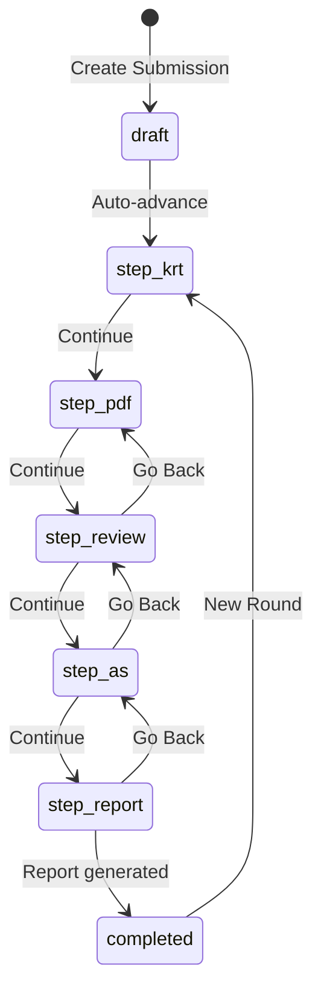

| Status | Step | View |
|--------|------|------|
| `draft` | — | Transient (auto-advances to `step_krt` on creation) |
| `step_krt` | 1 | KRTView |
| `step_pdf` | 2 | PDFView |
| `step_review` | 3 | ReviewView |
| `step_as` | 4 | AvailabilityView |
| `step_report` | 5 | ReportView |
| `completed` | 5 | ReportView |

Users can navigate back to any previous step from the step indicator. Starting a new round always resets the status to `step_krt` (the new PDF is collected up front in the **Process New Version** modal, so the user lands on Step 2 with the analysis pipeline already running) and increments `currentRound`.

---

## Create Submission

**View:** `CreateSubmissionView`

On the single create screen the user attaches the manuscript **PDF** (required) and their **KRT**
(CSV/XLSX). The KRT is **strongly recommended at creation time but optional**: if the user has no
KRT yet, a confirmation modal lets them proceed with a header-only empty KRT. Either way the PDF is
uploaded immediately and the analysis pipeline starts at creation — the user can upload the real KRT
later from Step 1. The Manuscript ID is **not** collected here; it is set later via Edit Metadata.

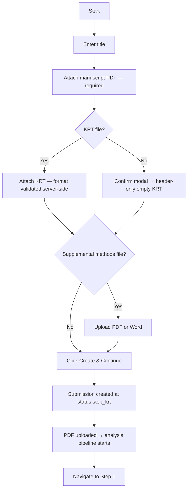

**User actions:**
1. Enter a title (required)
2. Attach the manuscript **PDF** (required)
3. Attach the **KRT** (CSV/XLSX) — strongly recommended; if omitted, confirm to continue with an empty KRT and add it later
4. Optionally add notes
5. Optionally upload a supplemental methods file (PDF or Word — Word files are auto-converted to PDF)
6. Click **Create & Continue to Step 1**

**Demo mode:** A "Use Demo Metadata" button populates the form with one of 6 pre-configured demo submissions.

**Result:** Creates the submission directly at status `step_krt` (the `draft` state is effectively never
persisted), uploads the PDF so the background pipeline begins, and navigates to KRTView.

---

## Step 1: Validate KRT

**View:** `KRTView`
**Status:** `step_krt`

**Instructions shown to the user:**
1. Upload or create a KRT
2. Resolve validation errors — address all red errors (required) and yellow warnings (recommended)
3. Click "Continue" to proceed to Step 2

### User Actions

**Upload a KRT file:**
- Drag-and-drop or click to upload a CSV or XLSX file (max 10MB)
- The file is parsed, validated, and displayed in the KRT editor
- A "Replace KRT" button appears once a KRT exists

**Use the KRT template:**
- A link to the Google Sheets KRT template is available in the sidebar and in the help panel
- Users can prepare their KRT in a spreadsheet and upload it

**Create an empty KRT:**
- Expand "I don't have a KRT" → click "Initialize an empty KRT"
- Creates an empty table the user can populate manually

**Load demo KRT:**
- A dropdown offers 6 pre-built demo KRT files for testing

**Edit KRT rows:**
- 6 editable columns: Resource Type, Resource Name, Source, Identifier, New/Reuse, Additional Information
- Click any cell to edit inline; inline **shortcut dropdowns** offer quick-pick values for Resource Type and New/Reuse
- Add new rows, delete existing rows
- **Merge rows:** select ≥2 rows → modal to pick each column's value → one merged row replaces them (`POST /api/submissions/:id/krt/merge`)
- **Resizable columns:** drag a header edge to resize; width is remembered per browser
- **QC / Optional flags** (boolean) are shown and editable **only** for Administrator and DS Annotator roles; regular users (author, asap_pm) never see them

**Fix validation errors:**
- Validation runs automatically after upload and after edits
- A Quick Fixes carousel shows auto-fixable errors with "Fix All" buttons
- Batch Fix modal lets users select a correct value for multiple rows with the same error (e.g., invalid resource types); resource-type errors carry a machine-actionable `suggestedValue` that powers one-click bulk fixes (e.g. "Set 4 → Software/code")

### Proceeding to Step 2

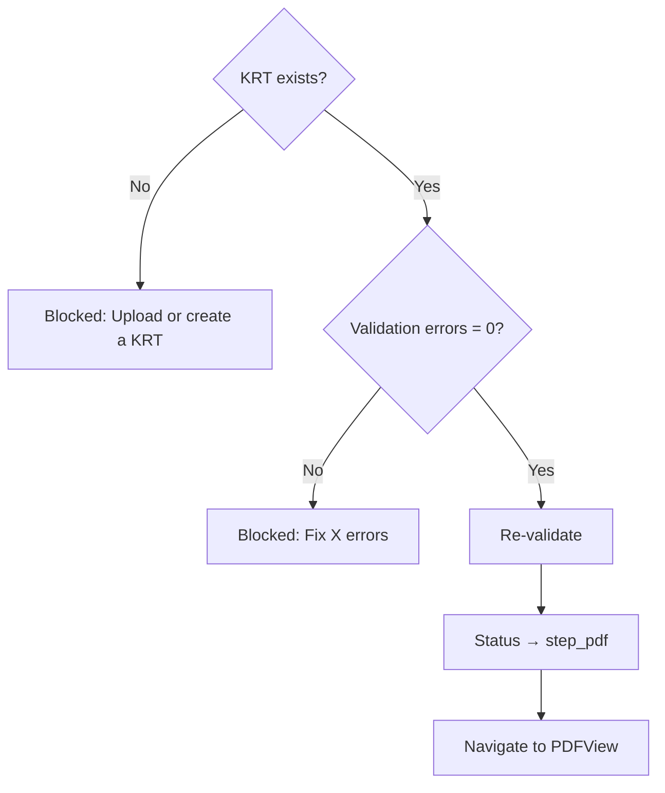

**Conditions (all must be true):**
- A KRT has been uploaded or created (even if empty)
- Total validation errors = 0

**Blocked reasons:**
- "Upload or create a KRT before continuing" — no KRT exists
- "Fix X error(s) before continuing" — validation errors remain

**On Continue:** Re-validates, updates status to `step_pdf`, navigates to PDFView.

---

## Step 2: Upload & Analyze Manuscript

**View:** `PDFView`
**Status:** `step_pdf`

**Instructions shown to the user:**
1. Upload your manuscript PDF (accepted: .pdf or .docx files, max 50MB)
2. View background job progress — DAS Extraction, Software Detection, ORCID Extraction, Markdown Convert, Datasets Detection, Materials Detection, Protocols Detection, Identifier Detection, PDF Analysis (Generated KRT), and AI Suggestions (KRT comparison)
3. Wait for analysis to complete (may take a few minutes)
4. Click "Continue" to proceed to Step 3

### User Actions

**Upload a PDF:**
- Drag-and-drop or click to upload a manuscript PDF
- Triggers the background job pipeline (see below)
- A "Replace PDF" button appears once a PDF exists

**Load demo PDF:**
- A dropdown offers 6 pre-built demo PDFs with pre-matched detection data

### Background Job Pipeline

When a PDF is uploaded, ten background jobs start (eight detections, the PDF Analysis Generated-KRT builder, and the AI Suggestions comparison that runs last):

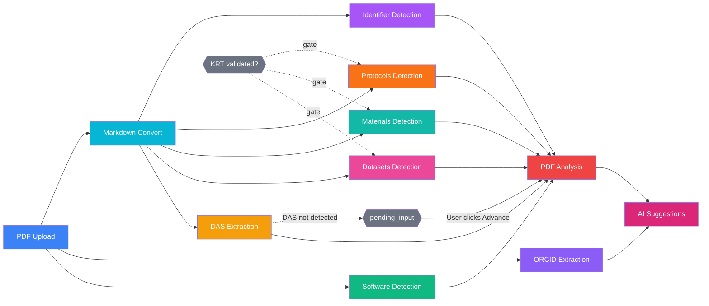

ORCID Extraction is **not** a contributor to PDF Analysis — its output writes to `submission.authors`, not the Generated KRT. **AI Suggestions** runs last, depending on PDF Analysis (which already gates on every KRT detector).

**Datasets, Materials, and Protocols detection wait for KRT validation.** These three seed the LM with the author's KRT rows, so they gate on `krt_curated` — they stay in `waiting` (the panel shows *"Waiting for the Key Resources Table to be validated"*) until the submission status moves past `step_krt`, then advance automatically with no user action. PDF Analysis and AI Suggestions inherit this gate through their dependencies.

Each job is displayed in the **JobStatusPanel** with live status updates:

#### DAS Extraction
- Asks Google Gemini to copy the Data Availability Statement out of the
  converted manuscript markdown, verbatim. The prompt also covers
  `funding_statement`, `acknowledgements`, `ethics_statement`, etc. — the
  active section is set via `DAS_EXTRACTION_SECTION` (default `das`).
- **Depends on:** Markdown Convert (reads the markdown File from S3
  rather than the PDF buffer)
- **If found:** Shows "Availability Statement found" with extracted text
- **If not found:** Job moves to `pending_input` status — user must manually enter a DAS or click "Advance" to skip
- **User actions:** "Edit" button to view/modify the extracted DAS; "Advance" to skip if not found
- The structured response (`partial_match`, `section_fragmented`) is preserved on the job's raw response for forensics; only `content` is persisted on `submission.extractedDataAvailabilityStatement`.

#### PDF Analysis (Generated KRT)
- Builds the Generated KRT in two stages: a rule-based merge of every detection's items, then an **LM (Google Gemini)** consolidation of those candidates (merging near-duplicates, dropping non-resources, cleaning fields, attaching a `reason` per kept line). **LM-primary with a rule-based fallback** — when `KRT_GENERATION_ENABLED` is off or the LM errors, the merged candidates are used so a Generated KRT is always produced.
- **Depends on:** DAS Extraction + Software + Datasets + Materials + Protocols + Identifier Detection (all six must reach a terminal state)
- **Auto-advances only if:** DAS extraction returned `result.status.detected === true`
- **If DAS not detected:** Job moves to `pending_input` — user must click "Advance" to consolidate without DAS context
- **On complete:** Shows the consolidated resource count (and multi-source overlap count); the AI Suggestions job then runs
- **Merge rule** (stage 1, `merge-detections.service.js`): two detection items merge iff they share **resource type** (case-insensitive, with `Code/Software` and `Software/code` normalized to the same key) **and** New/Reuse **and** their identifier tokens overlap or their normalized names match. The merged row's display fields come from the highest-precedence contributor (Software / Datasets / Protocols / Materials beat Identifier-scan)

#### AI Suggestions (KRT comparison)
- A dedicated `suggestion_generation` job: a **Gemini** call compares the author KRT against the Generated KRT and emits, for **every** generated resource, a decision — **add / skip / update / remove** — each with a reason, plus author-side fixes. Author data is prioritized; the actionable list is kept manageable; `remove` decisions are rare (clear mistakes only).
- **LM-only — no fallback:** with no LM configured (`KRT_COMPARISON_ENABLED` off or no key), **no suggestions are produced.**
- **Depends on:** PDF Analysis (which already gates on every KRT detector); it runs **last** in the pipeline.
- **Persisted, not recomputed:** the suggestions are stored on the job result, so editing the KRT does not silently change them. They change only when the job is re-run — the **Regenerate suggestions** button (`POST /api/submissions/:id/suggestions/regenerate`) or any module restart that cascades through.
- `read`/`approve`/`reject` operate on the persisted list; **accepting a `remove` deletes the KRT row.** Each suggestion carries its real contributing detection module(s) (software/datasets/materials/protocols/identifier) as origin badges.
- **Show more:** a modal **"Summary"** table listing every decision (Decision / Resource / Modules / Reason).

#### Software Detection
- Detects software mentions in the manuscript via Softcite API
- Runs independently (no dependencies)
- **Post-processing:** software defaults to **Reuse**; code (programming languages) becomes "`<Lang> code`" marked **New**; instrument/acquisition software is excluded; software is de-duplicated against the author KRT ignoring version numbers/RRIDs in the name
- **On complete:** Shows "X software mentions found"
- **Show more:** Displays a table with Name, Version, RRID, Source, Occurrences

#### ORCID Extraction
- Extracts author names and ORCIDs using GROBID, OpenAlex, and ORCID API
- Runs independently (no dependencies)
- **On complete:** Shows "Done — X/Y ORCIDs found"
- **Show more:** Displays a table with Name, ORCID (linked), Affiliation, Source

#### Markdown Convert
- Converts the manuscript PDF to Markdown text via MarkItDown (local) or Modal/Docling (remote)
- Runs independently (no dependencies)
- Stores the Markdown file on S3 as a File record (type: `markdown`)
- **On complete:** Shows "Converted (X chars)"

#### Datasets Detection
- Two-pass pipeline: (1) extracts raw dataset signals from Markdown via Python langextract, (2) consolidates into canonical KRT resources via Gemini
- **Depends on:** Markdown Convert
- **Gated on:** `krt_curated` — waits (in `waiting`, panel shows *"Waiting for the Key Resources Table to be validated"*) until the author validates the KRT, then advances automatically
- **On complete:** Shows "X dataset(s) detected (Y high relevance)"
- **Show more:** Displays a table with Name, Role, Repository, Accessions/DOIs, Relevance (color-coded badges)

#### Materials Detection
- Detects lab material/reagent mentions in the manuscript via Google Gemini, **grounded on the author's KRT material rows** (a minimal, author-seeded prompt)
- **Depends on:** Markdown Convert
- **Gated on:** `krt_curated` — waits until the author validates the KRT, then advances automatically (see Datasets Detection)
- **Skips extraction entirely when the author provided no materials** (no author material rows → no Gemini call)
- Contributes detected materials to the Generated KRT (mapped to appropriate resource types: Antibody, Cell line, Organism/strain, etc.)
- **On complete:** Shows "X material(s) detected (Y high relevance)"

#### Protocols Detection
- Detects protocol mentions in the manuscript via Google Gemini, **seeded with the author's protocol rows as "Section 0"**
- **Depends on:** Markdown Convert (uses the markdown text as input, not the PDF)
- **Gated on:** `krt_curated` — waits until the author validates the KRT, then advances automatically (see Datasets Detection)
- **Prompt fixes:** don't pull a reagent vendor as Source or a catalog#/RRID as Identifier; capture protocols.io DOIs/URLs + citations; exclude analyses; better new/reuse classification
- Contributes detected protocols to the Generated KRT
- **On complete:** Shows "X protocol(s) detected (Y high relevance)"

#### Identifier Detection
- Scans the converted manuscript markdown against the curated enrichment list (software, datasets, materials, protocols — all four categories in one pass) for DOIs, RRIDs, accession patterns (GSE, PRJNA, SRR, PXD…), and vendor catalog numbers
- **Depends on:** Markdown Convert
- No external API call — runs locally against an in-memory index built from `enrichment_list_entries`
- **On complete:** Shows "X identifier(s) matched (Y high relevance)" with a breakdown by category and relevance (HIGH / MEDIUM / LOW)

**Job controls:**
- Failed jobs show an error message and a "Restart" button
- `pending_input` jobs show an "Advance" button
- Admin/ds_annotator roles see additional details: timestamps, retry counts, timeout configuration

### Proceeding to Step 3

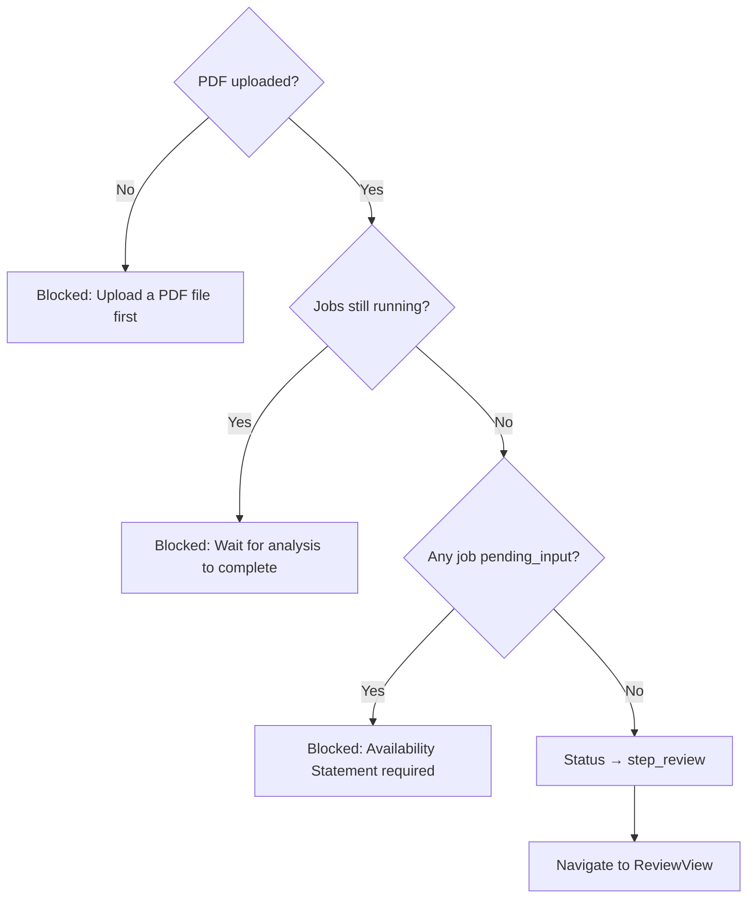

**Conditions (all must be true):**
- A PDF has been uploaded
- No background jobs are in `pending_input` status (all must be complete, failed, or not started)

**Blocked reasons:**
- "Upload a PDF file first" — no PDF uploaded
- "Wait for analysis to complete" — jobs still running
- "Availability Statement required" — DAS extraction pending user input

**On Continue:** Updates status to `step_review`, navigates to ReviewView.

---

## Step 3: Approve KRT

**View:** `ReviewView`
**Status:** `step_review`

**Instructions shown to the user:**
1. Review the updated KRT — edits, additions, and deletions are highlighted in the table below
2. Click "Continue" to approve the KRT and proceed to Step 4

### What the User Sees

**Change statistics card** (if changes exist):
- Cells Updated: "X from AI, Y from validation"
- Rows Added: "X from AI"
- Rows Removed: "X from AI"

**KRT table with change visualization:**
- **Green rows** — newly added
- **Blue rows** — updated cells
- **Red rows** — deleted
- **Source tags** on each change: "AI", "Val" (validation), "User"

**Filter tabs:** All, Datasets, Software/code, Protocols, Key Lab Materials — each showing a resource count.

**Show Changes toggle:**
- ON: Shows color-coded changes with source tags
- OFF: Shows final KRT data only

**Change history** (click any changed cell):
- Original value (struck-through, red)
- Final value (green)
- Full change history: source badge, user, timestamp, before/after values

### User Actions

- Review all changes made by AI suggestions, validation fixes, and manual edits
- Filter by resource type tab
- Toggle change visibility
- Click cells to inspect change history
- **Continue** to approve the KRT
- **Go Back** to return to Step 2

### Proceeding to Step 4

**Conditions:** None — Continue is always enabled.

**On Continue:** Updates status to `step_as`, navigates to AvailabilityView.

**On Go Back:** Updates status to `step_pdf`, navigates back to PDFView.

**Already approved:** If the submission is already past this step (`step_as`, `step_report`, or `completed`), a green banner shows "This KRT has already been approved."

---

## Step 4: Edit Data/Code Availability Statement

**View:** `AvailabilityView`
**Status:** `step_as`

**Instructions shown to the user:**
1. Review recommendations — outside of this app, edit your manuscript to address each recommendation. Confirm that each recommendation has been addressed or rejected.
2. Click "Continue" to generate a KRT Assist report

### Data Availability Statement Editor

- Displays the current DAS (extracted or user-edited)
- **Edit button** opens an inline textarea for modifications
- Save/Cancel buttons in edit mode
- **Editing the DAS re-runs the check** (see below)

### Availability Statement Recommendations (DAS Suggestions)

The DAS is checked against the **ASAP rulebook** by the standalone **`das_suggestions`** background job — a Google
Gemini call that judges the statement **semantically** (not by literal keyword matching). It runs on first arrival
at this step (once review is done, so the DAS is extracted and the KRT is final) and re-runs whenever the DAS is
edited. While it runs, the panel shows a **loader** and **Continue is blocked**. When the LM is disabled or fails,
the view **falls back** to the same rules computed in-browser and Continue is **not** blocked.

The rulebook — all nine checks — with the exact `rule_id`s and recommended text is documented in
[background-modules.md §3.11](./background-modules.md#311-das_suggestions--availability-statement-check-das-suggestions).
Quick reference:

| Rule (`rule_id`) | Type | Applies when |
|------------------|------|--------------|
| `no_new_dataset` | Warning | No "new" dataset resources in the KRT |
| `no_new_code` | Warning | No "new" code/software resources in the KRT |
| `datasets_not_mentioned` | Info | Has datasets but the DAS doesn't refer to the data |
| `code_not_mentioned` | Info | Has code/software but the DAS doesn't refer to code/software |
| `protocols_not_mentioned` | Info | Has protocols but the DAS doesn't refer to protocols |
| `materials_not_mentioned` | Info | Has materials but the DAS doesn't refer to materials/reagents |
| `missing_no_data_statement` | Warning | No new datasets and the DAS doesn't explicitly state "no new data" |
| `missing_no_code_statement` | Warning | No new code and the DAS doesn't explicitly state "no new code" |
| `missing_krt_reference` | Warning | The DAS doesn't reference the KRT / a Zenodo DOI / a persistent identifier / a table |

**For each applicable rule:**
- Severity badge (warning/info)
- Description of the issue
- Recommended text with a "Copy to clipboard" button
- Rules sorted: applicable first, then N/A with green checkmarks

**View modes:**
- **Expanded view:** All rules visible at once
- **Focus view:** Carousel with one rule at a time (Previous/Next navigation)
- **Toggle:** "Show all checks" to include non-applicable rules

### Proceeding to Step 5

**Conditions:** the DAS check must be **finished** — while the `das_suggestions` job is `queued`/`processing`,
Continue is disabled with the tooltip *"Generating availability suggestions… please wait."* Once it reaches a
terminal state (or the fallback rules are used), Continue is enabled.

**On Continue:** Updates status to `step_report`, navigates to ReportView.

---

## Step 5: Report Generation

**View:** `ReportView`
**Status:** `step_report` or `completed`

**Instructions shown to the user:**
1. Download report — to expedite ASAP compliance review, reports can be attached to compliance submissions
2. [Optional] Validate updated manuscript — click "Process updated manuscript" to run KRT Assist on your updated manuscript

### User Actions

**Generate a report:**
- Click **Download as XLSX** to generate an Excel report
- Google Sheets option is shown but disabled (coming soon)
- Generated reports appear in a list with download buttons

**Download previous reports:**
- Current round reports listed with type, timestamp, and download button
- Previous round reports grouped by version number in collapsible sections

**Start a new round (revision):**

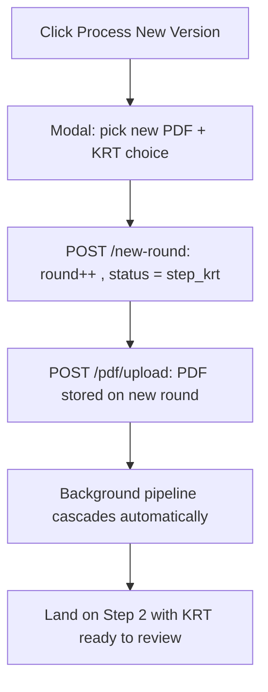

- Click **Process New Version**
- The modal collects two things up front:
  - **New PDF** (required) — file picker, accepts PDF or DOCX. The file is uploaded immediately after the round bump, so the analysis pipeline is already running by the time the user lands on Step 2.
  - **Do you have a new KRT file?** — radio choice. *No* keeps the current KRT (it is copied forward to the new round). *Yes* leaves the KRT empty so the user uploads a replacement on Step 2.
- The submission always lands on `step_krt` (Step 2 in the UI). The dedicated `step_pdf` redirect is gone.
- Increments `currentRound` (Version 2, 3, etc.).
- A "Replace PDF" button on Step 2 provides the same upload affordance as a fallback for users who want to swap the manuscript later in the round (it cascades the analysis pipeline the same way).

### Excel Report Contents

The generated XLSX file (`ExcelExporter.js`) contains up to 4 sheets:

1. **Summary** — a single overview sheet with three sections:
   - *Submission* — manuscript ID, title, project (grant code), status, submitter, current round, created/updated, notes.
   - *Detected authors* — each detected author with their ORCID (from ORCID extraction).
   - *Data Availability Statement* — the final provided DAS and the AI-extracted DAS.
   - *KRT statistics* — total resources, new vs reuse, with/without identifier, with source, changes logged,
     outstanding suggestions, and a **resources-by-type** breakdown.
2. **KRT** — the complete Key Resources Table (RESOURCE TYPE / RESOURCE NAME / SOURCE / IDENTIFIER /
   NEW/REUSE / ADDITIONAL INFORMATION), sorted by resource-type group then name, with a frozen header row and filters.
3. **Change History** — chronological audit trail (date, user, action, step, column, old/new value, description).
4. **Suggestions** _(only when present)_ — outstanding AI suggestions (Source / Type / Title / Description / Status).

---

## Navigation & Header Actions

The **SubmissionHeader** component appears on all step views and provides:

**Always visible:**
- Submission title (click to edit)
- Manuscript ID
- File indicators: KRT icon (click to download CSV), PDF icon (click to download)
- **Edit Metadata** button — opens modal to edit title, manuscript ID, DAS, and notes

**Step navigation (steps 1–4):**
- **Go Back** button — returns to previous step (updates status)
- Current step badge
- **Continue** button — advances to next step (disabled with tooltip if conditions not met)

**File management:**
- **Files info** button — opens modal listing all uploaded files with download links

---

## Complete Path Summary

### Happy Path (Fastest)

### Path with DAS Not Found

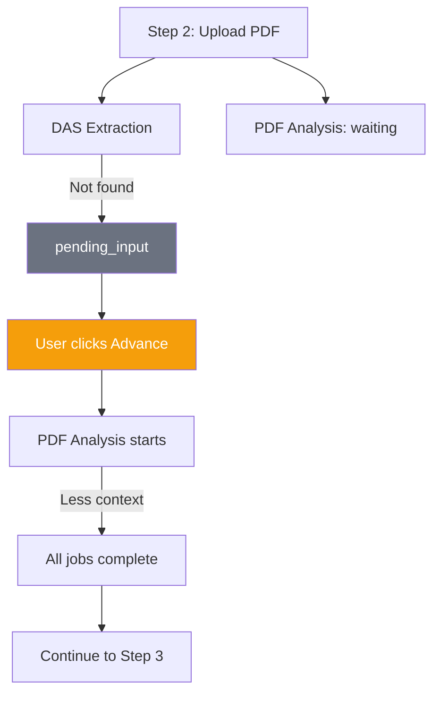

### Path with Manual DAS Entry

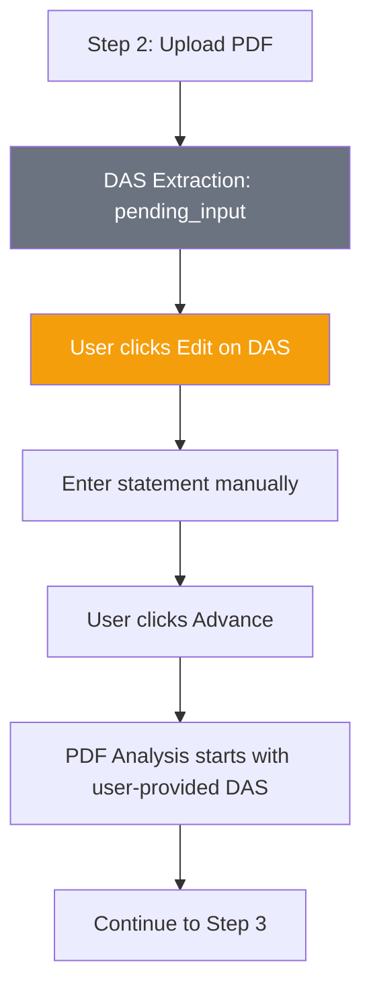

### Path with Failed Job

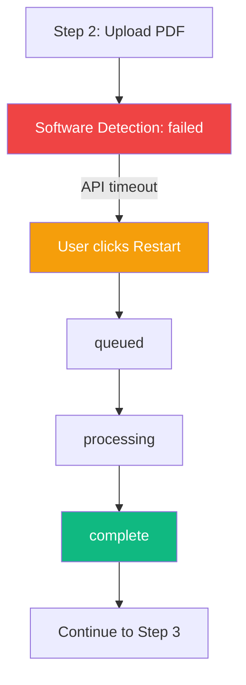

### Path with New Round (Revision)

Both new-round paths (keep KRT / new KRT) now land on Step 2 (`step_krt`) because the modal collects the new PDF up front and the frontend uploads it immediately after bumping `currentRound`.

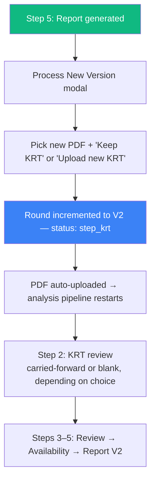

### Path with Back Navigation

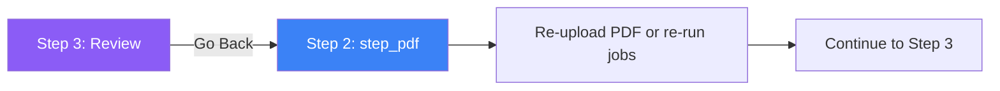

### Path with Empty KRT (Manual Entry)

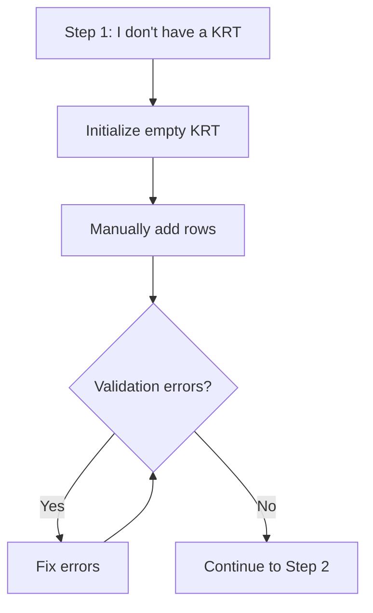

---

## Role-Specific Behavior

| Feature | Author | ASAP PM | DS Annotator | Admin |
|---------|--------|---------|-------------|-------|
| Create submissions | Yes | Yes | Yes | Yes |
| View own submissions | Yes | Yes | Yes | Yes |
| View team submissions | — | Yes | Yes | Yes |
| View all submissions | — | — | Yes | Yes |
| Delete submissions | — | — | Yes | Yes |
| See job debug info | — | — | Yes | Yes |
| Hide/unhide submissions | Yes | Yes | Yes | Yes |
| Start new round | Yes | Yes | Yes | Yes |

## Key Files

| File | Purpose |
|------|---------|
| `src/frontend/src/views/submissions/CreateSubmissionView.vue` | Submission creation form |
| `src/frontend/src/views/submissions/KRTView.vue` | Step 1: KRT upload and validation |
| `src/frontend/src/views/submissions/PDFView.vue` | Step 2: PDF upload and analysis |
| `src/frontend/src/views/submissions/ReviewView.vue` | Step 3: Change review and approval |
| `src/frontend/src/views/submissions/AvailabilityView.vue` | Step 4: DAS editing and recommendations |
| `src/frontend/src/views/submissions/ReportView.vue` | Step 5: Report generation |
| `src/frontend/src/components/submission/StepIndicator.vue` | Step navigation bar |
| `src/frontend/src/components/submission/StepHelpPanel.vue` | Contextual help for each step |
| `src/frontend/src/components/submission/SubmissionHeader.vue` | Header with navigation and actions |
| `src/frontend/src/components/submission/JobStatusPanel.vue` | Background job status display |
| `src/frontend/src/components/submission/NewRoundModal.vue` | New round/version dialog |
| `src/backend/controllers/submissions.controller.js` | Status update logic |
| `src/backend/config/constants.js` | Status and step constants |
