# Submission Workflow

The application guides users through a 5-step workflow to validate and enhance Key Resource Tables (KRT) for academic manuscripts. This document details every step, user action, condition, and transition path.

## Status Flow

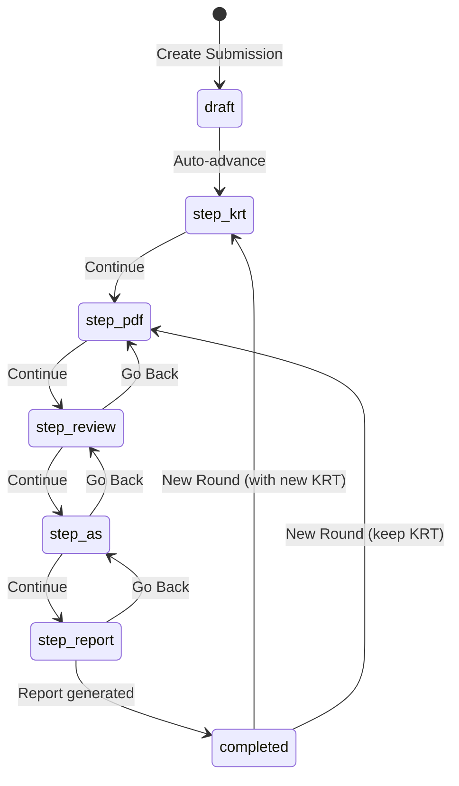

| Status | Step | View |
|--------|------|------|
| `draft` | — | Transient (auto-advances to `step_krt` on creation) |
| `step_krt` | 1 | KRTView |
| `step_pdf` | 2 | PDFView |
| `step_review` | 3 | ReviewView |
| `step_as` | 4 | AvailabilityView |
| `step_report` | 5 | ReportView |
| `completed` | 5 | ReportView |

Users can navigate back to any previous step from the step indicator. Starting a new round resets the status to `step_krt` or `step_pdf` and increments `currentRound`.

---

## Create Submission

**View:** `CreateSubmissionView`

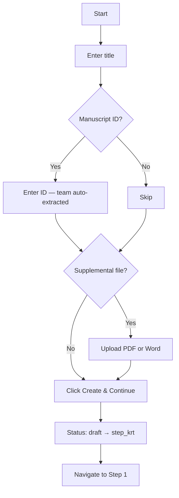

**User actions:**
1. Enter a title (required)
2. Optionally enter a Manuscript ID — auto-extracts team code from the ID format (`XX#-######-###-org-X-#`)
3. Optionally add notes
4. Optionally upload a supplemental methods file (PDF or Word — Word files are auto-converted to PDF)
5. Click **Create & Continue to Step 1**

**Demo mode:** A "Use Demo Metadata" button populates the form with one of 6 pre-configured demo submissions.

**Result:** Creates submission with status `draft`, immediately transitions to `step_krt`, and navigates to KRTView.

---

## Step 1: Validate KRT

**View:** `KRTView`
**Status:** `step_krt`

**Instructions shown to the user:**
1. Upload or create a KRT
2. Resolve validation errors — address all red errors (required) and yellow warnings (recommended)
3. Click "Continue" to proceed to Step 2

### User Actions

**Upload a KRT file:**
- Drag-and-drop or click to upload a CSV or XLSX file (max 10MB)
- The file is parsed, validated, and displayed in the KRT editor
- A "Replace KRT" button appears once a KRT exists

**Use the KRT template:**
- A link to the Google Sheets KRT template is available in the sidebar and in the help panel
- Users can prepare their KRT in a spreadsheet and upload it

**Create an empty KRT:**
- Expand "I don't have a KRT" → click "Initialize an empty KRT"
- Creates an empty table the user can populate manually

**Load demo KRT:**
- A dropdown offers 6 pre-built demo KRT files for testing

**Edit KRT rows:**
- 6 editable columns: Resource Type, Resource Name, Source, Identifier, New/Reuse, Additional Information
- Click any cell to edit inline
- Add new rows, delete existing rows

**Fix validation errors:**
- Validation runs automatically after upload and after edits
- A Quick Fixes carousel shows auto-fixable errors with "Fix All" buttons
- Batch Fix modal lets users select a correct value for multiple rows with the same error (e.g., invalid resource types)

### Proceeding to Step 2

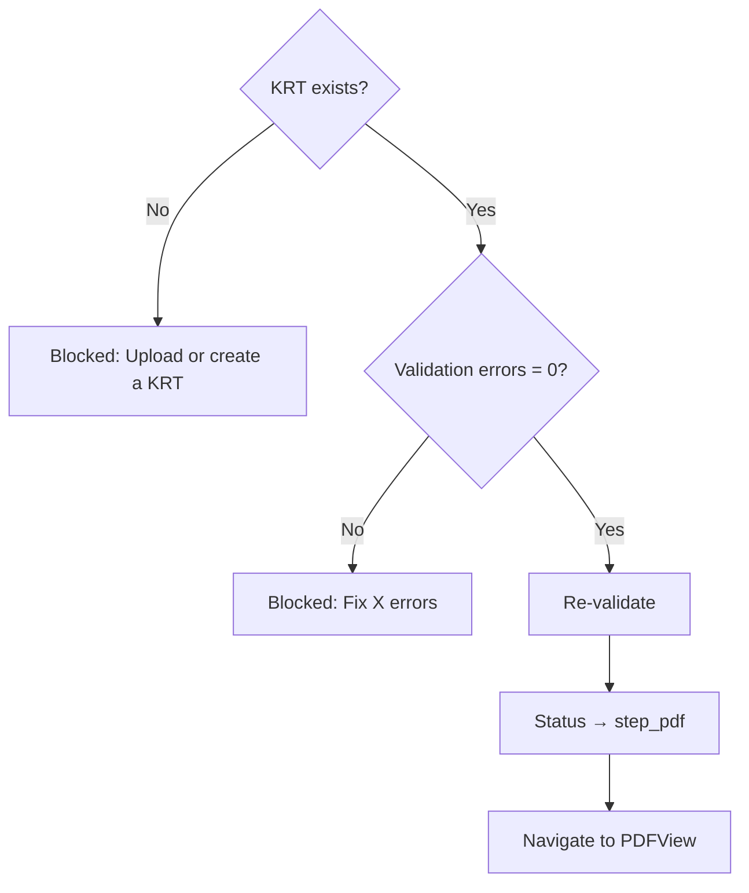

**Conditions (all must be true):**
- A KRT has been uploaded or created (even if empty)
- Total validation errors = 0

**Blocked reasons:**
- "Upload or create a KRT before continuing" — no KRT exists
- "Fix X error(s) before continuing" — validation errors remain

**On Continue:** Re-validates, updates status to `step_pdf`, navigates to PDFView.

---

## Step 2: Upload & Analyze Manuscript

**View:** `PDFView`
**Status:** `step_pdf`

**Instructions shown to the user:**
1. Upload your manuscript PDF (accepted: .pdf or .docx files, max 50MB)
2. View background job progress — DAS Extraction, Software Detection, ORCID Extraction, Markdown Convert, Datasets Detection, Materials Detection, Protocols Detection, Identifier Detection, and PDF Analysis (consolidator)
3. Wait for analysis to complete (may take a few minutes)
4. Click "Continue" to proceed to Step 3

### User Actions

**Upload a PDF:**
- Drag-and-drop or click to upload a manuscript PDF
- Triggers the background job pipeline (see below)
- A "Replace PDF" button appears once a PDF exists

**Load demo PDF:**
- A dropdown offers 6 pre-built demo PDFs with pre-matched detection data

### Background Job Pipeline

When a PDF is uploaded, nine background jobs start (eight detections plus the PDF Analysis consolidator):

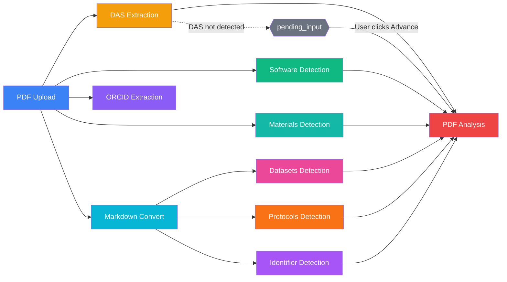

ORCID Extraction is **not** a contributor to PDF Analysis — its output writes to `submission.authors`, not the Generated KRT.

Each job is displayed in the **JobStatusPanel** with live status updates:

#### DAS Extraction
- Extracts the Data Availability Statement from the PDF
- **If found:** Shows "Availability Statement found" with extracted text
- **If not found:** Job moves to `pending_input` status — user must manually enter a DAS or click "Advance" to skip
- **User actions:** "Edit" button to view/modify the extracted DAS; "Advance" to skip if not found

#### PDF Analysis (in-app consolidator)
- Merges items from every detection job into the Generated KRT — no external API call
- **Depends on:** DAS Extraction + Software + Datasets + Materials + Protocols + Identifier Detection (all six must reach a terminal state)
- **Auto-advances only if:** DAS extraction returned `result.status.detected === true`
- **If DAS not detected:** Job moves to `pending_input` — user must click "Advance" to consolidate without DAS context
- **On complete:** Shows the consolidated resource count (and multi-source overlap count) and refreshes the KRT suggestions

#### Software Detection
- Detects software mentions in the manuscript via Softcite API
- Runs independently (no dependencies)
- **On complete:** Shows "X software mentions found"
- **Show more:** Displays a table with Name, Version, RRID, Source, Occurrences

#### ORCID Extraction
- Extracts author names and ORCIDs using GROBID, OpenAlex, and ORCID API
- Runs independently (no dependencies)
- **On complete:** Shows "Done — X/Y ORCIDs found"
- **Show more:** Displays a table with Name, ORCID (linked), Affiliation, Source

#### Markdown Convert
- Converts the manuscript PDF to Markdown text via MarkItDown (local) or Modal/Docling (remote)
- Runs independently (no dependencies)
- Stores the Markdown file on S3 as a File record (type: `markdown`)
- **On complete:** Shows "Converted (X chars)"

#### Datasets Detection
- Two-pass pipeline: (1) extracts raw dataset signals from Markdown via Python langextract, (2) consolidates into canonical KRT resources via Gemini
- **Depends on:** Markdown Convert
- **On complete:** Shows "X dataset(s) detected (Y high relevance)"
- **Show more:** Displays a table with Name, Role, Repository, Accessions/DOIs, Relevance (color-coded badges)

#### Materials Detection
- Detects lab material/reagent mentions in the manuscript via Google Gemini
- Runs independently (no dependencies)
- Generates KRT add_row suggestions for detected materials (mapped to appropriate resource types: Antibody, Cell line, Organism/strain, etc.)
- **On complete:** Shows "X material(s) detected (Y high relevance)"

#### Protocols Detection
- Detects protocol mentions in the manuscript via Google Gemini
- **Depends on:** Markdown Convert (uses the markdown text as input, not the PDF)
- Generates KRT add_row suggestions for detected protocols
- **On complete:** Shows "X protocol(s) detected (Y high relevance)"

#### Identifier Detection
- Scans the converted manuscript markdown against the curated enrichment list (software, datasets, materials, protocols — all four categories in one pass) for DOIs, RRIDs, accession patterns (GSE, PRJNA, SRR, PXD…), and vendor catalog numbers
- **Depends on:** Markdown Convert
- No external API call — runs locally against an in-memory index built from `enrichment_list_entries`
- **On complete:** Shows "X identifier(s) matched (Y high relevance)" with a breakdown by category and relevance (HIGH / MEDIUM / LOW)

**Job controls:**
- Failed jobs show an error message and a "Restart" button
- `pending_input` jobs show an "Advance" button
- Admin/ds_annotator roles see additional details: timestamps, retry counts, timeout configuration

### Proceeding to Step 3

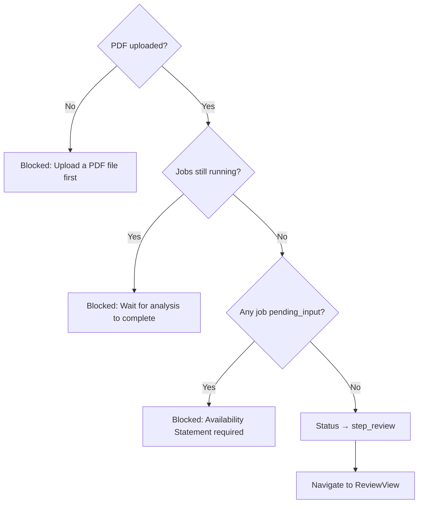

**Conditions (all must be true):**
- A PDF has been uploaded
- No background jobs are in `pending_input` status (all must be complete, failed, or not started)

**Blocked reasons:**
- "Upload a PDF file first" — no PDF uploaded
- "Wait for analysis to complete" — jobs still running
- "Availability Statement required" — DAS extraction pending user input

**On Continue:** Updates status to `step_review`, navigates to ReviewView.

---

## Step 3: Approve KRT

**View:** `ReviewView`
**Status:** `step_review`

**Instructions shown to the user:**
1. Review the updated KRT — edits, additions, and deletions are highlighted in the table below
2. Click "Continue" to approve the KRT and proceed to Step 4

### What the User Sees

**Change statistics card** (if changes exist):
- Cells Updated: "X from AI, Y from validation"
- Rows Added: "X from AI"
- Rows Removed: "X from AI"

**KRT table with change visualization:**
- **Green rows** — newly added
- **Blue rows** — updated cells
- **Red rows** — deleted
- **Source tags** on each change: "AI", "Val" (validation), "User"

**Filter tabs:** All, Datasets, Code/Software, Protocols, Key Lab Materials — each showing a resource count.

**Show Changes toggle:**
- ON: Shows color-coded changes with source tags
- OFF: Shows final KRT data only

**Change history** (click any changed cell):
- Original value (struck-through, red)
- Final value (green)
- Full change history: source badge, user, timestamp, before/after values

### User Actions

- Review all changes made by AI suggestions, validation fixes, and manual edits
- Filter by resource type tab
- Toggle change visibility
- Click cells to inspect change history
- **Continue** to approve the KRT
- **Go Back** to return to Step 2

### Proceeding to Step 4

**Conditions:** None — Continue is always enabled.

**On Continue:** Updates status to `step_as`, navigates to AvailabilityView.

**On Go Back:** Updates status to `step_pdf`, navigates back to PDFView.

**Already approved:** If the submission is already past this step (`step_as`, `step_report`, or `completed`), a green banner shows "This KRT has already been approved."

---

## Step 4: Edit Data/Code Availability Statement

**View:** `AvailabilityView`
**Status:** `step_as`

**Instructions shown to the user:**
1. Review recommendations — outside of this app, edit your manuscript to address each recommendation. Confirm that each recommendation has been addressed or rejected.
2. Click "Continue" to generate a KRT Assist report

### Data Availability Statement Editor

- Displays the current DAS (extracted or user-edited)
- **Edit button** opens an inline textarea for modifications
- Save/Cancel buttons in edit mode

### Availability Statement Recommendations

A carousel or expanded list of smart rules that check the DAS against the KRT contents:

| Rule | Type | Triggered When |
|------|------|----------------|
| No new dataset | Warning | No "new" dataset resources in KRT |
| No new code | Warning | No "new" code/software resources in KRT |
| Dataset mention | Info | Has datasets but DAS doesn't mention "data" |
| Software mention | Info | Has code/software but DAS doesn't mention "code"/"software" |
| Protocol mention | Info | Has protocols but DAS doesn't mention "protocol" |
| Lab material mention | Info | Has materials but DAS doesn't mention "material"/"reagent"/"resource" |
| Explicit no-data statement | Warning | No new datasets and DAS doesn't state "no new data" |
| Explicit no-code statement | Warning | No new code and DAS doesn't state "no new code" |
| KRT reference | Warning | DAS doesn't reference KRT, Zenodo, DOI, or table number |

**For each applicable rule:**
- Severity badge (warning/info)
- Description of the issue
- Recommended text with a "Copy to clipboard" button
- Rules sorted: applicable first, then N/A with green checkmarks

**View modes:**
- **Expanded view:** All rules visible at once
- **Focus view:** Carousel with one rule at a time (Previous/Next navigation)
- **Toggle:** "Show all checks" to include non-applicable rules

### Proceeding to Step 5

**Conditions:** None — Continue is always enabled.

**On Continue:** Updates status to `step_report`, navigates to ReportView.

---

## Step 5: Report Generation

**View:** `ReportView`
**Status:** `step_report` or `completed`

**Instructions shown to the user:**
1. Download report — to expedite ASAP compliance review, reports can be attached to compliance submissions
2. [Optional] Validate updated manuscript — click "Process updated manuscript" to run KRT Assist on your updated manuscript

### User Actions

**Generate a report:**
- Click **Download as XLSX** to generate an Excel report
- Google Sheets option is shown but disabled (coming soon)
- Generated reports appear in a list with download buttons

**Download previous reports:**
- Current round reports listed with type, timestamp, and download button
- Previous round reports grouped by version number in collapsible sections

**Start a new round (revision):**

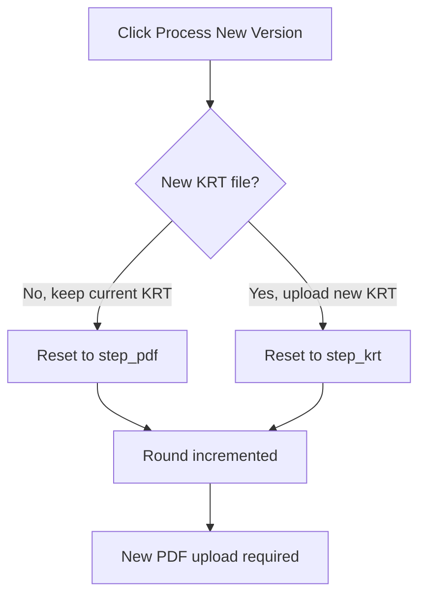

- Click **Process New Version**
- A modal asks: "Do you have a new KRT file?"
  - **No, keep current KRT** → resets to `step_pdf` (skip KRT upload, go straight to PDF)
  - **Yes, upload new KRT** → resets to `step_krt` (start from Step 1)
- Increments `currentRound` (Version 2, 3, etc.)
- A new PDF upload is always required

### Excel Report Contents

The generated XLSX file contains 4 sheets:

1. **Summary** — manuscript metadata, resource count, change count
2. **KRT Data** — resource table sorted by type group then name
3. **Change History** — chronological audit trail with user, action, source
4. **LM Analysis** — AI findings with confidence scores and status

---

## Navigation & Header Actions

The **SubmissionHeader** component appears on all step views and provides:

**Always visible:**
- Submission title (click to edit)
- Manuscript ID
- File indicators: KRT icon (click to download CSV), PDF icon (click to download)
- **Edit Metadata** button — opens modal to edit title, manuscript ID, DAS, and notes

**Step navigation (steps 1–4):**
- **Go Back** button — returns to previous step (updates status)
- Current step badge
- **Continue** button — advances to next step (disabled with tooltip if conditions not met)

**File management:**
- **Files info** button — opens modal listing all uploaded files with download links

---

## Complete Path Summary

### Happy Path (Fastest)

### Path with DAS Not Found

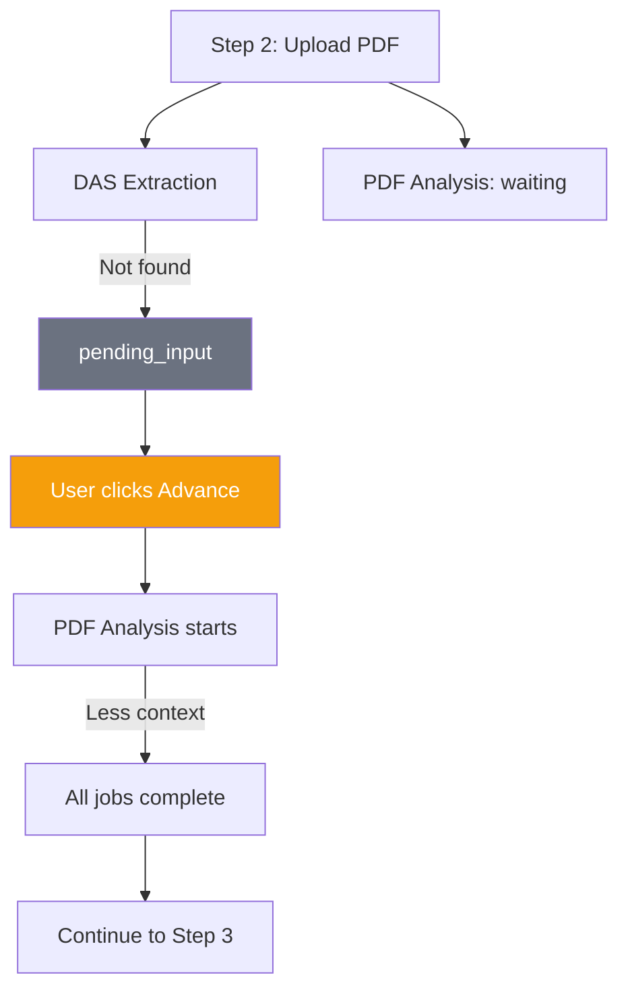

### Path with Manual DAS Entry

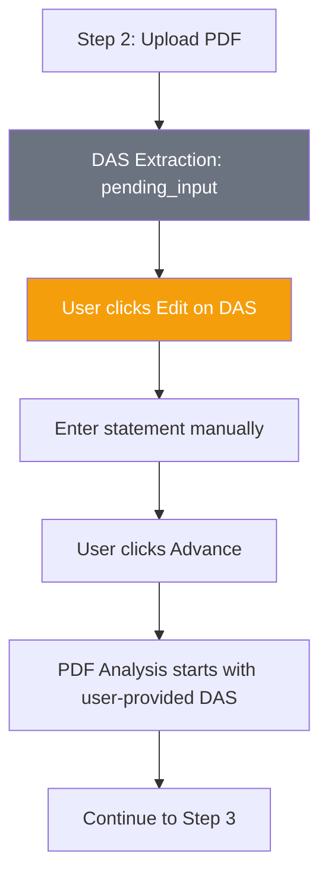

### Path with Failed Job

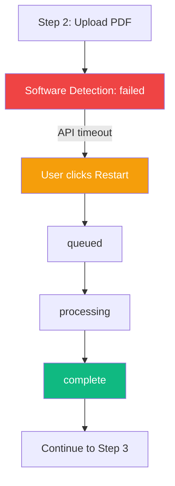

### Path with New Round (Revision)

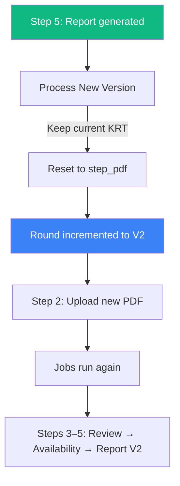

### Path with New Round + New KRT

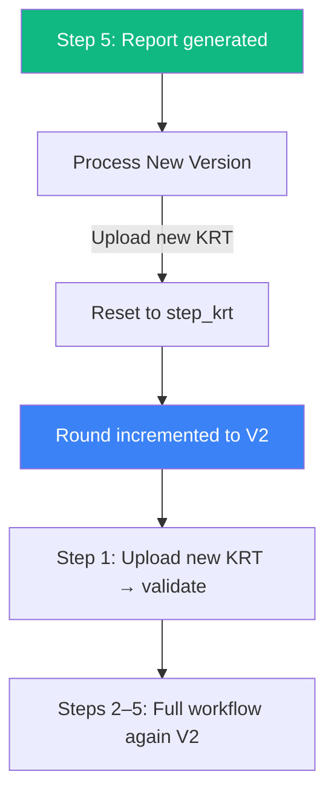

### Path with Back Navigation

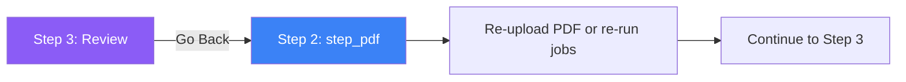

### Path with Empty KRT (Manual Entry)

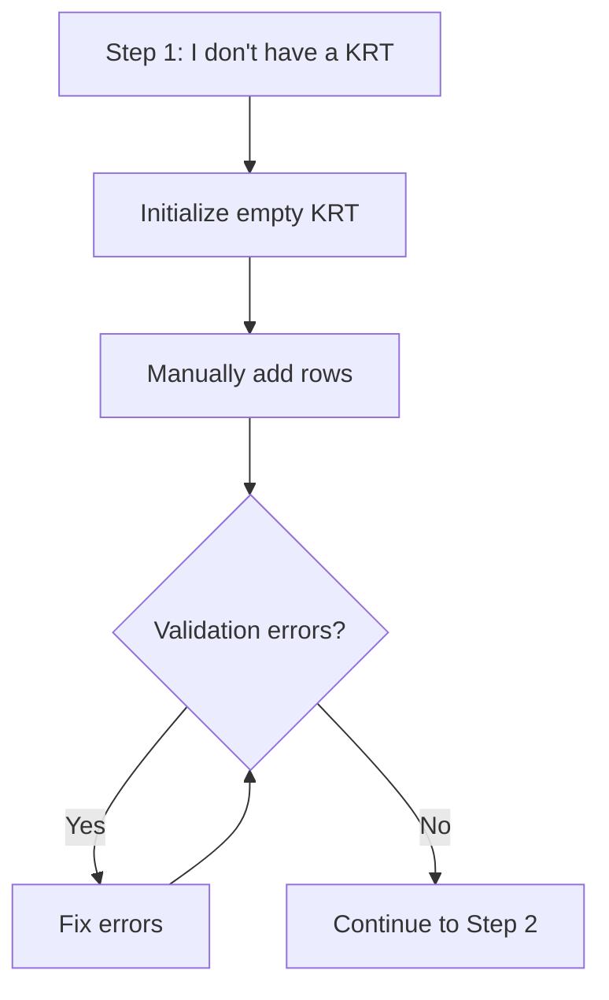

---

## Role-Specific Behavior

| Feature | Author | ASAP PM | DS Annotator | Admin |
|---------|--------|---------|-------------|-------|
| Create submissions | Yes | Yes | Yes | Yes |
| View own submissions | Yes | Yes | Yes | Yes |
| View team submissions | — | Yes | Yes | Yes |
| View all submissions | — | — | Yes | Yes |
| Delete submissions | — | — | Yes | Yes |
| See job debug info | — | — | Yes | Yes |
| Hide/unhide submissions | Yes | Yes | Yes | Yes |
| Start new round | Yes | Yes | Yes | Yes |

## Key Files

| File | Purpose |
|------|---------|
| `src/frontend/src/views/submissions/CreateSubmissionView.vue` | Submission creation form |
| `src/frontend/src/views/submissions/KRTView.vue` | Step 1: KRT upload and validation |
| `src/frontend/src/views/submissions/PDFView.vue` | Step 2: PDF upload and analysis |
| `src/frontend/src/views/submissions/ReviewView.vue` | Step 3: Change review and approval |
| `src/frontend/src/views/submissions/AvailabilityView.vue` | Step 4: DAS editing and recommendations |
| `src/frontend/src/views/submissions/ReportView.vue` | Step 5: Report generation |
| `src/frontend/src/components/submission/StepIndicator.vue` | Step navigation bar |
| `src/frontend/src/components/submission/StepHelpPanel.vue` | Contextual help for each step |
| `src/frontend/src/components/submission/SubmissionHeader.vue` | Header with navigation and actions |
| `src/frontend/src/components/submission/JobStatusPanel.vue` | Background job status display |
| `src/frontend/src/components/submission/NewRoundModal.vue` | New round/version dialog |
| `src/backend/controllers/submissions.controller.js` | Status update logic |
| `src/backend/config/constants.js` | Status and step constants |
