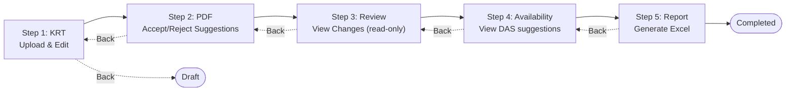

# ASAP KR-Sync User Guide

## Welcome to KR-Sync

KR-Sync is a web application designed to help you manage Key Resource Tables (KRT) for scientific manuscripts. This guide will walk you through everything you need to know to use the application effectively.

---

## Table of Contents

1. [Getting Started](#getting-started)
2. [Understanding the Workflow](#understanding-the-workflow)
3. [Step 1: Upload Your KRT](#step-1-upload-your-krt)
4. [Step 2: PDF Analysis](#step-2-pdf-analysis)
5. [Step 3: Review Changes (view-only)](#step-3-final-review)
6. [Step 4: Availability (view-only)](#step-4-availability)
7. [Step 5: Generate Report](#step-4-generate-report)
7. [Managing Your Submissions](#managing-your-submissions)
8. [User Roles](#user-roles)
9. [Frequently Asked Questions](#frequently-asked-questions)
10. [Getting Help](#getting-help)

---

## Getting Started

### Creating an Account

**For ASAP users:** You do not need to create an account. Simply sign in using the **ASAP Hub** tab (see below) — your account will be created automatically on first login.

**For non-ASAP users (DataSeer):**

1. Navigate to the KR-Sync login page
2. Select the **DataSeer** tab
3. Click "Don't have an account? Register"
4. Fill in your details:
   - Email address (this will be your username)
   - Full name
   - Password (must be at least 8 characters)
5. Click "Register"
6. You can now log in with your credentials

### Logging In

The login page offers two authentication methods, selectable via tabs:

#### ASAP Hub Login (for ASAP users)

1. Go to the KR-Sync login page
2. Select the **ASAP Hub** tab (selected by default)
3. Choose one of:
   - **Email and password:** Enter your ASAP Hub credentials and click "Sign in with ASAP"
   - **Google:** Click "Sign in with Google" and authenticate with your Google account
   - **ORCID:** Click "Sign in with ORCID" and authenticate with your ORCID credentials
4. You will be taken to your Dashboard
5. On your first login, an account is automatically created for you

#### DataSeer Login (for non-ASAP users)

1. Go to the KR-Sync login page
2. Select the **DataSeer** tab
3. Enter your email and password
4. Click "Sign In"
5. You will be taken to your Dashboard

### Dashboard Overview

After logging in, you'll see your Dashboard, which shows:

- **Recent Submissions**: Your most recent KRT submissions
- **Quick Actions**: Buttons to create new submissions or view all submissions
- **Statistics**: Overview of your submission status (drafts, in progress, completed)

---

## Understanding the Workflow

KR-Sync uses a 5-step workflow to process your Key Resource Tables:

```
Step 1            Step 2             Step 3        Step 4         Step 5
KRT Upload    →   PDF Analysis   →   Review    →   Availability   →   Report
Upload & Edit     Accept / Reject    View-only     View DAS           Excel
                  AI Suggestions                   suggestions
```



**Navigation:** You can move forward through the steps by completing each one, or go back to previous steps if you need to make changes.

**Step Overview:**

| Step | Name | What You Do | Editable? |
|------|------|-------------|-----------|
| 1 | KRT | Upload your KRT file, fix validation errors, edit data inline, add/delete rows | Yes |
| 2 | PDF | Upload manuscript PDF, let AI analyze it, **review and accept/reject/edit suggestions** | Yes — suggestion decisions live here |
| 3 | Review | See every change applied across the round (text + AI-driven), with full history and diffs | **No** — view-only |
| 4 | Availability | View AI-extracted Data Availability Statement (DAS) suggestions for the manuscript | **No** — view-only; the DAS is edited outside the app |
| 5 | Report | Generate the final Excel report, download and share | n/a — output step |

### What is a Key Resource Table (KRT)?

A Key Resource Table is a standardized document that lists all the key resources used in your scientific manuscript. Each row represents one resource and includes:

| Column | Description | Example |
|--------|-------------|---------|
| Resource Type | Category of the resource | Antibody, Cell Line, Dataset |
| Resource Name | Name of the resource | Anti-GFP Antibody |
| Source | Where the resource came from | Thermo Fisher |
| Identifier | Unique identifier | RRID:AB_123456 |
| New/Reuse | Is this new or reused? | New or Reuse |
| Additional Info | Any extra details | Dilution 1:1000 |

### Supported Resource Types

KR-Sync recognizes 14 resource types:

1. Antibody
2. Cell Line
3. Chemical/Drug
4. Commercial Kit
5. Dataset
6. Genetic Reagent
7. Model Organism
8. Peptide/Protein
9. Plasmid
10. Primary Cell
11. Sequence-Based Reagent
12. Software/Algorithm
13. Strain
14. Other

---

## Step 1: KRT Management

### Preparing Your KRT File

Before uploading, ensure your KRT file:

- Is in CSV, Excel (.xlsx), or OpenDocument (.ods) format
- Has the correct column headers
- Contains at least one resource entry

**Required columns:**
- Resource Type
- Resource Name
- New/Reuse (values: "new" or "reuse")

**Optional columns:**
- Source
- Identifier
- Additional Information

> **Tip:** A KRT template link is available on the upload page to help you get started.

### Uploading Your File

1. From the Dashboard, click "New Submission" or "Process New Document"
2. Enter a Title and Manuscript ID (Article ID)
3. Fill in the Data Availability Statement
4. Click "Upload KRT" or drag and drop your file
5. Wait for the file to be processed and validated

### Understanding Validation Results

After upload, KR-Sync automatically validates your KRT. You'll see indicators on:

- **Row number column**: Shows if the row has any issues (hover for summary)
- **Individual cells**: Shows specific cell errors/warnings (hover for details)

**Issue types:**

- **Errors** (Red): Should be fixed for best results
  - Example: "Missing required field: Resource Name"
  - Example: "Invalid resource type: Unknown"

- **Warnings** (Yellow): Should be reviewed
  - Example: "No identifier provided for row 5"
  - Example: "Possible duplicate entry detected"

### Editing Your KRT

You can edit your KRT directly in the application:

1. **Click on any cell** to edit its value
2. **Add new rows** using the form at the top
3. **Delete rows** using the trash icon on each row
4. **Quick N/A button**: For empty Identifier cells, click "N/A" to fill quickly
5. **Batch fixes**: When multiple rows have the same fixable issue, apply the fix to all at once

All changes are automatically saved and tracked with full history.

### Proceeding to Step 2

Once you've reviewed your KRT:
1. Check that critical errors are resolved
2. Click "Continue to PDF Analysis"

---

## Step 2: PDF Analysis

### What is PDF Analysis?

In this step, you upload your manuscript PDF. Our AI system will:

1. Read through your manuscript
2. Find references to resources mentioned in the text
3. Compare what's in your PDF with your KRT
4. Suggest additions, corrections, or deletions

### Uploading Your PDF

1. Click "Upload PDF" or drag and drop your manuscript
2. Supported formats: PDF only
3. Maximum file size: 50 MB
4. Wait for the upload to complete

### Starting the Analysis

1. After upload, click "Start Analysis"
2. Analysis typically takes 2-5 minutes
3. You'll see a progress indicator with status updates
4. You can leave and come back - your results will be waiting

### Analysis Results

When analysis is complete, you'll see AI suggestions in a collapsible panel (expanded by default). The KRT editor below shows your data with suggestion indicators.

**Types of suggestions:**

1. **Add Row** (Blue + icon) - The AI found a resource in your PDF that's not in your KRT
   - Shows: Suggested resource data in a highlighted row
   - Action: Click Accept (checkmark) or Reject (X)

2. **Edit Cell** (Blue info icon on cell) - The AI suggests a correction to an existing value
   - Shows: Current value → Suggested value in tooltip
   - Action: Click the cell to open edit modal, then Accept or Reject

3. **Delete Row** (Red highlight) - The AI suggests removing a row
   - Shows: Row highlighted with delete suggestion
   - Action: Click Accept to delete or Reject to keep

**Visual indicators:**
- **Blue row number**: Row has AI suggestions
- **Blue cell icon**: Cell has an edit suggestion (hover for details)
- **Blue + row**: Suggested new row to add

Each suggestion shows:
- Title and description
- Confidence level
- Suggested data or changes

---

## Step 3: Final Review

### Understanding the Review Screen

The review screen shows your final KRT with all changes made throughout the process:

- **KRT Table**: Your complete Key Resource Table with change indicators
- **Change History**: Click the "?" icon on any cell to see its modification history
- **Data Highlighting**: Changed cells are highlighted to show what was modified

### Reviewing Change History

For each cell that was modified, you can:

1. **Hover over the cell** to see if it has history (look for the "?" icon)
2. **Click the "?" icon** to open the history modal showing:
   - Original value (from CSV upload)
   - Current value
   - Who made the change
   - When the change was made
   - Change source (manual, AI suggestion, or validation fix)

### Change Sources

Changes are tracked with their source:

| Source | Description |
|--------|-------------|
| Manual | You edited the cell directly |
| AI Suggestion | You accepted an AI recommendation |
| KRT Validation | You applied a validation fix |

### Making Final Edits

Before proceeding:
1. Review the complete KRT data
2. Check cells with history indicators
3. Make any final manual corrections if needed
4. Ensure all required fields are complete

### Proceeding to Step 4

Once you've completed your review:
1. Click "Continue" or "Approve"
2. You'll proceed to report generation

---

## Step 4: Report Generation

### Available Report Types

KR-Sync can generate reports in two formats:

1. **Google Sheets** (Recommended)
   - Creates a shareable Google Spreadsheet
   - Includes all KRT data and change history
   - Easy to share with collaborators
   - Stored in ASAP shared folder

2. **Excel Download**
   - Downloads an .xlsx file
   - Same content as Google Sheets
   - For offline use or local storage

### Generating Your Report

1. Click "Generate Google Sheets" or "Generate Excel"
2. Wait for generation (usually 10-30 seconds)
3. Access your report:
   - **Google Sheets**: Click "Open in Google Sheets" link
   - **Excel**: Click "Download" to save the file

You can generate multiple reports - each will reflect the current state of your KRT.

### Report Contents

Your report includes multiple sections:

1. **Summary**
   - Manuscript ID and Title
   - Submission date and completion date
   - Total resources count
   - Number of changes made

2. **KRT Data**
   - Complete Key Resource Table
   - Final, validated data

3. **Change History**
   - All modifications made during the workflow
   - Change source (manual, AI, validation)
   - Timestamps and user info

4. **Analysis Summary** (if PDF analysis was run)
   - AI suggestions received
   - Acceptance/rejection status
   - Analysis metadata

### Completing the Submission

Once you've generated your report:
1. Click "Finish" to mark the submission as complete
2. You'll be returned to the Dashboard
3. The submission status will show as "Completed"

### Revising After Completion

Need to make changes after completing?
1. Open the completed submission from Dashboard
2. Navigate back to any previous step
3. Make your changes
4. Generate a new report (creates a new version)

---

## Managing Your Submissions

### Viewing All Submissions

From the Dashboard, click "View All Submissions" to see:

- All your submissions (or team submissions if you're a PM)
- Filter by status: Draft, In Progress, Completed
- Search by Manuscript ID
- Sort by date, status, or team

### Submission Statuses

| Status | Meaning |
|--------|---------|
| Draft | Just created, KRT not yet uploaded |
| Step 1: KRT | Working on KRT upload and validation |
| Step 2: PDF | Working on PDF upload and AI analysis |
| Step 3: Review | Reviewing changes before finalizing |
| Step 4: Report | Generating final reports |
| Completed | Report generated, workflow finished |

### Continuing a Submission

1. Find your submission in the list
2. Click on it to open
3. You'll be taken to where you left off
4. Continue the workflow from there

### Editing a Completed Submission

Need to make changes after completion?

1. Open the completed submission
2. Click "Revise Submission"
3. Make your changes
4. Generate a new report (new version)

---

## User Roles

### Author

As an Author, you can:
- Create new submissions
- Upload and edit your own KRTs
- Run PDF analysis on your submissions
- Generate reports for your submissions
- View your submission history

### ASAP PM (Project Manager)

As an ASAP PM, you can:
- View all submissions from your assigned team
- Edit submissions from your team
- Help team members with their KRTs
- Generate reports for team submissions

### DS Annotator (Data Science)

As a DS Annotator, you can:
- View and edit all submissions
- Assist any user with their KRTs
- Run analysis and generate reports
- Quality check submissions

### Admin

Administrators can:
- Manage user accounts
- Configure system settings
- Access all submissions
- View system statistics

---

## Frequently Asked Questions

### General Questions

**Q: What file formats can I upload for my KRT?**

A: KR-Sync accepts CSV (.csv), Excel (.xlsx), and OpenDocument Spreadsheet (.ods) files.

**Q: How long does PDF analysis take?**

A: Typically 2-5 minutes, depending on the length of your manuscript. You can leave the page and come back - you'll see your results when you return.

**Q: Can I edit my KRT after uploading?**

A: Yes! You can edit your KRT at any point before generating the final report. All changes are tracked and can be undone.

### Upload Issues

**Q: My file won't upload. What should I do?**

A: Check that:
1. File is under 50 MB
2. File format is CSV, XLSX, or ODS
3. Your internet connection is stable

Try refreshing the page and uploading again.

**Q: I'm getting validation errors. How do I fix them?**

A: Click on each error to see details. Common fixes:
- Missing Resource Name: Add names for all resources
- Invalid Resource Type: Use one of the 14 supported types
- Missing New/Reuse: Enter "new" or "reuse" for each row

### Analysis Questions

**Q: The AI suggested something incorrect. What should I do?**

A: Simply click "Reject" on that suggestion. The AI isn't perfect - your judgment is the final word.

**Q: Can I run analysis multiple times?**

A: Yes, you can upload a new PDF and run analysis again. Previous analysis results will be replaced.

**Q: What if the AI misses something in my PDF?**

A: You can always manually add rows to your KRT. The AI is a helper, not a replacement for your expertise.

### Report Questions

**Q: Can I generate multiple reports?**

A: Yes! You can generate as many reports as you need. Each will reflect the current state of your KRT.

**Q: Who can see my Google Sheets report?**

A: Only you (and anyone you share it with) can see your report. Reports are created in a shared ASAP folder but are private by default.

**Q: How do I download my report?**

A: For Google Sheets: File > Download > Microsoft Excel (.xlsx)
For Excel reports: Click the download link provided.

### Account Questions

**Q: What is the difference between ASAP Hub and DataSeer login?**

A: **ASAP Hub** is for users who belong to the ASAP organization — you can sign in with your Google account, ORCID, or ASAP Hub credentials. **DataSeer** is for non-ASAP users who registered directly on KR-Sync with an email and password.

**Q: I'm an ASAP user. Do I need to register?**

A: No. Just use the **ASAP Hub** tab to sign in. Your account will be created automatically the first time you log in.

**Q: How do I change my password?**

A: It depends on how you log in:
- **ASAP Hub users**: Your password is managed by your identity provider (Auth0). Change it through your ASAP Hub account settings. The KR-Sync profile page will show a message indicating this.
- **DataSeer users**: Go to your Profile page and use the "Change Password" form.

**Q: I forgot my password. What do I do?**

A: **ASAP Hub users**: Use the password reset on your identity provider (Google, ORCID, or ASAP Hub). **DataSeer users**: Contact your administrator to reset your password.

**Q: I used to log in with DataSeer but now I want to use ASAP Hub. What happens?**

A: If you sign in via ASAP Hub with the same email address, your existing account will be automatically linked. You keep all your submissions, role, and team assignments. You can then use either login method.

**Q: How do I change my team assignment?**

A: Contact your administrator to update your team assignment.

---

## Getting Help

### In-App Help

- Click the "?" icon in the top right corner for contextual help
- Hover over icons and buttons to see tooltips
- Look for blue information banners with helpful tips

### Reporting Issues

Found a bug or have a suggestion?

1. Click "Report Issue" in the app menu
2. Describe what happened
3. Include any error messages you saw
4. Submit - our team will investigate

---

## Quick Reference Card

### Keyboard Shortcuts

| Shortcut | Action |
|----------|--------|
| Ctrl + S | Save changes |
| Ctrl + Z | Undo |
| Ctrl + Y | Redo |
| Enter | Move to next cell |
| Tab | Move to next column |
| Escape | Cancel editing |

### Status Colors

| Color | Meaning |
|-------|---------|
| Green | Success / Approved |
| Yellow | Warning / Needs attention |
| Red | Error / Rejected |
| Blue | Information |
| Gray | Pending / Not started |

### Workflow Summary

```
1. Create Submission
   └─> Enter Manuscript ID & Team

2. Upload KRT
   └─> Fix any validation errors
   └─> Edit data as needed

3. Upload PDF & Analyze
   └─> Wait for AI analysis
   └─> Review suggestions

4. Approve/Reject Changes
   └─> Review each suggestion
   └─> Make final edits

5. Generate Report
   └─> Choose format
   └─> Download or share
```

---

Thank you for using KR-Sync! We hope this guide helps you manage your Key Resource Tables efficiently.
